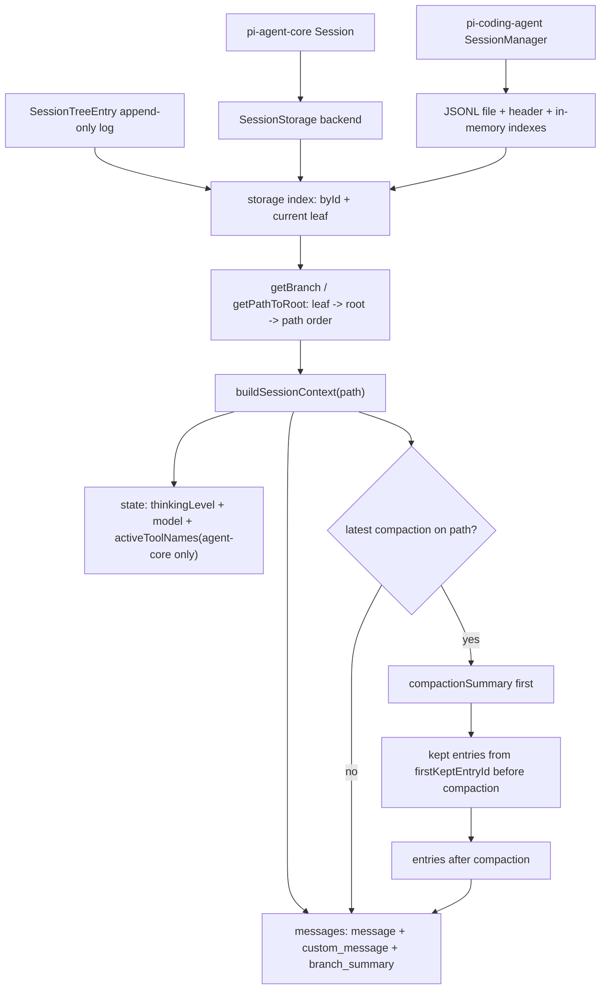

> `spine.session-state-model` 说明 pi 如何把 append-only session tree 解析成当前分支的 LLM context，并把 `pi-agent-core` 的通用 `Session` 与 `pi-coding-agent` 的产品级 `SessionManager` 分开看。

## 能回答的问题

- `SessionTreeEntry` 的 `id` / `parentId` / `leaf` 如何决定当前 branch？
- `buildSessionContext` 会把哪些 session entry 送进 LLM messages，哪些只改变状态或元数据？
- compaction、branch summary、custom message 在 context 中分别如何出现？
- `Session` / `SessionStorage` 属于 `pi-agent-core`，`SessionManager` 属于 `pi-coding-agent`，两者边界在哪里？
- coding-agent 恢复历史 session 时如何恢复 messages、model、thinking level？

## 端到端步骤

1. `SessionTreeEntryBase` 定义所有会话树节点共同拥有 `type`、`id`、`parentId`、`timestamp`，所以 session history 的形状不是线性数组，而是由 `parentId` 连接出的 tree。[E: packages/agent/src/harness/types.ts:335] [E: packages/agent/src/harness/types.ts:336] [E: packages/agent/src/harness/types.ts:337] [E: packages/agent/src/harness/types.ts:338] `SessionTreeEntry` union 覆盖 message、thinking/model/tools change、compaction、branch summary、custom/custom_message、label、session_info、leaf 这些节点类型。[E: packages/agent/src/harness/types.ts:409] [E: packages/agent/src/harness/types.ts:410] [E: packages/agent/src/harness/types.ts:411] [E: packages/agent/src/harness/types.ts:412] [E: packages/agent/src/harness/types.ts:413] [E: packages/agent/src/harness/types.ts:414] [E: packages/agent/src/harness/types.ts:415] [E: packages/agent/src/harness/types.ts:416] [E: packages/agent/src/harness/types.ts:417] [E: packages/agent/src/harness/types.ts:418] [E: packages/agent/src/harness/types.ts:419] [E: packages/agent/src/harness/types.ts:420]

2. `pi-agent-core` 的 `Session<TMetadata>` 是薄 facade：它持有 `SessionStorage<TMetadata>`，读写入口基本都委托给 storage，例如 `getLeafId()`、`getEntry()`、`getEntries()` 直接返回 storage 结果。[E: packages/agent/src/harness/session/session.ts:82] [E: packages/agent/src/harness/session/session.ts:83] [E: packages/agent/src/harness/session/session.ts:98] [E: packages/agent/src/harness/session/session.ts:102] [E: packages/agent/src/harness/session/session.ts:106]

3. `Session.getBranch(fromId?)` 先选择 `fromId` 或 storage 当前 leaf，再调用 `storage.getPathToRoot(leafId)`；`Session.buildContext()` 则把当前 branch 传给同文件的 `buildSessionContext()`。[E: packages/agent/src/harness/session/session.ts:110] [E: packages/agent/src/harness/session/session.ts:111] [E: packages/agent/src/harness/session/session.ts:115]

4. `SessionStorage` 是 agent-core 的 durable boundary：它要求 storage 提供 metadata、leaf pointer、entry id creation、append/read/find、label lookup、path-to-root、entries list 等能力。[E: packages/agent/src/harness/types.ts:441] [E: packages/agent/src/harness/types.ts:442] [E: packages/agent/src/harness/types.ts:444] [E: packages/agent/src/harness/types.ts:445] [E: packages/agent/src/harness/types.ts:446] [E: packages/agent/src/harness/types.ts:447] [E: packages/agent/src/harness/types.ts:448] [E: packages/agent/src/harness/types.ts:451] [E: packages/agent/src/harness/types.ts:452] [E: packages/agent/src/harness/types.ts:453] 这让内存 storage 与 JSONL storage 都能服务同一个 `Session` API。[E: packages/agent/src/harness/session/memory-storage.ts:40] [E: packages/agent/src/harness/session/memory-storage.ts:41] [E: packages/agent/src/harness/session/jsonl-storage.ts:161]

5. `InMemorySessionStorage` 和 `JsonlSessionStorage` 都把普通 entry 的 leaf 更新成 entry 自身，把 `leaf` entry 的 leaf 更新成 `targetId`；这解释了为什么导航可以作为一条 append-only `leaf` entry 记录，而不是改写旧 entry。[E: packages/agent/src/harness/session/memory-storage.ts:37] [E: packages/agent/src/harness/session/memory-storage.ts:96] [E: packages/agent/src/harness/session/jsonl-storage.ts:110] [E: packages/agent/src/harness/session/jsonl-storage.ts:258]

6. `buildSessionContext(pathEntries)` 首先扫描当前 branch path，累积最后的 `thinking_level_change`、`model_change`、assistant message 的 provider/model、`active_tools_change` 和最新 compaction entry。[E: packages/agent/src/harness/session/session.ts:22] [E: packages/agent/src/harness/session/session.ts:28] [E: packages/agent/src/harness/session/session.ts:30] [E: packages/agent/src/harness/session/session.ts:32] [E: packages/agent/src/harness/session/session.ts:34] [E: packages/agent/src/harness/session/session.ts:36] [E: packages/agent/src/harness/session/session.ts:38]

7. context 的 message list 只从三类 entry 生成：`message` 原样 push，`custom_message` 经 `createCustomMessage()` 转成 agent message，`branch_summary` 在有 summary 时经 `createBranchSummaryMessage()` 转成 message；`custom`、`label`、`session_info`、`model_change`、`thinking_level_change`、`active_tools_change` 本身不会直接成为 LLM message。[E: packages/agent/src/harness/session/session.ts:42] [E: packages/agent/src/harness/session/session.ts:44] [E: packages/agent/src/harness/session/session.ts:45] [E: packages/agent/src/harness/session/session.ts:46] [E: packages/agent/src/harness/session/session.ts:48] [E: packages/agent/src/harness/session/session.ts:56] [E: packages/agent/src/harness/session/session.ts:57]

8. 如果当前 branch path 上有 compaction，`buildSessionContext` 先插入 `createCompactionSummaryMessage(summary, tokensBefore, timestamp)`，再追加 compaction 前从 `firstKeptEntryId` 开始的消息，最后追加 compaction 后的消息。[E: packages/agent/src/harness/session/session.ts:61] [E: packages/agent/src/harness/session/session.ts:62] [E: packages/agent/src/harness/session/session.ts:63] [E: packages/agent/src/harness/session/session.ts:67] [E: packages/agent/src/harness/session/session.ts:68] [E: packages/agent/src/harness/session/session.ts:70] [E: packages/agent/src/harness/session/session.ts:71] 没有 compaction 时，它按 branch path 顺序尝试 append 每个 entry。[E: packages/agent/src/harness/session/session.ts:73] [E: packages/agent/src/harness/session/session.ts:74] [E: packages/agent/src/harness/session/session.ts:75]

9. agent-core `SessionContext` 返回 `messages`、`thinkingLevel`、`model`、`activeToolNames`，其中 `activeToolNames` 来自 branch-scoped `active_tools_change` entry。[E: packages/agent/src/harness/types.ts:423] [E: packages/agent/src/harness/types.ts:424] [E: packages/agent/src/harness/types.ts:425] [E: packages/agent/src/harness/types.ts:426] [E: packages/agent/src/harness/session/session.ts:35] [E: packages/agent/src/harness/session/session.ts:36] [E: packages/agent/src/harness/session/session.ts:79] `AgentHarness.setActiveTools()` 和 `AgentHarness.setTools()` 会把 active tool changes 写入 session 或 pending session writes，pending writes flush 时也会追加为 session entry；因此这个字段是 agent-core harness 的 durable state，不是单纯 UI 状态。[E: packages/agent/src/harness/agent-harness.ts:871] [E: packages/agent/src/harness/agent-harness.ts:883] [E: packages/agent/src/harness/agent-harness.ts:885] [E: packages/agent/src/harness/agent-harness.ts:906] [E: packages/agent/src/harness/agent-harness.ts:912] [E: packages/agent/src/harness/agent-harness.ts:914] [E: packages/agent/src/harness/agent-harness.ts:471] [E: packages/agent/src/harness/agent-harness.ts:472]

10. `AgentHarness.createTurnState()` 每 turn 都调用 `session.buildContext()` 取 messages，并用 harness 当前的 `this.activeToolNames` 过滤工具；`createContext()` 把这些 messages 与 active tools 组成 `AgentContext` 传给 agent loop。[E: packages/agent/src/harness/agent-harness.ts:314] [E: packages/agent/src/harness/agent-harness.ts:315] [E: packages/agent/src/harness/agent-harness.ts:319] [E: packages/agent/src/harness/agent-harness.ts:352] [E: packages/agent/src/harness/agent-harness.ts:354] [E: packages/agent/src/harness/agent-harness.ts:355]

11. `pi-coding-agent` 的 `SessionManager` 是另一套产品级实现：它在 `packages/coding-agent/src/index.ts` 直接导出 `SessionManager`、`buildSessionContext` 与 entry types，来源是 `core/session-manager.ts`，不是 agent-core 的 `Session` 类。[E: packages/coding-agent/src/index.ts:206] [E: packages/coding-agent/src/index.ts:208] [E: packages/coding-agent/src/index.ts:225] [E: packages/coding-agent/src/index.ts:228] [E: packages/coding-agent/src/core/session-manager.ts:758] [I]

12. coding-agent `SessionManager` 管理 JSONL header、session file、cwd、flush 状态、`fileEntries`、`byId`、label caches 和 `leafId`；写入新 entry 时先把 entry 放入 `fileEntries` 和 `byId`，再把 `leafId` 推进到新 entry，而普通 append entry 的 `parentId` 来自当前 `leafId`。[E: packages/coding-agent/src/core/session-manager.ts:32] [E: packages/coding-agent/src/core/session-manager.ts:152] [E: packages/coding-agent/src/core/session-manager.ts:758] [E: packages/coding-agent/src/core/session-manager.ts:759] [E: packages/coding-agent/src/core/session-manager.ts:760] [E: packages/coding-agent/src/core/session-manager.ts:762] [E: packages/coding-agent/src/core/session-manager.ts:764] [E: packages/coding-agent/src/core/session-manager.ts:765] [E: packages/coding-agent/src/core/session-manager.ts:766] [E: packages/coding-agent/src/core/session-manager.ts:767] [E: packages/coding-agent/src/core/session-manager.ts:768] [E: packages/coding-agent/src/core/session-manager.ts:769] [E: packages/coding-agent/src/core/session-manager.ts:941] [E: packages/coding-agent/src/core/session-manager.ts:942] [E: packages/coding-agent/src/core/session-manager.ts:943] [E: packages/coding-agent/src/core/session-manager.ts:944] [E: packages/coding-agent/src/core/session-manager.ts:955] [E: packages/coding-agent/src/core/session-manager.ts:957] [E: packages/coding-agent/src/core/session-manager.ts:958] `branch()` 只校验目标 entry 存在并把 `leafId` 设为该 entry id，未改写既有 `fileEntries`。[E: packages/coding-agent/src/core/session-manager.ts:1248] [E: packages/coding-agent/src/core/session-manager.ts:1251]

13. coding-agent `SessionManager.buildSessionContext()` 调用同文件的 `buildSessionContext(this.getEntries(), this.leafId, this.byId)`，而 coding-agent `SessionContext` 只有 `messages`、`thinkingLevel`、`model` 三个字段，没有 agent-core 的 `activeToolNames`。[E: packages/coding-agent/src/core/session-manager.ts:164] [E: packages/coding-agent/src/core/session-manager.ts:165] [E: packages/coding-agent/src/core/session-manager.ts:166] [E: packages/coding-agent/src/core/session-manager.ts:167] [E: packages/coding-agent/src/core/session-manager.ts:1171] [E: packages/coding-agent/src/core/session-manager.ts:1172] 因此 active tool durability 是 agent-core harness 能力；coding-agent 当前产品 SessionManager 的 context restore 不包含 active tool names。[I]

14. coding-agent session restore 在 `createAgentSession()` 中读取 `sessionManager.buildSessionContext()`，用 `messages.length` 判断是否有历史，并在没有显式 model 但 context 有 model 时尝试从 `ModelRegistry` 恢复模型。[E: packages/coding-agent/src/core/sdk.ts:187] [E: packages/coding-agent/src/core/sdk.ts:188] [E: packages/coding-agent/src/core/sdk.ts:195] [E: packages/coding-agent/src/core/sdk.ts:196] compaction 或 tree navigation 后，coding-agent 会重新调用 `buildSessionContext()` 并把 `sessionContext.messages` 写回 `agent.state.messages`。[E: packages/coding-agent/src/core/agent-session.ts:1739] [E: packages/coding-agent/src/core/agent-session.ts:1740] [E: packages/coding-agent/src/core/agent-session.ts:2878] [E: packages/coding-agent/src/core/agent-session.ts:2879]

## 关键决策点

### branch path 是事实来源

LLM context 不是从整个 JSONL 文件直接顺序读取，而是从 current leaf 回溯到 root 得到 branch path，再按 path 顺序抽取 messages 和 branch-scoped state。[E: packages/agent/src/harness/session/memory-storage.ts:113] [E: packages/agent/src/harness/session/memory-storage.ts:116] [E: packages/agent/src/harness/session/memory-storage.ts:118] [E: packages/agent/src/harness/session/memory-storage.ts:119] [E: packages/agent/src/harness/session/jsonl-storage.ts:275] [E: packages/agent/src/harness/session/jsonl-storage.ts:278] [E: packages/agent/src/harness/session/jsonl-storage.ts:280] [E: packages/agent/src/harness/session/jsonl-storage.ts:281] coding-agent 的 `getBranch()` 也从 `fromId ?? leafId` 沿 `parentId` 走到 root 再 reverse。[E: packages/coding-agent/src/core/session-manager.ts:1157] [E: packages/coding-agent/src/core/session-manager.ts:1159] [E: packages/coding-agent/src/core/session-manager.ts:1161] [E: packages/coding-agent/src/core/session-manager.ts:1163]

### entry type 决定是否进 LLM

`custom_message` 明确是“参与 context”的扩展消息，而 `custom` 是扩展状态；agent-core 的代码体现为 `custom_message` 被转换成 message，`custom` 没有 append path。[E: packages/agent/src/harness/types.ts:379] [E: packages/agent/src/harness/types.ts:385] [E: packages/agent/src/harness/session/session.ts:46] [E: packages/agent/src/harness/session/session.ts:48] coding-agent 的 `appendMessage()` 只处理 `message`、`custom_message`、`branch_summary` 三类，`custom` 没有 message append 分支；其中 `custom_message` 经 `createCustomMessage(...)` 转换后进入 `messages`。[E: packages/coding-agent/src/core/session-manager.ts:389] [E: packages/coding-agent/src/core/session-manager.ts:390] [E: packages/coding-agent/src/core/session-manager.ts:391] [E: packages/coding-agent/src/core/session-manager.ts:392] [E: packages/coding-agent/src/core/session-manager.ts:394] [E: packages/coding-agent/src/core/session-manager.ts:396] [E: packages/coding-agent/src/core/session-manager.ts:397]

### compaction 是 branch-local rewrite-on-read

`appendCompaction()` 只是追加一条 `compaction` entry；context builder 读到最新 compaction 后，用 summary + kept tail + later messages 组成新的 message view。[E: packages/agent/src/harness/session/session.ts:180] [E: packages/agent/src/harness/session/session.ts:181] [E: packages/agent/src/harness/session/session.ts:186] [E: packages/agent/src/harness/session/session.ts:187] [E: packages/agent/src/harness/session/session.ts:61] [E: packages/agent/src/harness/session/session.ts:62] [E: packages/agent/src/harness/session/session.ts:67] [E: packages/agent/src/harness/session/session.ts:68] [E: packages/agent/src/harness/session/session.ts:70] [E: packages/agent/src/harness/session/session.ts:71] 这种行为更像“read-time projection”，不是 session log mutation。[I]

### coding-agent 与 agent-core 的边界

`pi-agent-core` 提供可复用 `Session`、`SessionStorage`、`AgentHarness` 和 session repo/storage backend；`pi-coding-agent` 仍导出并在 SDK 创建路径中使用自己的 `SessionManager` 作为产品侧 persistence API。[E: packages/agent/src/index.ts:30] [E: packages/agent/src/index.ts:33] [E: packages/agent/src/index.ts:38] [E: packages/coding-agent/src/index.ts:206] [E: packages/coding-agent/src/index.ts:225] [E: packages/coding-agent/src/index.ts:228] [E: packages/coding-agent/src/core/sdk.ts:178] 从文件证据看，两者的数据模型高度同构但不是同一个 class hierarchy。[I]

## 指向 T1/T2 深挖

- `subsys.agent-core.session-tree` 应细化 `SessionStorage` backend、`leaf` entry、`JsonlSessionRepo` fork/list/delete 与 `Session.moveTo()` 的语义。
- `subsys.agent-core.tree-navigation` 应细化 `Session.moveTo()`、branch summary 生成、`session_tree` event，以及编辑历史时如何更新当前 leaf。
- `subsys.coding-agent.session-manager` 应细化产品级 JSONL header、migration、flush 策略、listing、fork/open/create、session selector 交互。
- `ref.coding-agent.session-format` 应列全 coding-agent JSONL entry schema、版本迁移和兼容字段。

## Sources

- packages/agent/src/harness/session/session.ts
- packages/agent/src/harness/types.ts
- packages/coding-agent/src/core/session-manager.ts

## 相关

- subsys.agent-core.session-tree
- subsys.agent-core.tree-navigation
- subsys.coding-agent.session-manager
- ref.coding-agent.session-format
