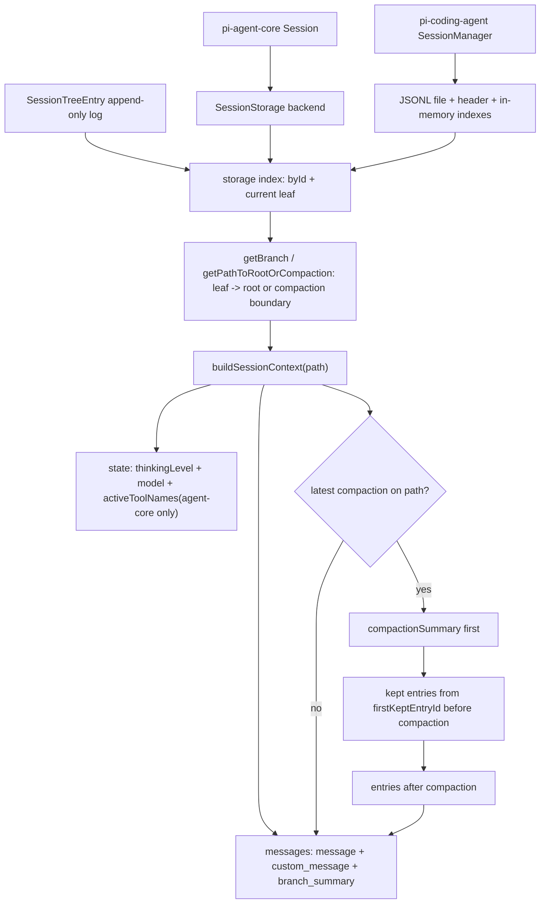

> `spine.session-state-model` 说明 pi 如何把 append-only session tree 解析成当前分支的 LLM context，并把 `pi-agent-core` 的通用 `Session` 与 `pi-coding-agent` 的产品级 `SessionManager` 分开看。

## 能回答的问题

- `SessionTreeEntry` 的 `id` / `parentId` / `leaf` 如何决定当前 branch？
- `buildSessionContext` 会把哪些 session entry 送进 LLM messages，哪些只改变状态或元数据？
- compaction、branch summary、custom message 在 context 中分别如何出现？
- `Session` / `SessionStorage` 属于 `pi-agent-core`，`SessionManager` 属于 `pi-coding-agent`，两者边界在哪里？
- coding-agent 恢复历史 session 时如何恢复 messages、model、thinking level？

```mermaid
flowchart TD
  A["SessionTreeEntry append-only log"] --> B["storage index: byId + current leaf"]
  B --> C["getBranch / getPathToRootOrCompaction: leaf -> root or compaction boundary"]
  C --> D["buildSessionContext(path)"]
  D --> E["messages: message + custom_message + branch_summary"]
  D --> F["state: thinkingLevel + model + activeToolNames(agent-core only)"]
  D --> G{"latest compaction on path?"}
  G -- "no" --> E
  G -- "yes" --> H["compactionSummary first"]
  H --> I["kept entries from firstKeptEntryId before compaction"]
  I --> J["entries after compaction"]
  J --> E
  K["pi-agent-core Session<TMetadata>"] --> L["SessionStorage backend"]
  L --> B
  M["pi-coding-agent SessionManager"] --> N["JSONL file + header + in-memory indexes"]
  N --> B
```

## 端到端步骤

1. `SessionTreeEntryBase` 定义所有会话树节点共同拥有 `type`、`id`、`parentId`、`timestamp`，所以 session history 的形状不是线性数组，而是由 `parentId` 连接出的 tree。[E: packages/agent/src/harness/types.ts:376] [E: packages/agent/src/harness/types.ts:377] [E: packages/agent/src/harness/types.ts:378] [E: packages/agent/src/harness/types.ts:379] `SessionTreeEntry` union 覆盖 message、thinking/model/tools change、compaction、branch summary、custom/custom_message、label、session_info、leaf 这些节点类型。[E: packages/agent/src/harness/types.ts:453] [E: packages/agent/src/harness/types.ts:454] [E: packages/agent/src/harness/types.ts:455] [E: packages/agent/src/harness/types.ts:456] [E: packages/agent/src/harness/types.ts:457] [E: packages/agent/src/harness/types.ts:458] [E: packages/agent/src/harness/types.ts:459] [E: packages/agent/src/harness/types.ts:460] [E: packages/agent/src/harness/types.ts:461] [E: packages/agent/src/harness/types.ts:462] [E: packages/agent/src/harness/types.ts:463] [E: packages/agent/src/harness/types.ts:464]

2. `pi-agent-core` 的 `Session<TMetadata>` 是薄 facade：它持有 `SessionStorage<TMetadata>`，读写入口基本都委托给 storage，例如 `getLeafId()`、`getEntry()`、`getEntries()` 直接返回 storage 结果。[E: packages/agent/src/harness/session/session.ts:150] [E: packages/agent/src/harness/session/session.ts:151] [E: packages/agent/src/harness/session/session.ts:168] [E: packages/agent/src/harness/session/session.ts:172] [E: packages/agent/src/harness/session/session.ts:176]

3. `Session.getBranch(fromId?)` 先选择 `fromId` 或 storage 当前 leaf，再调用 `storage.getPathToRootOrCompaction(leafId)`；该 contract 允许 backend 在 compaction boundary 截断历史，而不保证总是走到 root。`Session.buildContext()` 再把当前 branch 传给同文件的 `buildSessionContext()`。[E: packages/agent/src/harness/session/session.ts:180] [E: packages/agent/src/harness/session/session.ts:181] [E: packages/agent/src/harness/types.ts:512] [I]

4. `SessionStorage` 是 agent-core 的 durable boundary：它要求 storage 提供 metadata、leaf pointer、entry id creation、append/read/find、label lookup、path-to-root、entries list 等能力。[E: packages/agent/src/harness/types.ts:499] [E: packages/agent/src/harness/types.ts:500] [E: packages/agent/src/harness/types.ts:502] [E: packages/agent/src/harness/types.ts:503] [E: packages/agent/src/harness/types.ts:504] [E: packages/agent/src/harness/types.ts:505] [E: packages/agent/src/harness/types.ts:506] [E: packages/agent/src/harness/types.ts:509] [E: packages/agent/src/harness/types.ts:512] [E: packages/agent/src/harness/types.ts:513] 这让内存 storage 与 JSONL storage 都能服务同一个 `Session` API。[E: packages/agent/src/harness/session/memory-storage.ts:43] [E: packages/agent/src/harness/session/memory-storage.ts:44] [E: packages/agent/src/harness/session/jsonl-storage.ts:187]

5. `InMemorySessionStorage` 和 `JsonlSessionStorage` 都把普通 entry 的 leaf 更新成 entry 自身，把 `leaf` entry 的 leaf 更新成 `targetId`；这解释了为什么导航可以作为一条 append-only `leaf` entry 记录，而不是改写旧 entry。[E: packages/agent/src/harness/session/memory-storage.ts:40] [E: packages/agent/src/harness/session/memory-storage.ts:99] [E: packages/agent/src/harness/session/jsonl-storage.ts:135] [E: packages/agent/src/harness/session/jsonl-storage.ts:286]

6. `buildSessionContext(pathEntries)` 首先扫描当前 branch path，累积最后的 `thinking_level_change`、`model_change`、assistant message 的 provider/model、`active_tools_change` 和最新 compaction entry。[E: packages/agent/src/harness/session/session.ts:24] [E: packages/agent/src/harness/session/session.ts:44] [E: packages/agent/src/harness/session/session.ts:46] [E: packages/agent/src/harness/session/session.ts:48] [E: packages/agent/src/harness/session/session.ts:50] [E: packages/agent/src/harness/session/session.ts:52] [E: packages/agent/src/harness/session/session.ts:63]

7. context 的 message list 只从三类 entry 生成：`message` 原样 push，`custom_message` 经 `createCustomMessage()` 转成 agent message，`branch_summary` 在有 summary 时经 `createBranchSummaryMessage()` 转成 message；`custom`、`label`、`session_info`、`model_change`、`thinking_level_change`、`active_tools_change` 本身不会直接成为 LLM message。[E: packages/agent/src/harness/session/session.ts:44] [E: packages/agent/src/harness/session/session.ts:109] [E: packages/agent/src/harness/session/session.ts:110] [E: packages/agent/src/harness/session/session.ts:112] [E: packages/agent/src/harness/session/session.ts:114] [E: packages/agent/src/harness/session/session.ts:129] [E: packages/agent/src/harness/session/session.ts:130]

8. 如果当前 branch path 上有 compaction，`buildSessionContext` 先插入 `createCompactionSummaryMessage(summary, tokensBefore, timestamp)`，再追加 compaction 前从 `firstKeptEntryId` 开始的消息，最后追加 compaction 后的消息。[E: packages/agent/src/harness/session/session.ts:63] [E: packages/agent/src/harness/session/session.ts:63] [E: packages/agent/src/harness/session/session.ts:71] [E: packages/agent/src/harness/session/session.ts:82] [E: packages/agent/src/harness/session/session.ts:70] [E: packages/agent/src/harness/session/session.ts:86] [E: packages/agent/src/harness/session/session.ts:80] 没有 compaction 时，它按 branch path 顺序尝试 append 每个 entry。[E: packages/agent/src/harness/session/session.ts:82] [E: packages/agent/src/harness/session/session.ts:61] [E: packages/agent/src/harness/session/session.ts:83]

9. agent-core `SessionContext` 返回 `messages`、`thinkingLevel`、`model`、`activeToolNames`，其中 `activeToolNames` 来自 branch-scoped `active_tools_change` entry。[E: packages/agent/src/harness/types.ts:467] [E: packages/agent/src/harness/types.ts:468] [E: packages/agent/src/harness/types.ts:469] [E: packages/agent/src/harness/types.ts:470] [E: packages/agent/src/harness/session/session.ts:51] [E: packages/agent/src/harness/session/session.ts:52] [E: packages/agent/src/harness/session/session.ts:56] `AgentHarness.setActiveTools()` 和 `AgentHarness.setTools()` 会把 active tool changes 写入 session 或 pending session writes，pending writes flush 时也会追加为 session entry；因此这个字段是 agent-core harness 的 durable state，不是单纯 UI 状态。[E: packages/agent/src/harness/agent-harness.ts:926] [E: packages/agent/src/harness/agent-harness.ts:938] [E: packages/agent/src/harness/agent-harness.ts:940] [E: packages/agent/src/harness/agent-harness.ts:961] [E: packages/agent/src/harness/agent-harness.ts:967] [E: packages/agent/src/harness/agent-harness.ts:969] [E: packages/agent/src/harness/agent-harness.ts:521] [E: packages/agent/src/harness/agent-harness.ts:522]

10. `AgentHarness.createTurnState()` 每 turn 都调用 `session.buildContext()` 取 messages，并用 harness 当前的 `this.activeToolNames` 过滤工具；`createContext()` 把这些 messages 与 active tools 组成 `AgentContext` 传给 agent loop。[E: packages/agent/src/harness/agent-harness.ts:354] [E: packages/agent/src/harness/agent-harness.ts:355] [E: packages/agent/src/harness/agent-harness.ts:360] [E: packages/agent/src/harness/agent-harness.ts:393] [E: packages/agent/src/harness/agent-harness.ts:395] [E: packages/agent/src/harness/agent-harness.ts:395]

11. `pi-coding-agent` 的 `SessionManager` 是另一套产品级实现：它在 `packages/coding-agent/src/index.ts` 直接导出 `SessionManager`、`buildSessionContext` 与 entry types，来源是 `core/session-manager.ts`，不是 agent-core 的 `Session` 类。[E: packages/coding-agent/src/index.ts:213] [E: packages/coding-agent/src/index.ts:215] [E: packages/coding-agent/src/index.ts:233] [E: packages/coding-agent/src/index.ts:236] [E: packages/coding-agent/src/core/session-manager.ts:855] [I]

12. coding-agent `SessionManager` 管理 JSONL header、session file、cwd、flush 状态、`fileEntries`、`byId`、label caches 和 `leafId`；写入新 entry 时先把 entry 放入 `fileEntries` 和 `byId`，再把 `leafId` 推进到新 entry，而普通 append entry 的 `parentId` 来自当前 `leafId`。[E: packages/coding-agent/src/core/session-manager.ts:32] [E: packages/coding-agent/src/core/session-manager.ts:156] [E: packages/coding-agent/src/core/session-manager.ts:855] [E: packages/coding-agent/src/core/session-manager.ts:856] [E: packages/coding-agent/src/core/session-manager.ts:857] [E: packages/coding-agent/src/core/session-manager.ts:859] [E: packages/coding-agent/src/core/session-manager.ts:861] [E: packages/coding-agent/src/core/session-manager.ts:862] [E: packages/coding-agent/src/core/session-manager.ts:863] [E: packages/coding-agent/src/core/session-manager.ts:864] [E: packages/coding-agent/src/core/session-manager.ts:865] [E: packages/coding-agent/src/core/session-manager.ts:866] [E: packages/coding-agent/src/core/session-manager.ts:1044] [E: packages/coding-agent/src/core/session-manager.ts:1045] [E: packages/coding-agent/src/core/session-manager.ts:1046] [E: packages/coding-agent/src/core/session-manager.ts:1047] [E: packages/coding-agent/src/core/session-manager.ts:1058] [E: packages/coding-agent/src/core/session-manager.ts:1060] [E: packages/coding-agent/src/core/session-manager.ts:1061] `branch()` 只校验目标 entry 存在并把 `leafId` 设为该 entry id，未改写既有 `fileEntries`。[E: packages/coding-agent/src/core/session-manager.ts:1361] [E: packages/coding-agent/src/core/session-manager.ts:1364]

13. coding-agent `SessionManager.buildSessionContext()` 调用同文件的 `buildSessionContext(this.getEntries(), this.leafId, this.byId)`，而 coding-agent `SessionContext` 只有 `messages`、`thinkingLevel`、`model` 三个字段，没有 agent-core 的 `activeToolNames`。[E: packages/coding-agent/src/core/session-manager.ts:168] [E: packages/coding-agent/src/core/session-manager.ts:169] [E: packages/coding-agent/src/core/session-manager.ts:170] [E: packages/coding-agent/src/core/session-manager.ts:171] [E: packages/coding-agent/src/core/session-manager.ts:1284] [E: packages/coding-agent/src/core/session-manager.ts:1285] 因此 active tool durability 是 agent-core harness 能力；coding-agent 当前产品 SessionManager 的 context restore 不包含 active tool names。[I]

14. coding-agent session restore 在 `createAgentSession()` 中读取 `sessionManager.buildSessionContext()`，用 `messages.length` 判断是否有历史，并在没有显式 model 但 context 有 model 时尝试从 `ModelRegistry` 恢复模型。[E: packages/coding-agent/src/core/sdk.ts:188] [E: packages/coding-agent/src/core/sdk.ts:189] [E: packages/coding-agent/src/core/sdk.ts:196] [E: packages/coding-agent/src/core/sdk.ts:201] compaction 或 tree navigation 后，coding-agent 会重新调用 `buildSessionContext()` 并把 `sessionContext.messages` 写回 `agent.state.messages`。[E: packages/coding-agent/src/core/agent-session.ts:1848] [E: packages/coding-agent/src/core/agent-session.ts:1849] [E: packages/coding-agent/src/core/agent-session.ts:3033] [E: packages/coding-agent/src/core/agent-session.ts:3034]

## 关键决策点

### branch path 是事实来源

LLM context 不是从整个 JSONL 文件直接顺序读取，而是从 current leaf 回溯到 root 得到 branch path，再按 path 顺序抽取 messages 和 branch-scoped state。[E: packages/agent/src/harness/session/memory-storage.ts:163] [E: packages/agent/src/harness/session/memory-storage.ts:167] [E: packages/agent/src/harness/session/memory-storage.ts:169] [E: packages/agent/src/harness/session/memory-storage.ts:170] [E: packages/agent/src/harness/session/jsonl-storage.ts:350] [E: packages/agent/src/harness/session/jsonl-storage.ts:354] [E: packages/agent/src/harness/session/jsonl-storage.ts:356] [E: packages/agent/src/harness/session/jsonl-storage.ts:357] coding-agent 的 `getBranch()` 也从 `fromId ?? leafId` 沿 `parentId` 走到 root 再 reverse。[E: packages/coding-agent/src/core/session-manager.ts:1262] [E: packages/coding-agent/src/core/session-manager.ts:1264] [E: packages/coding-agent/src/core/session-manager.ts:1266] [E: packages/coding-agent/src/core/session-manager.ts:1268]

### entry type 决定是否进 LLM

`custom_message` 明确是“参与 context”的扩展消息，而 `custom` 是扩展状态；agent-core 的代码体现为 `custom_message` 被转换成 message，`custom` 没有 append path。[E: packages/agent/src/harness/types.ts:423] [E: packages/agent/src/harness/types.ts:429] [E: packages/agent/src/harness/session/session.ts:112] [E: packages/agent/src/harness/session/session.ts:114] coding-agent 的 `appendMessage()` 只处理 `message`、`custom_message`、`branch_summary` 三类，`custom` 没有 message append 分支；其中 `custom_message` 经 `createCustomMessage(...)` 转换后进入 `messages`。[E: packages/coding-agent/src/core/session-manager.ts:160] [E: packages/coding-agent/src/core/session-manager.ts:268] [E: packages/coding-agent/src/core/session-manager.ts:394] [E: packages/coding-agent/src/core/session-manager.ts:396] [E: packages/coding-agent/src/core/session-manager.ts:398] [E: packages/coding-agent/src/core/session-manager.ts:401] [E: packages/coding-agent/src/core/session-manager.ts:402]

### compaction 是 branch-local rewrite-on-read

`appendCompaction()` 只是追加一条 `compaction` entry；context builder 读到最新 compaction 后，用 summary + kept tail + later messages 组成新的 message view。[E: packages/agent/src/harness/session/session.ts:269] [E: packages/agent/src/harness/session/session.ts:270] [E: packages/agent/src/harness/session/session.ts:275] [E: packages/agent/src/harness/session/session.ts:276] [E: packages/agent/src/harness/session/session.ts:63] [E: packages/agent/src/harness/session/session.ts:63] [E: packages/agent/src/harness/session/session.ts:82] [E: packages/agent/src/harness/session/session.ts:70] [E: packages/agent/src/harness/session/session.ts:86] [E: packages/agent/src/harness/session/session.ts:80] 这种行为更像“read-time projection”，不是 session log mutation。[I]

### coding-agent 与 agent-core 的边界

`pi-agent-core` 提供可复用 `Session`、`SessionStorage`、`AgentHarness` 和 session repo/storage backend；`pi-coding-agent` 仍导出并在 SDK 创建路径中使用自己的 `SessionManager` 作为产品侧 persistence API。[E: packages/agent/src/index.ts:32] [E: packages/agent/src/index.ts:37] [E: packages/agent/src/index.ts:42] [E: packages/coding-agent/src/index.ts:213] [E: packages/coding-agent/src/index.ts:233] [E: packages/coding-agent/src/index.ts:236] [E: packages/coding-agent/src/core/sdk.ts:179] 从文件证据看，两者的数据模型高度同构但不是同一个 class hierarchy。[I]

## 指向 T1/T2 深挖

- `subsys.agent-core.session-tree` 应细化 `SessionStorage` backend、`leaf` entry、`JsonlSessionRepo` fork/list/delete 与 `Session.moveTo()` 的语义。
- `subsys.agent-core.tree-navigation` 应细化 `Session.moveTo()`、branch summary 生成、`session_tree` event，以及编辑历史时如何更新当前 leaf。
- `subsys.coding-agent.session-manager` 应细化产品级 JSONL header、migration、flush 策略、listing、fork/open/create、session selector 交互。
- `ref.coding-agent.session-format` 应列全 coding-agent JSONL entry schema、版本迁移和兼容字段。

## Sources

- packages/agent/src/harness/session/session.ts
- packages/agent/src/harness/types.ts
- packages/coding-agent/src/core/session-manager.ts

## 相关

- subsys.agent-core.session-tree
- subsys.agent-core.tree-navigation
- subsys.coding-agent.session-manager
- ref.coding-agent.session-format
