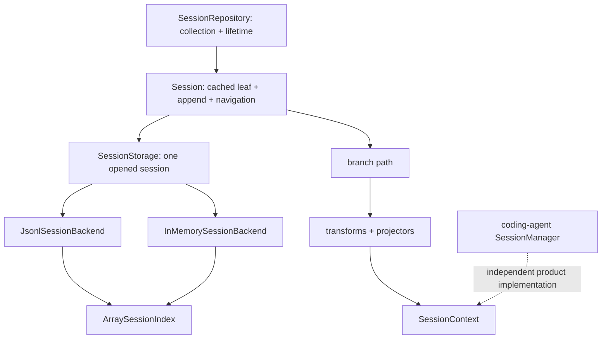

> `spine.session-state-model` 串起 `pi-agent-core` 的 repository → storage → `Session` → context 流程，并明确它与 `pi-coding-agent` 产品级 `SessionManager` 是两套相邻但独立的状态系统。

## 能回答的问题

- append-only entries 如何形成 branch 与 active leaf？
- repository、storage、`Session`、backend 各自负责什么？
- compaction 与 custom projection 如何改变送给模型的 context？
- JSONL 与 memory 实现共享什么语义？
- agent-core `Session` 与 coding-agent `SessionManager` 为什么不能混为一个 API？

```mermaid
flowchart TD
    R["SessionRepository: collection + lifetime"] --> S["Session: cached leaf + append + navigation"]
    S --> C["SessionStorage: one opened session"]
    C --> J["JsonlSessionBackend"]
    C --> M["InMemorySessionBackend"]
    J --> A["ArraySessionIndex"]
    M --> A
    S --> P["branch path"]
    P --> T["transforms + projectors"]
    T --> X["SessionContext"]
    CA["coding-agent SessionManager"] -. "independent product implementation" .-> X
```

## 端到端状态流

1. `SessionTreeEntryBase` 让每条记录拥有 type、id、parentId 与 timestamp；`SessionTreeEntry` union 包含 message、状态变化、compaction、branch summary、custom、label、session_info 与 leaf。[E: packages/agent/src/harness/types.ts:375] [E: packages/agent/src/harness/types.ts:377] [E: packages/agent/src/harness/types.ts:378] [E: packages/agent/src/harness/types.ts:453] [E: packages/agent/src/harness/types.ts:464]
2. `SessionRepository` 管 collection create/open/list/delete/fork，并通过 `AsyncDisposable` 拥有 backend lifetime。[E: packages/agent/src/harness/session/repository.ts:22] [E: packages/agent/src/harness/session/repository.ts:26] [E: packages/agent/src/harness/session/repository.ts:27] [E: packages/agent/src/harness/session/repository.ts:31]
3. repository 打开一个 `SessionStorage` 后，以 `createSession()` 读取 durable head，构造缓存 metadata/leaf 的 `Session`。[E: packages/agent/src/harness/session/session.ts:152] [E: packages/agent/src/harness/session/session.ts:166] [E: packages/agent/src/harness/session/session.ts:425] [E: packages/agent/src/harness/session/session.ts:429]
4. `Session.enqueueAppend()` 生成唯一 entry id，以当前 leaf 为 parent，等待 storage append 成功后才更新缓存 leaf；并发 append 由 `appendTail` 串行。[E: packages/agent/src/harness/session/session.ts:229] [E: packages/agent/src/harness/session/session.ts:237] [E: packages/agent/src/harness/session/session.ts:243] [E: packages/agent/src/harness/session/session.ts:246] [E: packages/agent/src/harness/session/session.ts:250]
5. `SessionStorage` 只提供单会话 persistence 原语：head、entry/cursor、append、branch/path 查询和 projection；entry id 与 leaf mutation 不再属于 storage contract。[E: packages/agent/src/harness/types.ts:559] [E: packages/agent/src/harness/types.ts:562] [E: packages/agent/src/harness/types.ts:565] [E: packages/agent/src/harness/types.ts:567] [E: packages/agent/src/harness/types.ts:570]
6. JSONL 与 memory backend 都把 entries 放入 `ArraySessionIndex`。该索引以最后 append 的普通 entry 或 leaf target 计算 active head，同时维护 name/label/stats projection。[E: packages/agent/src/harness/session/jsonl-repo.ts:213] [E: packages/agent/src/harness/session/memory-repo.ts:24] [E: packages/agent/src/harness/session/array-session-index.ts:72] [E: packages/agent/src/harness/session/array-session-index.ts:78] [E: packages/agent/src/harness/session/array-session-index.ts:159]
7. `Session.getBranch()` 从指定 entry 或 active leaf 读取到 root/compaction boundary 的 path；有界查询另由 `findEntriesOnBranch()` 提供 stop/filter/order/limit。[E: packages/agent/src/harness/session/session.ts:184] [E: packages/agent/src/harness/session/session.ts:188] [E: packages/agent/src/harness/session/array-session-index.ts:167] [E: packages/agent/src/harness/session/array-session-index.ts:176]
8. context state 从原始 path 派生；默认 entry transform 以最后一个 compaction 重组 message 输入，之后再执行宿主 transforms 与 custom-entry projectors。[E: packages/agent/src/harness/session/session.ts:41] [E: packages/agent/src/harness/session/session.ts:61] [E: packages/agent/src/harness/session/session.ts:94] [E: packages/agent/src/harness/session/session.ts:134]
9. `buildSessionContext()` 把 message、custom_message、compaction、非空 branch_summary 和投影后的 custom entries 转成 `AgentMessage[]`，再与 thinking/model/active tools state 合并。[E: packages/agent/src/harness/session/session.ts:105] [E: packages/agent/src/harness/session/session.ts:125] [E: packages/agent/src/harness/session/session.ts:131] [E: packages/agent/src/harness/session/session.ts:140] [E: packages/agent/src/harness/session/session.ts:149]
10. JSONL repository 把文件作为 durable truth，memory repository 只保存进程内 map；两者均通过相同 `Session` API 暴露行为。[E: packages/agent/src/harness/session/jsonl-repo.ts:445] [E: packages/agent/src/harness/session/jsonl-repo.ts:457] [E: packages/agent/src/harness/session/memory-repo.ts:132] [E: packages/agent/src/harness/session/memory-repo.ts:142]

## 关键决策点

### Branch 是 parent path，不是 append-order history

`readEntries()` 返回 append-order log；branch traversal 从 leaf 沿 parentId 向上，并检测 cycle 与 missing parent。[E: packages/agent/src/harness/session/array-session-index.ts:112] [E: packages/agent/src/harness/session/array-session-index.ts:123] [E: packages/agent/src/harness/session/array-session-index.ts:128] [E: packages/agent/src/harness/session/array-session-index.ts:138] 导航通过 append `leaf` entry 记录，所以旧 entries 不被改写。[E: packages/agent/src/harness/session/session.ts:257] [E: packages/agent/src/harness/session/session.ts:262]

### Context 是投影，不是 storage dump

state entry 可改变 thinking/model/tools，却不一定成为 message；custom entry 默认不进入 context，只有注册 projector 才能产出消息。[E: packages/agent/src/harness/session/session.ts:46] [E: packages/agent/src/harness/session/session.ts:53] [E: packages/agent/src/harness/session/session.ts:134] 这使持久化记录可比模型输入更丰富。[I]

### 两套 session 系统必须分层

`pi-agent-core` 的 `Session` 是 async、repository-backed 的可复用 harness API。`pi-coding-agent` 的 `SessionManager` 自己维护 fileEntries、byId、labels 与 leafId，并同步实现 `getBranch()`/`buildSessionContext()`。[E: packages/coding-agent/src/core/session-manager.ts:855] [E: packages/coding-agent/src/core/session-manager.ts:862] [E: packages/coding-agent/src/core/session-manager.ts:866] [E: packages/coding-agent/src/core/session-manager.ts:1260] [E: packages/coding-agent/src/core/session-manager.ts:1284] 两层概念相似，但类型、持久化入口与恢复逻辑不是同一个实现。[I]

## Gotcha

- `Session` 缓存 active leaf；直接把同一 backend storage 打开成多个 handle 时，各 handle 的缓存不会自动互相刷新。[E: packages/agent/src/harness/session/session.ts:155] [E: packages/agent/src/harness/session/session.ts:174] [E: packages/agent/src/harness/session/session.ts:247] [I]
- `readPathToRootOrCompaction()` 可因 retained tail 或 first-kept boundary 提前停止；它不是无条件的完整 root path。[E: packages/agent/src/harness/session/array-session-index.ts:176] [E: packages/agent/src/harness/session/array-session-index.ts:177] [E: packages/agent/src/harness/session/array-session-index.ts:178]
- JSONL list 对 malformed header 失败，不会静默跳过坏文件。[E: packages/agent/src/harness/session/jsonl-repo.ts:263] [E: packages/agent/src/harness/session/jsonl-repo.ts:270]

## 深挖节点

- [subsys.agent-core.session-storage](../subsystems/agent-core/session-storage.md)：repository/storage/Session contract 与共享 queue/index。
- [subsys.agent-core.tree-navigation](../subsystems/agent-core/tree-navigation.md)：branch query、moveTo 与 context pipeline。
- [subsys.agent-core.jsonl-storage](../subsystems/agent-core/jsonl-storage.md)：JSONL 格式、并发与 fork。
- [subsys.agent-core.memory-storage](../subsystems/agent-core/memory-storage.md)：进程内 state 与 lifecycle。
- [subsys.coding-agent.session-manager](../subsystems/coding-agent/session-manager.md)：产品级 `SessionManager`。

## Sources

- packages/agent/src/harness/types.ts
- packages/agent/src/harness/session/repository.ts
- packages/agent/src/harness/session/session.ts
- packages/agent/src/harness/session/array-session-index.ts
- packages/agent/src/harness/session/jsonl-repo.ts
- packages/agent/src/harness/session/memory-repo.ts
- packages/coding-agent/src/core/session-manager.ts

## 相关

- [subsys.agent-core.session-tree](../subsystems/agent-core/session-tree.md)：agent-core entry union。
- [ref.coding-agent.session-format](../reference/session-format.md)：coding-agent 产品文件格式。
