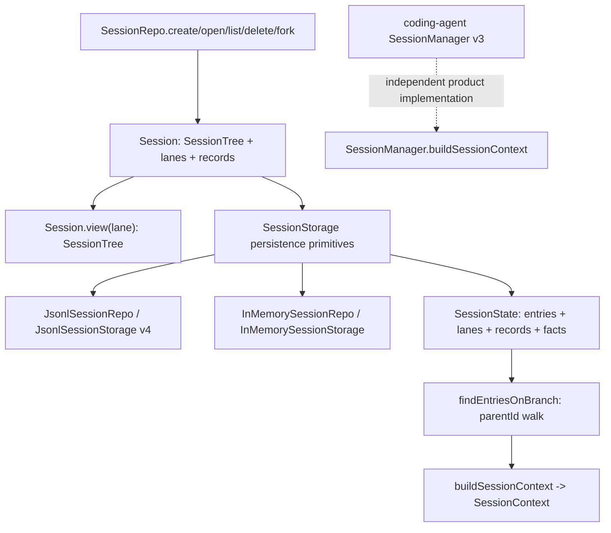

> `spine.session-state-model` 串起 `pi-agent-core` harness v4 的 `SessionRepo` → `SessionStorage` → `Session` → lane-based `Entry` / `LaneRecord` → `buildSessionContext` 流程，并明确它与 `pi-coding-agent` 产品级 `SessionManager`（`CURRENT_SESSION_VERSION = 3`）是两套相邻但独立的状态系统。

## 能回答的问题

- harness v4 的 `Entry` 与 `LaneRecord` 分别记录什么？lane 如何决定 `parentId`？
- `SessionRepo`、`SessionStorage`、`Session`、`SessionTree` 各自负责什么？
- `JsonlSessionRepo` 与 `InMemorySessionRepo` 共享什么语义？
- compaction 与 custom projector 如何改变送给模型的 context？
- coding-agent `SessionManager` 为什么不能和 harness `Session` 混为一个 API？

```mermaid
flowchart TD
    Repo["SessionRepo.create/open/list/delete/fork"] --> Sess["Session: SessionTree + lanes + records"]
    Sess --> View["Session.view(lane): SessionTree"]
    Sess --> Store["SessionStorage persistence primitives"]
    Store --> Jsonl["JsonlSessionRepo / JsonlSessionStorage v4"]
    Store --> Mem["InMemorySessionRepo / InMemorySessionStorage"]
    Store --> State["SessionState: entries + lanes + records + facts"]
    State --> Branch["findEntriesOnBranch: parentId walk"]
    Branch --> Ctx["buildSessionContext -> SessionContext"]
    CA["coding-agent SessionManager v3"] -. "independent product implementation" .-> ProductCtx["SessionManager.buildSessionContext"]
```

## 端到端状态流

1. harness `EntryBase` 让每条 tree 记录拥有 `type`、`id`、`seq`、`parentId` 与 `timestamp`；`seq` / `parentId` / `timestamp` 由 storage 赋值。`Entry` union 包含 `message`、`model_change`、`thinking_level_change`、`active_tools_change`、`compaction`、`branch_summary`、`custom`。[E: packages/agent/src/harness/session/types.ts:14] [E: packages/agent/src/harness/session/types.ts:67]
2. `ProvisionedEntry` 是写入前的 entry：调用方提供 type / id / payload，省略 `parentId` / `seq` / `timestamp`。[E: packages/agent/src/harness/session/types.ts:76]
3. `LaneRecord` 是与 tree 并行的 operation log，不是 branch 上的 entry。它覆盖 `operation_started` / `abort_requested` / `operation_finished` / `step_attempt` / `tool_started` / `queue_enqueued` / `queue_cancelled` / `write_deferred` / `usage`。[E: packages/agent/src/harness/session/types.ts:203]
4. `SessionStorage` 只提供单会话 persistence 原语：lane CRUD、`appendEntry` / `appendRecord`、entry / record / open-operation / log 查询，以及 name / label / stats 这类 global facts。[E: packages/agent/src/harness/session/types.ts:290] [E: packages/agent/src/harness/session/types.ts:294] [E: packages/agent/src/harness/session/types.ts:299]
5. `SessionRepo` 管 collection lifetime：`create` / `open` / `list` / `delete` / `fork`。`open` 打开会话并获取 backend writer claim；`list` 不打开会话、不拿 writer claim。[E: packages/agent/src/harness/session/types.ts:361] [E: packages/agent/src/harness/session/types.ts:366]
6. `Session` 包装一份 `SessionStorage`，实现 `SessionTree`。默认 lane 是 `"main"`：`getLeafId()` / `appendMessage()` / `findEntriesOnBranch()` 都作用在 `main`；`view(lane)` 对非 `main` lane 返回另一个 `SessionTree`。[E: packages/agent/src/harness/session/session.ts:102] [E: packages/agent/src/harness/session/session.ts:115] [E: packages/agent/src/harness/session/session.ts:134]
7. `appendMessage` / `appendCustomEntry` 生成 id 后走 `commitEntry` → `storage.appendEntry`。storage 用当前 lane leaf 填 `parentId`，用 `nextSequence` 填 `seq`，用 `Date.now()` 填 `timestamp`。[E: packages/agent/src/harness/session/session.ts:271] [E: packages/agent/src/harness/session/session.ts:286] [E: packages/agent/src/harness/session/memory.ts:59]
8. `SessionState` 默认就有 `main` lane，leaf 为 `null`。append entry 时要求 `parentId` 等于该 lane 当前 leaf，然后把 leaf 推进到新 entry id。`moveLane` 通过 `{ kind: "lane" }` mutation 改 leaf，不改写旧 entries。[E: packages/agent/src/harness/session/state.ts:57] [E: packages/agent/src/harness/session/state.ts:112] [E: packages/agent/src/harness/session/state.ts:121] [E: packages/agent/src/harness/session/state.ts:156]
9. branch 查询从 `start`（默认 lane leaf）沿 `parentId` 走向 root；`walkToRoot` 检测 cycle 与 missing parent，并可用 `stopAtId` / `stopAtType` 提前结束。[E: packages/agent/src/harness/session/session.ts:243] [E: packages/agent/src/harness/session/state.ts:301] [E: packages/agent/src/harness/session/state.ts:310]
10. `buildSessionContext()` 先从完整 path 派生 thinking / model / active tools，再跑 `defaultContextEntryTransform`（从最后一个 `compaction` 截断）和可选 host transforms，最后把 message / compaction / 非空 branch_summary / 注册过 projector 的 custom entry 投影成 `AgentMessage[]`。[E: packages/agent/src/harness/session/context.ts:25] [E: packages/agent/src/harness/session/context.ts:45] [E: packages/agent/src/harness/session/context.ts:90]
11. `JsonlSessionRepo` 把新会话写成 `JsonlV4Header`（`kind: "header"`、`version: 4`），再交给 `JsonlSessionStorage.create`；`open` 加载已有文件并校验 header id。public 入口从 `jsonl.ts` re-export `JsonlSessionRepo` 与 header / options 类型。[E: packages/agent/src/harness/session/jsonl/repo.ts:109] [E: packages/agent/src/harness/session/jsonl/repo.ts:209] [E: packages/agent/src/harness/session/jsonl/types.ts:47] [E: packages/agent/src/harness/session/jsonl.ts:1]
12. `InMemorySessionRepo` 用进程内 `Map<id, InMemorySessionStorage>` 实现同一 `SessionRepo` contract；`create` / `open` / `fork` 都返回 `new Session(storage)`。[E: packages/agent/src/harness/session/memory.ts:148] [E: packages/agent/src/harness/session/memory.ts:151] [E: packages/agent/src/harness/session/memory.ts:163]
13. harness session 的 public barrel 是 `packages/agent/src/harness/session/index.ts`：导出 `JsonlSessionRepo`、memory 实现、`Session` 与 types。[E: packages/agent/src/harness/session/index.ts:10]

## 关键决策点

### Branch 是 parent path，不是 append-order history

`findEntries()` 按 `seq` 返回 session-wide log；branch traversal 从 leaf 沿 `parentId` 向上，并检测 cycle 与 missing parent。[E: packages/agent/src/harness/session/state.ts:186] [E: packages/agent/src/harness/session/state.ts:301] 导航通过 `moveLane` 改 lane pointer，所以旧 entries 不被改写。[E: packages/agent/src/harness/session/types.ts:296] [E: packages/agent/src/harness/session/state.ts:156]

### Context 是投影，不是 storage dump

state entry（`thinking_level_change` / `model_change` / `active_tools_change`）会改变 `SessionContext` 的 thinking / model / tools，却不一定成为 message；`custom` entry 默认不进入 context，只有注册 `entryProjectors[customType]` 才能产出消息。[E: packages/agent/src/harness/session/context.ts:31] [E: packages/agent/src/harness/session/context.ts:84] 这使持久化记录可比模型输入更丰富。[I]

### LaneRecord 不进入 LLM context

`LaneRecord` 记录 run / compaction / navigation 的 operation 生命周期、tool start、queue 与 usage；`buildSessionContext()` 只消费 `Entry[]`，不读 records。[E: packages/agent/src/harness/session/types.ts:203] [E: packages/agent/src/harness/session/context.ts:90] 未完成 operation 通过 `findOpenOperations(lane, options?)` 查询；memory / JSONL storage 在再开 `operation_started` 前会先用 `limit: 1` 检查当前 lane 是否已有 open operation。[E: packages/agent/src/harness/session/types.ts:317] [E: packages/agent/src/harness/session/memory.ts:75]

### 两套 session 系统必须分层

`pi-agent-core` 的 `Session` 是 async、`SessionRepo`-backed 的可复用 harness API，JSONL 格式是 v4 header + mutation log。`pi-coding-agent` 的 `SessionManager` 自己维护 `fileEntries`、`byId`、labels 与 `leafId`，`CURRENT_SESSION_VERSION = 3`，并同步实现 `getBranch()` / `buildSessionContext()`。[E: packages/coding-agent/src/core/session-manager.ts:30] [E: packages/coding-agent/src/core/session-manager.ts:855] [E: packages/coding-agent/src/core/session-manager.ts:862] [E: packages/coding-agent/src/core/session-manager.ts:866] [E: packages/coding-agent/src/core/session-manager.ts:1260] [E: packages/coding-agent/src/core/session-manager.ts:1284] 两层概念相似，但类型、持久化入口与恢复逻辑不是同一个实现。[I]

产品 `SessionManager.appendMessage()` 自己把 `parentId` 写成 `this.leafId` 再 `_appendEntry` 推进 leaf；harness 则把 `parentId` 交给 storage，按 lane leaf 赋值。[E: packages/coding-agent/src/core/session-manager.ts:1061] [E: packages/agent/src/harness/session/memory.ts:60]

## Gotcha

- `Session.view(lane)` 对 `"main"` 直接返回 `this`；对其他 lane 返回一个只把 branch / append 绑到该 lane 的 `SessionTree`。全局 facts（name / label / stats）仍共享同一 storage。[E: packages/agent/src/harness/session/session.ts:115]
- `findEntriesOnBranch()` 在 storage 层要求显式 `start`；默认到 lane leaf 是 `Session` / `SessionTree` 的 view sugar。[E: packages/agent/src/harness/session/types.ts:306] [E: packages/agent/src/harness/session/session.ts:250]
- `walkToRoot` 遇到 cycle 或 missing parent 会抛 `SessionError`，不会静默截断。[E: packages/agent/src/harness/session/state.ts:311] [E: packages/agent/src/harness/session/state.ts:318]
- `listJsonlSessionMetadata()` 对空文件或 `parseHeader` 失败的 `.jsonl` 选择 `continue`，不会因单个 malformed header 让整个 list 失败。[E: packages/agent/src/harness/session/jsonl/repo.ts:80]
- `JsonlSessionRepo` 新文件只写 `version: 4`；`decodeHeader` 在 `version !== 4` 时抛 unsupported session version。coding-agent 产品 JSONL 仍是 `CURRENT_SESSION_VERSION = 3`，不能把两种文件互相当同一 schema 打开。[E: packages/agent/src/harness/session/jsonl/types.ts:49] [E: packages/agent/src/harness/session/jsonl/codec.ts:73] [E: packages/coding-agent/src/core/session-manager.ts:30]
- 可选 `@earendil-works/pi-session-backend-sqlite-node` 实现同一 `SessionRepo` seam；CLI 默认路径不经过它。[I]

## 深挖节点

- [subsys.agent-core.session-storage](../subsystems/agent-core/session-storage.md)：`SessionRepo` / `SessionStorage` / `Session` contract。
- [subsys.agent-core.tree-navigation](../subsystems/agent-core/tree-navigation.md)：branch query、lane move 与 context pipeline。
- [subsys.agent-core.jsonl-storage](../subsystems/agent-core/jsonl-storage.md)：JSONL v4 格式、并发与 fork。
- [subsys.agent-core.memory-storage](../subsystems/agent-core/memory-storage.md)：进程内 state 与 lifecycle。
- [subsys.coding-agent.session-manager](../subsystems/coding-agent/session-manager.md)：产品级 `SessionManager` v3。
- [subsys.session-backends.sqlite-node](../subsystems/session-backends/sqlite-node.md)：可选 SQLite `SessionRepo`。

## Sources

- packages/agent/src/harness/session/types.ts
- packages/agent/src/harness/session/session.ts
- packages/agent/src/harness/session/index.ts
- packages/agent/src/harness/session/jsonl.ts
- packages/agent/src/harness/session/jsonl/repo.ts
- packages/agent/src/harness/session/jsonl/types.ts
- packages/agent/src/harness/session/jsonl/codec.ts
- packages/agent/src/harness/session/memory.ts
- packages/agent/src/harness/session/context.ts
- packages/agent/src/harness/session/state.ts
- packages/coding-agent/src/core/session-manager.ts

## 相关

- [subsys.agent-core.session-tree](../subsystems/agent-core/session-tree.md)：harness `Entry` union。
- [subsys.agent-core.session-storage](../subsystems/agent-core/session-storage.md)：`SessionRepo` / `SessionStorage` / `Session` contract。
- [subsys.agent-core.tree-navigation](../subsystems/agent-core/tree-navigation.md)：branch query、lane move 与 context pipeline。
- [subsys.agent-core.jsonl-storage](../subsystems/agent-core/jsonl-storage.md)：JSONL v4 格式、并发与 fork。
- [subsys.agent-core.memory-storage](../subsystems/agent-core/memory-storage.md)：进程内 state 与 lifecycle。
- [subsys.coding-agent.session-manager](../subsystems/coding-agent/session-manager.md)：产品级 `SessionManager` v3。
- [subsys.session-backends.sqlite-node](../subsystems/session-backends/sqlite-node.md)：可选 SQLite `SessionRepo`。
- [ref.coding-agent.session-format](../reference/session-format.md)：coding-agent 产品文件格式。
