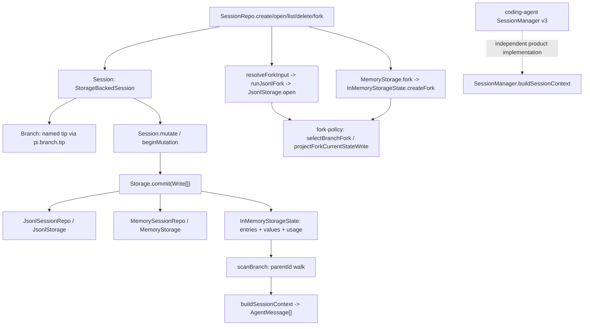

> `spine.session-state-model` 串起 `pi-agent-core` 的 `SessionRepo` → `Storage` → `Session` / `Branch` → `commit(Write[])` 流程：tree 只存 `Entry`，branch tip / lane 配置 / 操作态走 `values.ts` 地址；fork 在 JSONL 上是 `resolveForkInput` → `runJsonlFork` → `JsonlStorage.open`，在 memory 上是 `MemoryStorage.fork` / `InMemoryStorageState.createFork`；并明确它与 `pi-coding-agent` 产品级 `SessionManager`（`CURRENT_SESSION_VERSION = 3`）是两套相邻但独立的状态系统。

## 能回答的问题

- harness `Entry` 现在有哪些 type？lane 配置还是不是 tree entry？
- `SessionRepo`、`Storage`、`Session`、`Branch` 各自负责什么？
- `JsonlSessionRepo` 与 `MemorySessionRepo` 共享什么语义，fork 各走哪条路径？
- `buildSessionContext()` 如何把一条 parent path 投影成模型消息？
- coding-agent `SessionManager` 为什么不能和 harness `Session` 混为一个 API？

```mermaid
flowchart TD
    Repo["SessionRepo.create/open/list/delete/fork"] --> Sess["Session: StorageBackedSession"]
    Sess --> Branch["Branch: named tip via pi.branch.tip"]
    Sess --> Mut["Session.mutate / beginMutation"]
    Mut --> Store["Storage.commit(Write[])"]
    Store --> Jsonl["JsonlSessionRepo / JsonlStorage"]
    Store --> Mem["MemorySessionRepo / MemoryStorage"]
    Store --> State["InMemoryStorageState: entries + values + usage"]
    Repo --> JsonlFork["resolveForkInput -> runJsonlFork -> JsonlStorage.open"]
    Repo --> MemFork["MemoryStorage.fork -> InMemoryStorageState.createFork"]
    JsonlFork --> Policy["fork-policy: selectBranchFork / projectForkCurrentStateWrite"]
    MemFork --> Policy
    State --> Walk["scanBranch: parentId walk"]
    Walk --> Ctx["buildSessionContext -> AgentMessage[]"]
    CA["coding-agent SessionManager v3"] -. "independent product implementation" .-> ProductCtx["SessionManager.buildSessionContext"]
```

## 端到端状态流

1. harness `EntryBase` 让每条 tree 记录拥有 `id`、`parentId`、`seq`、`timestamp` 与 `type`。`EntryType` 只有 `message` / `compaction` / `branch_summary` / `custom`；模型、thinking、active tools 不再是 tree entry。[E: packages/agent/src/harness/session/types.ts:16] [E: packages/agent/src/harness/session/types.ts:18] [E: packages/agent/src/harness/session/types.ts:64]
2. `NewEntry` 是写入前的 entry：调用方提供 `id` / `parentId` / type / payload，省略 `seq` 与 `timestamp`。storage 在 `commitWrite` 里补这两项。[E: packages/agent/src/harness/session/types.ts:67] [E: packages/agent/src/harness/session/commit.ts:61]
3. 可寻址状态在 `values.ts`：`pi.branch.tip` 存 branch leaf，`pi.lane.config` / `pi.lane.state` 存 AgentLane 配置与 inbox，`pi.op.*` / `pi.result` / `pi.pending.*` 存操作态，`pi.session.name` 与 `pi.entry.label` 存 name/label。[E: packages/agent/src/harness/session/values.ts:158] [E: packages/agent/src/harness/session/values.ts:160] [E: packages/agent/src/harness/session/values.ts:194]
4. `Storage` 是单会话 persistence 原语：`commit(writes)`、按 id 读 entry、value/list 读写、`scanBranch` / `scanEntries` / `scanUsage`、`getStats`、`close`。[E: packages/agent/src/harness/session/types.ts:456] [E: packages/agent/src/harness/session/types.ts:456]
5. `SessionRepo` 管 collection lifetime：`create` / `open` / `list` / `delete` / `fork`。每个方法都带 `Context`。[E: packages/agent/src/harness/session/types.ts:592] [E: packages/agent/src/harness/session/types.ts:597]
6. `Session` 是面向调用方的 facade：实现 `SessionReader`，再提供 `branch` / `createBranch`、`beginMutation` / `mutate`、value/list writer 与 name/label。包内实现是 `StorageBackedSession`。[E: packages/agent/src/harness/session/types.ts:530] [E: packages/agent/src/harness/session/session.ts:224]
7. `Branch.appendMessage` / `appendCustomEntry` 走 `appendToBranch`：生成 id，读 `branchTip(name)` 作 `parentId`，一次 `commit` 写入 entry 并把 tip 推进到新 id。[E: packages/agent/src/harness/session/session.ts:210] [E: packages/agent/src/harness/session/session.ts:433]
8. 新建会话**没有**隐式 `main` branch。conformance 断言 `create` 之后 `branch("main")` 与 `laneConfig("main")` 都是 `undefined`，必须 `createBranch`。[E: packages/agent/src/harness/session/testing/conformance/session-repo.ts:159] [E: packages/agent/src/harness/session/session.ts:355]
9. memory / JSONL 共用 `InMemoryStorageState`：从 `nextSeq = 1` 起步，`prepareCommit` 赋 seq/timestamp，`applyValidated` 更新 entries / values / usage / stats。[E: packages/agent/src/harness/session/in-memory-storage-state.ts:94] [E: packages/agent/src/harness/session/in-memory-storage-state.ts:94] [E: packages/agent/src/harness/session/in-memory-storage-state.ts:97]
10. branch 查询从显式 `start` 沿 `parentId` 走向 root；缺 parent 抛 `Corrupt branch: missing parent`。`Session.scanBranch` 要求 `StorageBranchScan.start`；`Branch.findEntries` 用 tip 补默认 start。[E: packages/agent/src/harness/session/in-memory-storage-state.ts:274] [E: packages/agent/src/harness/session/in-memory-storage-state.ts:283] [E: packages/agent/src/harness/session/session.ts:198]
11. `buildSessionContext()` 先 `buildContextEntries`（从最后一条 `compaction` 截断），再把 message / compaction / 非空 branch_summary / 注册过 projector 的 custom entry 投影成 `AgentMessage[]`。它不再返回 thinking / model / tools；那些在 `LaneConfiguration`。[E: packages/agent/src/harness/session/context.ts:10] [E: packages/agent/src/harness/session/context.ts:47] [E: packages/agent/src/harness/session/types.ts:69]
12. `JsonlSessionRepo` 把新会话写成 `JsonlStorageHeader`（`kind: "header"`、`v: 4`、`storageVersion: 1`），再交给 `JsonlStorage.create`。公开入口是 `jsonl/index.ts`。[E: packages/agent/src/harness/session/jsonl/types.ts:4] [E: packages/agent/src/harness/session/jsonl/repo.ts:74] [E: packages/agent/src/harness/session/jsonl/index.ts:1]
13. JSONL fork：`resolveForkInput` 得到 `open` / `closed` / `legacy-v3`，再 `runJsonlFork` 两趟流式写出 destination，最后 `JsonlStorage.open`。已打开的 legacy v3 拒绝 fork；未打开的 v3 可以。[E: packages/agent/src/harness/session/jsonl/repo.ts:165] [E: packages/agent/src/harness/session/jsonl/repo.ts:176] [E: packages/agent/src/harness/session/jsonl/repo.ts:305]
14. `MemorySessionRepo` 用进程内 `Map<id, MemorySessionRecord>` 实现同一 `SessionRepo` contract。fork 走 `MemoryStorage.fork` → `InMemoryStorageState.createFork`，不经 snapshot 数组。[E: packages/agent/src/harness/session/memory.ts:334] [E: packages/agent/src/harness/session/memory.ts:409] [E: packages/agent/src/harness/session/in-memory-storage-state.ts:141]
15. 两条生产 fork 都调用 `selectBranchFork` / `projectForkCurrentStateWrite`：始终复制 `pi.session.name`；排除 `pi.result`、`pi.op.*`、`pi.pending.*` 与全部 usage；lane state 复制但重置 operation/inbox。`createForkSnapshot` 仍从 barrel 导出，生产 repo 不用。[E: packages/agent/src/harness/session/fork-policy.ts:46] [E: packages/agent/src/harness/session/fork-policy.ts:59] [E: packages/agent/src/harness/session/index.ts:13]
16. harness session 的 public barrel 是 `packages/agent/src/harness/session/index.ts`：导出 `JsonlSessionRepo`、`MemorySessionRepo`、`StorageBackedSession`、types、values 与 `createForkSnapshot`。[E: packages/agent/src/harness/session/index.ts:13] [E: packages/agent/src/harness/session/index.ts:20] [E: packages/agent/src/harness/session/index.ts:24]

## 关键决策点

### Branch 是 parent path，不是 append-order history

`Session.findEntries()` 按 seq 扫 session-wide log（`scanEntries`）；branch traversal 从 tip 沿 `parentId` 向上。[E: packages/agent/src/harness/session/session.ts:318] [E: packages/agent/src/harness/session/in-memory-storage-state.ts:273] 导航通过 `setValue(branchTip(name), id)` 改 tip，不改写旧 entries。[E: packages/agent/src/harness/session/session.ts:365] [E: packages/agent/src/harness/session/values.ts:158]

### Context 是投影，不是 storage dump

`buildSessionContext()` 只消费 `Entry[]`，返回 `AgentMessage[]`。`custom` 默认不进入 context，只有注册 `entryProjectors[customType]` 才能产出消息。[E: packages/agent/src/harness/session/context.ts:43] [E: packages/agent/src/harness/session/context.ts:60] thinking / model / tools 存在 `pi.lane.config`，不靠 tree 上的 change entry。[E: packages/agent/src/harness/session/values.ts:160] [I]

### 操作态不进入 LLM context

durable operation 写在 `pi.op.meta` / `pi.op.state` / `pi.result` 等 value 地址上，不是 tree node。`buildSessionContext()` 不读这些地址。[E: packages/agent/src/harness/session/values.ts:164] [E: packages/agent/src/harness/session/context.ts:47] [I]

### Fork 共享政策、不共享 IO

JSONL 必须两趟读文件（index 结构 + stream 投影），memory 直接迭代 maps。复制/排除规则在 `fork-policy.ts`，不在某个 backend 私有 snapshot 类型里。详见 [subsys.agent-core.jsonl-storage](../subsystems/agent-core/jsonl-storage.md) 与 [subsys.agent-core.memory-storage](../subsystems/agent-core/memory-storage.md)。[E: packages/agent/src/harness/session/jsonl/fork.ts:305] [E: packages/agent/src/harness/session/in-memory-storage-state.ts:141] [I]

### 两套 session 系统必须分层

`pi-agent-core` 的 `Session` 是 async、`SessionRepo`-backed、`Context`-scoped 的可复用 harness API；JSONL 是 `v: 4` header + commit 事务行，`storageVersion` 为 1。`pi-coding-agent` 的 `SessionManager` 自己维护 `fileEntries`、`byId`、labels 与 `leafId`，`CURRENT_SESSION_VERSION = 3`，并同步实现 `getBranch()` / `buildSessionContext()`。[E: packages/coding-agent/src/core/session-manager.ts:30] [E: packages/coding-agent/src/core/session-manager.ts:1274] [E: packages/coding-agent/src/core/session-manager.ts:1298] 两层概念相似，但类型、持久化入口与恢复逻辑不是同一个实现。[I]

产品 `SessionManager.appendMessage()` 自己把 `parentId` 写成 `this.leafId` 再 `_appendEntry` 推进 leaf；harness `Branch.appendMessage` 在 mutation 里读 `branchTip` 再 `commit`。[E: packages/coding-agent/src/core/session-manager.ts:1075] [E: packages/agent/src/harness/session/session.ts:433]

## Gotcha

- `create()` 不会自动建 `main`。调用方或 `AgentHarness.lane()` 必须 `createBranch`。[E: packages/agent/src/harness/session/testing/conformance/session-repo.ts:159]
- `Storage.scanBranch` 强制 `start`；缺省 start 是 `Branch.findEntries` 的糖。[E: packages/agent/src/harness/session/types.ts:432] [E: packages/agent/src/harness/session/session.ts:198]
- `InMemoryStorageState.scanBranch` 遇到 missing parent 抛普通 `Error`，不是旧的 `SessionError`。[E: packages/agent/src/harness/session/in-memory-storage-state.ts:283]
- `JsonlSessionRepo.list` 对空文件或 `parseJsonlSessionHeader` 失败的 `.jsonl` 选择 skip，不会因单个 malformed header 让整个 list 失败。[E: packages/agent/src/harness/session/jsonl/repo.ts:249] [E: packages/agent/src/harness/session/jsonl/repo.ts:251]
- JSONL header 的格式字段是 `v: 4`，另有 `storageVersion`（当前必须为 `JSONL_STORAGE_VERSION = 1`）。coding-agent 产品 JSONL 仍是 `type: "session", version: 3`，不能把两种文件互相当同一 schema 打开；harness JSONL 可以把未打开的 v3-legacy fork / 只读投影进来，已打开的 v3 必须先 commit 升级才能 fork。[E: packages/agent/src/harness/session/jsonl/types.ts:4] [E: packages/agent/src/harness/session/jsonl/codec.ts:38] [E: packages/agent/src/harness/session/jsonl/repo.ts:305] [E: packages/coding-agent/src/core/session-manager.ts:30]
- 可选 `@earendil-works/pi-session-backend-sqlite-node` 实现同一 `SessionRepo` seam；CLI 默认路径不经过它。[I]

## 深挖节点

- [subsys.agent-core.session-storage](../subsystems/agent-core/session-storage.md)：`SessionRepo` / `Storage` / `Session` / `Branch` contract。
- [subsys.agent-core.tree-navigation](../subsystems/agent-core/tree-navigation.md)：branch query 与 context pipeline。
- [subsys.agent-core.jsonl-storage](../subsystems/agent-core/jsonl-storage.md)：JSONL v4 格式、并发与 `runJsonlFork`。
- [subsys.agent-core.memory-storage](../subsystems/agent-core/memory-storage.md)：进程内 state 与 `createFork`。
- [subsys.coding-agent.session-manager](../subsystems/coding-agent/session-manager.md)：产品级 `SessionManager` v3。
- [subsys.session-backends.sqlite-node](../subsystems/session-backends/sqlite-node.md)：可选 SQLite `SessionRepo`。

## Sources

- packages/agent/src/harness/session/types.ts
- packages/agent/src/harness/session/session.ts
- packages/agent/src/harness/session/index.ts
- packages/agent/src/harness/session/values.ts
- packages/agent/src/harness/session/in-memory-storage-state.ts
- packages/agent/src/harness/session/fork-policy.ts
- packages/agent/src/harness/session/fork.ts
- packages/agent/src/harness/session/jsonl/index.ts
- packages/agent/src/harness/session/jsonl/repo.ts
- packages/agent/src/harness/session/jsonl/fork.ts
- packages/agent/src/harness/session/jsonl/types.ts
- packages/agent/src/harness/session/jsonl/codec.ts
- packages/agent/src/harness/session/memory.ts
- packages/agent/src/harness/session/context.ts
- packages/agent/src/harness/session/commit.ts
- packages/coding-agent/src/core/session-manager.ts

## 相关

- [subsys.agent-core.session-tree](../subsystems/agent-core/session-tree.md)：harness `Entry` union。
- [subsys.agent-core.session-storage](../subsystems/agent-core/session-storage.md)：`SessionRepo` / `Storage` / `Session` contract。
- [subsys.agent-core.tree-navigation](../subsystems/agent-core/tree-navigation.md)：branch query 与 context pipeline。
- [subsys.agent-core.jsonl-storage](../subsystems/agent-core/jsonl-storage.md)：JSONL v4 格式、并发与 fork。
- [subsys.agent-core.memory-storage](../subsystems/agent-core/memory-storage.md)：进程内 state 与 lifecycle。
- [subsys.coding-agent.session-manager](../subsystems/coding-agent/session-manager.md)：产品级 `SessionManager` v3。
- [subsys.session-backends.sqlite-node](../subsystems/session-backends/sqlite-node.md)：可选 SQLite `SessionRepo`。
- [ref.coding-agent.session-format](../reference/session-format.md)：coding-agent 产品文件格式。
