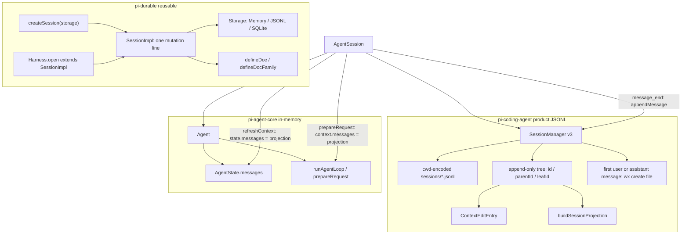

> `spine.session-state-model` 说明 1.0 之后会话状态分成三套互不替代的系统：`pi-coding-agent` 产品 JSONL 由 `SessionManager`（`CURRENT_SESSION_VERSION = 3`，append-only tree + `ContextEditEntry`）持有，文件在第一条 user/assistant message 时创建；`@earendil-works/pi-durable` 的 `createSession(storage)` 是可复用 Session kernel（documents / `Tx` / `Storage`），`Harness` 继承它跑 conversation/task；`pi-agent-core` 的 `AgentState.messages` 只是进程内 transcript。`pi-agent-core` 1.0 已删除 experimental harness session / `SessionRepo` JSONL。

## 能回答的问题

- 1.0 之后会话持久化落在哪三层，各自的权威类型是什么？
- coding-agent `SessionManager` 何时真正创建 JSONL 文件，`ContextEditEntry` 改 raw history 还是未来模型 context？
- `AgentSession.prepareRequest` 如何把 `SessionManager` 投影设成 canonical provider context，赋值 `agent.state.messages` 还会不会替换下一轮 history？
- `pi-durable` 的 `createSession` / `defineDoc` / `Storage` / `Harness.open` 各自负责什么，root conversation 的 ID 是谁写入的？
- 产品 `SessionManager` JSONL 与 durable `JsonlStorage` 的 `main.jsonl` 能不能互相打开？
- CLI 默认路径用哪套 session，experimental durable TUI 用哪套？

```mermaid
flowchart TD
  subgraph Product["pi-coding-agent product JSONL"]
    SM["SessionManager v3"]
    File["cwd-encoded sessions/*.jsonl"]
    Tree["append-only tree: id / parentId / leafId"]
    Edit["ContextEditEntry"]
    Proj["buildSessionProjection"]
    SM --> File
    SM --> Tree
    Tree --> Edit
    Tree --> Proj
    First["first user or assistant message: wx create file"]
    SM --> First
  end
  subgraph Core["pi-agent-core in-memory"]
    Ag["Agent"]
    St["AgentState.messages"]
    Loop["runAgentLoop / prepareRequest"]
    Ag --> St
    Ag --> Loop
  end
  subgraph Durable["pi-durable reusable"]
    CS["createSession(storage)"]
    SI["SessionImpl: one mutation line"]
    Docs["defineDoc / defineDocFamily"]
    Store["Storage: Memory / JSONL / SQLite"]
    H["Harness.open extends SessionImpl"]
    CS --> SI
    SI --> Store
    SI --> Docs
    H --> SI
  end
  AS["AgentSession"] --> SM
  AS --> Ag
  AS -->|"message_end: appendMessage"| SM
  AS -->|"prepareRequest: context.messages = projection"| Loop
  AS -->|"refreshContext: state.messages = projection"| St
```

## 端到端状态流

1. `pi-agent-core` 1.0.0 删除 experimental harness session / session storage / `./harness/*` 子路径。现行 `@earendil-works/pi-agent-core` 只导出 `Agent`、agent loop、proxy stream 与 types；changelog 要求 durable session 用 `@earendil-works/pi-durable`。[E: packages/agent/CHANGELOG.md:11] [E: packages/agent/src/index.ts:1] [E: packages/agent/src/index.ts:2] [E: packages/agent/src/index.ts:3] [E: packages/agent/src/index.ts:5] [E: packages/agent/package.json:8] 产品 CLI 默认路径仍是 `AgentSession` + `SessionManager`，不是 durable `Harness`。[E: packages/coding-agent/package.json:51] [I]

2. 产品会话文件格式常量是 `CURRENT_SESSION_VERSION = 3`。第一行是 `SessionHeader`（`type: "session"`、可选 `version`、`id`、`timestamp`、`cwd`、可选 `parentSession`）；后续行是带 `id` / `parentId` / `timestamp` 的 `SessionEntry`。[E: packages/coding-agent/src/core/session-manager.ts:41] [E: packages/coding-agent/src/core/session-manager.ts:43] [E: packages/coding-agent/src/core/session-manager.ts:57] [E: packages/coding-agent/src/core/session-manager.ts:197] `SessionEntry` union 含 message、thinking/model change、usage、compaction、branch_summary、custom / custom_message、`context_edit`、label、session_info。[E: packages/coding-agent/src/core/session-manager.ts:183] [E: packages/coding-agent/src/core/session-manager.ts:192] 字段级目录在 [ref.coding-agent.session-format](../reference/session-format.md)。

3. `SessionManager` 在内存里维护 `fileEntries`、`byId`、label cache 和 `leafId`。`appendMessage()` 等 append API 生成 id，把 `parentId` 写成当前 `leafId`，再 `_appendEntry()` 推进 leaf 并 `_persist()`。[E: packages/coding-agent/src/core/session-manager.ts:987] [E: packages/coding-agent/src/core/session-manager.ts:994] [E: packages/coding-agent/src/core/session-manager.ts:998] [E: packages/coding-agent/src/core/session-manager.ts:1191] [E: packages/coding-agent/src/core/session-manager.ts:1204] [E: packages/coding-agent/src/core/session-manager.ts:1208] `branch(entryId)` 只移动内存 leaf，不改写旧 entry；`resetLeaf()` 把 leaf 置 `null`，下一次 append 成为新 root。[E: packages/coding-agent/src/core/session-manager.ts:1579] [E: packages/coding-agent/src/core/session-manager.ts:1583] [E: packages/coding-agent/src/core/session-manager.ts:1591]

4. 新 session 文件**延迟创建**。`_persist()` 在 `persist` 且已有 `sessionFile` 时，若尚未 flushed 且 `_hasConversation()` 为 false，直接 return。`_hasConversation()` 只在 `fileEntries` 出现 `type: "message"` 且 `message.role` 为 `"user"` 或 `"assistant"` 时为 true；仅 model/thinking/system 等 setup entry 留在内存，打开再关闭且从未聊天不会留下文件。从 user message（而不是等第一条 assistant）起落盘，是为了第一轮若未完成仍把 prompt 留在磁盘（#10000）。[E: packages/coding-agent/src/core/session-manager.ts:1166] [E: packages/coding-agent/src/core/session-manager.ts:1168] [E: packages/coding-agent/src/core/session-manager.ts:1172] [E: packages/coding-agent/src/core/session-manager.ts:1173] [E: packages/coding-agent/src/core/session-manager.ts:1176] [E: packages/coding-agent/CHANGELOG.md:207] 首次满足后用 `"wx"` 写出全部 `fileEntries`；已经 flush 的 session 后续只 append 新行。[E: packages/coding-agent/src/core/session-manager.ts:1177] [E: packages/coding-agent/src/core/session-manager.ts:1187] `SessionManager.create()` 只选定 session dir 并 `newSession()` 生成路径，把 `flushed` 置 false；`inMemory()` 把 `persist` 设为 false。[E: packages/coding-agent/src/core/session-manager.ts:1755] [E: packages/coding-agent/src/core/session-manager.ts:1076] [E: packages/coding-agent/src/core/session-manager.ts:1078] [E: packages/coding-agent/src/core/session-manager.ts:1804]

5. `ContextEditEntry`（`type: "context_edit"`）是 append-only 的 branch-local 编辑：`targetId` 指向同一 active branch 上更早的 user / assistant / toolResult message 或 `custom_message`；`replacement: null` 从未来模型 context **省略**该 target，非 null 只替换 content。[E: packages/coding-agent/src/core/session-manager.ts:175] [E: packages/coding-agent/src/core/session-manager.ts:176] [E: packages/coding-agent/src/core/session-manager.ts:179] [E: packages/coding-agent/src/core/session-manager.ts:1360] [E: packages/coding-agent/src/core/session-manager.ts:1371] [E: packages/coding-agent/src/core/session-manager.ts:1374] 它不改 target 的 raw JSONL 行。`buildSessionProjection()` 在 compaction-aware 选中的 entries 上按 `targetId` 收入 map（后者覆盖前者），`replacement === null` 产出空 messages。[E: packages/coding-agent/src/core/session-manager.ts:543] [E: packages/coding-agent/src/core/session-manager.ts:551] [E: packages/coding-agent/src/core/session-manager.ts:553] [E: packages/coding-agent/src/core/session-manager.ts:522] `getBranch()` 返回 root-to-leaf 全部 entry type，不做 compaction / edit 投影。[E: packages/coding-agent/src/core/session-manager.ts:1469]

6. `Agent` 的公开状态是 `AgentState`：`messages` 是 conversation transcript，赋值时拷贝顶层数组。[E: packages/agent/src/types.ts:382] [E: packages/agent/src/types.ts:407] [E: packages/agent/src/agent.ts:103] [E: packages/agent/src/agent.ts:276] 低层 loop 在 `message_end` 时 `this._state.messages.push(event.message)`，所以它是**进程内** finalized transcript，不是磁盘 store。[E: packages/agent/src/agent.ts:575] [E: packages/agent/src/agent.ts:577]

7. 产品 `AgentSession` 把两层接起来。构造时 `agent.subscribe(_handleAgentEvent)`，并安装 `_installAgentRequestProjection()`。[E: packages/coding-agent/src/core/agent-session.ts:462] [E: packages/coding-agent/src/core/agent-session.ts:485] [E: packages/coding-agent/src/core/agent-session.ts:488] `message_end` 时：`role === "custom"` 走 `appendCustomMessageEntry`，`system` / `user` / `assistant` / `toolResult` 走 `sessionManager.appendMessage(event.message)`。[E: packages/coding-agent/src/core/agent-session.ts:1115] [E: packages/coding-agent/src/core/agent-session.ts:1118] [E: packages/coding-agent/src/core/agent-session.ts:1133]

8. `prepareRequest` 在每一次 conversational provider 请求前运行（含本 run 第一次）。`AgentRequestUpdate` 从 turn update **省略** `messages`，所以这个 hook 不能追加 prompt messages。[E: packages/agent/src/agent-loop.ts:219] [E: packages/agent/src/types.ts:180] [E: packages/agent/src/types.ts:186] `AgentSession` 的实现每次用 `sessionManager.buildSessionProjection()` 覆盖 `request.context.messages`，并把 executable tools 设成 `agent.state.tools` 的拷贝。[E: packages/coding-agent/src/core/agent-session.ts:759] [E: packages/coding-agent/src/core/agent-session.ts:765] [E: packages/coding-agent/src/core/agent-session.ts:768] [E: packages/coding-agent/src/core/agent-session.ts:770] loop 用返回的 `context` 替换 `currentContext`。[E: packages/agent/src/agent-loop.ts:227] [E: packages/agent/src/agent-loop.ts:228] 因此赋值 `session.agent.state.messages` 只改公开内存副本，**不再**成为下一轮 provider history。`refreshContext()` 把公开 transcript 从投影写回：`this.agent.state.messages = projection.messages`。[E: packages/coding-agent/src/core/agent-session.ts:910] [E: packages/coding-agent/src/core/agent-session.ts:915] [E: packages/coding-agent/src/core/agent-session.ts:1391] 恢复或改未来 history 应走 `SessionManager.inMemory(...)`、`session.navigateTree()`，或经 `session.sessionManager` append 后再 `refreshContext()`。[E: packages/coding-agent/src/core/session-manager.ts:1804] [E: packages/coding-agent/src/core/agent-session.ts:3915]

9. 可复用 durable session 的公开工厂是 `createSession(storage)`，返回 `SessionImpl`（实现 `Session`）。根 barrel 导出 `createSession` 与 `MemoryStorage`，不导出 `SessionImpl`。[E: packages/durable/src/session/session.ts:49] [E: packages/durable/src/session/session.ts:59] [E: packages/durable/src/index.ts:98] [E: packages/durable/src/index.ts:99] `Session.commit(change, context)` 把 callback 排进单一 `#tail` mutation line；`#runCommit()` 构造 `Transaction`，成功则 `storage.commit(writes)`，再 adopt / publish。[E: packages/durable/src/session/session.ts:85] [E: packages/durable/src/session/session.ts:530] [E: packages/durable/src/session/session.ts:411] [E: packages/durable/src/session/session.ts:427] 只有 committed state 可观察。[E: packages/durable/src/types.ts:899] [E: packages/durable/src/types.ts:901]

10. `Storage` 是原子持久化边界：`commit(writes, context)` 返回 `Seq`，外加 `mintId` / conversation·entry·task·submission·document lookup 与 scan / `close`。Storage 信任 Session 提供语义正确的 records；Session 负责串行化 commits。[E: packages/durable/src/types.ts:993] [E: packages/durable/src/types.ts:997] [E: packages/durable/src/types.ts:1000] `StorageWrite` 是 conversation / entry / task / submission 记录，或 document.create / copy / change / retire。[E: packages/durable/src/types.ts:686] `Tx` 是一次 commit callback 的事务面：`createConversation` / `forkConversation` / `appendEntry` / `createTask`、`doc` / `retireDoc`。[E: packages/durable/src/types.ts:744] [E: packages/durable/src/types.ts:767] [E: packages/durable/src/types.ts:775]

11. Document tokens 由 `defineDoc()` / `defineDocFamily()` 定义：校验 `version` 为正整数后返回 `{ definition }`。scope 可以是 `"session"` / `"conversation"` / `"task"`；conversation document 再分 latest 与 rewindable。[E: packages/durable/src/documents.ts:54] [E: packages/durable/src/documents.ts:56] [E: packages/durable/src/documents.ts:75] [E: packages/durable/src/types.ts:104] `EntryRecord` 把 model-facing `Message[]`（`pi-ai`）与 application `data` 分开，并可带 `head` 与 `edits`（durable `ContextEdit`：`omit` 或 `replace` messages）。这与产品 JSONL 的 `ContextEditEntry` 不是同一类型。[E: packages/durable/src/types.ts:301] [E: packages/durable/src/types.ts:317] [E: packages/durable/src/types.ts:323]

12. `ROOT_CONVERSATION_ID` 是保留常量 `1`。`MemoryStorage.nextId` 从 `2` 起，`mintId()` 返回当前 nextId 再自增。[E: packages/durable/src/types.ts:39] [E: packages/durable/src/storage/memory.ts:241] [E: packages/durable/src/storage/memory.ts:410] `createSession()` **不会**自动插入这条 root conversation。plain `Session.conversationCreated` 是空操作；`Tx.createRootConversation()` 才用保留 ID 写入 ownerless root。[E: packages/durable/src/session/session.ts:374] [E: packages/durable/src/session/transaction.ts:285] [E: packages/durable/src/session/transaction.ts:286] `Tx.forkConversation()` 经 `prepareForkDocumentCopies()` 按 parent 可见 entry 与 fork policy 生成 definition-free `document.copy` writes。[E: packages/durable/src/session/transaction.ts:289] [E: packages/durable/src/session/forks.ts:26]

13. 三份 shipped `Storage`：detached `MemoryStorage`；portable `JsonlStorage`（包装一份 `MemoryStorage`，目录内 `main.jsonl` + sidecar，`fsync` 默认 false）；portable SQLite（Node 子路径 `storage/sqlite/node`）。[E: packages/durable/src/storage/memory.ts:219] [E: packages/durable/src/storage/jsonl/storage.ts:241] [E: packages/durable/src/storage/jsonl/storage.ts:246] [E: packages/durable/src/storage/jsonl/storage.ts:29] [E: packages/durable/src/storage/jsonl/storage.ts:256] [E: packages/durable/package.json:45] [E: packages/durable/package.json:57] durable JSONL **不是** coding-agent `type: "session"` v3 文件。根 barrel 导出 `createSession` / `MemoryStorage`；Node 文件后端走 `./storage/jsonl/node` 与 `./storage/sqlite/node`。[E: packages/durable/src/index.ts:98] [E: packages/durable/src/index.ts:99] [E: packages/durable/package.json:45] [E: packages/durable/package.json:57]

14. `Harness` 扩展 `Session`：`HarnessImpl` 继承 `SessionImpl`。`Harness.open(storage, { models, registry, ... }, context)` 要求 registry 含内置 tasks，再 `openTasks()`。[E: packages/durable/src/harness/types.ts:538] [E: packages/durable/src/harness/harness.ts:164] [E: packages/durable/src/harness/harness.ts:407] [E: packages/durable/src/harness/harness.ts:409] `root()` 若 ID `1` 已存在则复用，否则 `createRootConversation()`。[E: packages/durable/src/harness/harness.ts:304] [E: packages/durable/src/harness/harness.ts:334] [E: packages/durable/src/harness/harness.ts:339] 每个创建/fork commit 里，Harness 覆盖 `conversationCreated`：先种空的 `pi.live` / `pi.inbox` / `pi.usage`，再 `createAgent()` 写 rewindable `pi.agent`（`AgentDoc`）。[E: packages/durable/src/harness/harness.ts:354] [E: packages/durable/src/harness/agent.ts:36] durable 运行依赖是 Chord 与 `pi-ai`，**不**依赖 `pi-agent-core`；generation 走 `models.streamSimple()`，不是 `runAgentLoop`。[E: packages/durable/package.json:102] [E: packages/durable/package.json:103] 深挖见 [subsys.durable.harness](../subsystems/durable/harness.md)。

15. coding-agent 的 experimental durable TUI 才走 `Harness.open(openNodeSqliteStorage(...))` + `harness.root()`，与默认 `SessionManager` JSONL 并列，不是 CLI 主路径。[E: packages/coding-agent/src/experimental/durable/runtime.ts:124] [E: packages/coding-agent/src/experimental/durable/runtime.ts:138] [E: packages/coding-agent/src/experimental/durable/runtime.ts:139] [E: packages/coding-agent/src/experimental/durable/runtime.ts:150]

## 关键决策点

### 三套状态系统必须分层，不能混成一个 API

| 层 | 权威对象 | 持久化 | 谁用 |
|---|---|---|---|
| 产品 | `SessionManager` + `SessionEntry` tree | cwd-encoded `*.jsonl`，header `type: "session"` v3 | CLI / RPC / `AgentSession` |
| 可复用 durable | `createSession` → `Session` / `Tx` / document tokens | `MemoryStorage` 或 durable JSONL 目录 / SQLite | `Harness`、experimental durable TUI、其它 app |
| agent-core | `AgentState.messages` | 无。赋值只拷贝内存数组 | `Agent` loop、UI、tool context |

`pi-coding-agent` runtime dependencies 含 `pi-agent-core` 与 `pi-ai`，不含 `pi-durable`。[E: packages/coding-agent/package.json:51] [E: packages/coding-agent/package.json:52] [I] `pi-agent-core` 只依赖 `pi-ai`。[E: packages/agent/package.json:26] 产品层概念相似（tree / fork / context edit），但类型、文件格式与恢复入口不是同一个实现。

### 产品 context 是投影，不是 storage dump

`buildSessionProjection()` 先 `buildContextEntries()`（从最新 compaction 截断），再应用每个 target 的最新 `context_edit`，flatten 成发给模型的 `messages`。[E: packages/coding-agent/src/core/session-manager.ts:543] [E: packages/coding-agent/src/core/session-manager.ts:568] `custom` / `usage` / `context_edit` 自身不产生模型消息。[E: packages/coding-agent/src/core/session-manager.ts:465] raw history、UI 与 usage accounting 仍保留原 entry。切到 edit 之前的 leaf 会再次看到原始 content。[I]

### `AgentState.messages` 不再是 canonical provider history

产品路径上，下一轮（以及同一 run 内下一次）provider 请求的 messages 来自 `SessionManager.buildSessionProjection()`，由 `prepareRequest` 写入 loop `context`。[E: packages/coding-agent/src/core/agent-session.ts:765] [E: packages/agent/src/agent-loop.ts:219] `Agent.state.messages` 仍被 `message_end` 追加，供公开 transcript、找 last assistant、tool 侧 `context.messages` 使用，但覆盖它不会改未来 request history。[E: packages/agent/src/agent.ts:577] [E: packages/coding-agent/src/core/agent-session.ts:723]

### Durable Session 是 mutation line + documents，不是 JSONL tree facade

durable `Session` 没有 coding-agent 那种 `leafId` / `parentId` 字符串 tree。transcript scope 是 `ConversationRecord`（可 fork `parent: { conversationId, at }`）；可见历史由 entry ancestry + `head` 截断；可变状态在 document tokens 里，用 Chord `track()` / `Draft`。[E: packages/durable/src/types.ts:286] [E: packages/durable/src/types.ts:323] [E: packages/durable/src/session/session.ts:523] `Harness` 在同一条 line 上跑 generation / tool / compaction，取代已删除的 agent-core experimental `AgentHarness`。[E: packages/agent/CHANGELOG.md:11] [E: packages/durable/src/harness/harness.ts:164]

### 两种 JSONL、两种 `AgentState` 不要混名

产品文件是单文件 JSON Lines，第一行 `type: "session"`。durable `JsonlStorage` 是一个目录，主文件名硬编码 `main.jsonl`，记录的是 `StorageWrite` commit marker 与 sidecar，并在内存里套 `MemoryStorage`。[E: packages/coding-agent/src/core/session-manager.ts:43] [E: packages/durable/src/storage/jsonl/storage.ts:29] [E: packages/durable/src/storage/jsonl/storage.ts:246] 不能把两种文件互相当同一 schema 打开。

`pi-agent-core` 的 `AgentState` 是 loop 公开状态（`messages` / `tools` / `model`）。durable `AgentDoc` 的 `AgentState` 是 conversation document `pi.agent`（model / extensions / tools / instructions / cwd）。[E: packages/agent/src/types.ts:382] [E: packages/durable/src/harness/agent.ts:36] 同名不同类型。

## Gotcha

- `getSessionFile()` 返回路径不等同于该路径已经存在于磁盘：第一条 user/assistant message 之前 `_persist()` 不 `wx`。[E: packages/coding-agent/src/core/session-manager.ts:1156] [E: packages/coding-agent/src/core/session-manager.ts:1176]
- `_hasConversation()` 认 user **或** assistant。changelog 的产品叙述是“第一条 user message”；assistant-only 的 session 同样会落盘。[E: packages/coding-agent/src/core/session-manager.ts:1168] [E: packages/coding-agent/CHANGELOG.md:207]
- `appendContextEdit` 要求 target 在 `getBranch()` 上且贡献可编辑模型内容；不在 active branch 的 target 抛错。[E: packages/coding-agent/src/core/session-manager.ts:1371] [E: packages/coding-agent/src/core/session-manager.ts:1380]
- `createSession()` 不播种 `ROOT_CONVERSATION_ID`。要有 ID `1` 的 root，走 `Harness.root()` / `Tx.createRootConversation()`，或自己 `Storage.commit` 一条 conversation write。[E: packages/durable/src/session/session.ts:49] [E: packages/durable/src/session/transaction.ts:285]
- durable SQLite 在 `@earendil-works/pi-durable/storage/sqlite/node`。`packages/session-backends` 与 agent-core experimental harness 已删除，不要再 cite 那条 `SessionRepo` 路径。[E: packages/durable/package.json:57] [E: packages/agent/CHANGELOG.md:11]
- CLI 默认 interactive / RPC / print 用 `SessionManager`。`packages/coding-agent/src/experimental/durable/` 是另一条 Harness + SQLite 路径，见 [subsys.coding-agent.experimental-cli](../subsystems/coding-agent/experimental-cli.md)。[E: packages/coding-agent/src/experimental/durable/runtime.ts:138]

## 深挖节点

- [subsys.coding-agent.session-manager](../subsystems/coding-agent/session-manager.md)：产品 `SessionManager` 的 load / append / persist / projection。
- [ref.coding-agent.session-format](../reference/session-format.md)：JSONL v3 字段级 entry catalog。
- [surface.sessions.management](../surface/sessions/management.md)：fork / tree / clone / resume 用户可见面。
- [subsys.coding-agent.agent-session](../subsystems/coding-agent/agent-session.md)：`AgentSession` 如何把 `SessionManager` 投影装进 `prepareRequest`。
- [spine.agent-loop](agent-loop.md)：`prepareRequest` / `message_end` 如何改 `Agent` 内存状态。
- [subsys.durable.runtime](../subsystems/durable/runtime.md)：`createSession` / `Tx` / document tokens / `ROOT_CONVERSATION_ID`。
- [subsys.durable.storage](../subsystems/durable/storage.md)：Memory / JSONL / SQLite backends 与 Node 子路径。
- [subsys.durable.harness](../subsystems/durable/harness.md)：`Harness.open`、内置 tasks、`pi.*` documents。

## Sources

- packages/coding-agent/src/core/session-manager.ts
- packages/coding-agent/src/core/agent-session.ts
- packages/coding-agent/package.json
- packages/coding-agent/CHANGELOG.md
- packages/coding-agent/src/experimental/durable/runtime.ts
- packages/durable/package.json
- packages/durable/src/index.ts
- packages/durable/src/types.ts
- packages/durable/src/documents.ts
- packages/durable/src/session/session.ts
- packages/durable/src/session/transaction.ts
- packages/durable/src/session/forks.ts
- packages/durable/src/storage/memory.ts
- packages/durable/src/storage/jsonl/storage.ts
- packages/durable/src/harness/harness.ts
- packages/durable/src/harness/agent.ts
- packages/agent/src/types.ts
- packages/agent/src/agent.ts
- packages/agent/src/agent-loop.ts
- packages/agent/src/index.ts
- packages/agent/package.json
- packages/agent/CHANGELOG.md

## 相关

- [subsys.coding-agent.session-manager](../subsystems/coding-agent/session-manager.md) - 产品层磁盘 JSONL 与 tree leaf。
- [subsys.durable.runtime](../subsystems/durable/runtime.md) - `createSession` / documents / `Tx`。
- [subsys.durable.storage](../subsystems/durable/storage.md) - Memory / JSONL / SQLite `Storage`。
- [subsys.durable.harness](../subsystems/durable/harness.md) - 1.0 可复用 `Harness`。
- [ref.coding-agent.session-format](../reference/session-format.md) - 产品 JSONL v3 字段目录。
- [spine.agent-loop](agent-loop.md) - `prepareRequest` 与 `AgentState` 归约。
- [subsys.coding-agent.agent-session](../subsystems/coding-agent/agent-session.md) - 产品装配与 canonical projection。
- [surface.sessions.management](../surface/sessions/management.md) - fork / tree / resume 可见面。
