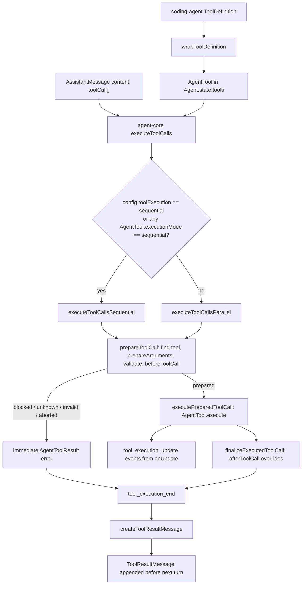

> 工具调用(tool call)在 pi 里分成两层: `pi-agent-core` 执行 `AgentTool` 的通用 prepare/validate/execute/finalize 流程, `pi-coding-agent` 负责把产品内置和扩展的 `ToolDefinition` 装配成这些 `AgentTool`。

## 能回答的问题

- 模型产出的 `toolCall` 怎样变成 `toolResult` message?
- `AgentTool` 和 `ToolDefinition` 的边界在哪里?
- `beforeToolCall`、`afterToolCall`、`prepareArguments` 分别在哪个阶段运行?
- parallel/sequential 工具批次如何选择,结果顺序如何保持?
- coding-agent 的内置工具全集和默认激活工具集分别是什么?

## 端到端步骤

1. `streamAssistantResponse` puts `context.tools` into the provider-facing `Context`; the main loop receives that assistant message, filters `message.content` for `type === "toolCall"`, then invokes `executeToolCalls` [E: packages/agent/src/agent-loop.ts:193] [E: packages/agent/src/agent-loop.ts:295] [E: packages/agent/src/agent-loop.ts:203] [E: packages/agent/src/agent-loop.ts:208].
2. `executeToolCalls` re-reads tool calls from the assistant message and switches the whole batch to sequential mode when global `config.toolExecution` is `"sequential"` or any requested `AgentTool.executionMode` is `"sequential"` [E: packages/agent/src/agent-loop.ts:380] [E: packages/agent/src/agent-loop.ts:381] [E: packages/agent/src/agent-loop.ts:382] [E: packages/agent/src/agent-loop.ts:384].
3. Sequential execution emits `tool_execution_start`, prepares one call, executes and finalizes it if preparation succeeds, emits `tool_execution_end`, creates and emits the `ToolResultMessage`, and then moves to the next call [E: packages/agent/src/agent-loop.ts:407] [E: packages/agent/src/agent-loop.ts:414] [E: packages/agent/src/agent-loop.ts:423] [E: packages/agent/src/agent-loop.ts:424] [E: packages/agent/src/agent-loop.ts:434] [E: packages/agent/src/agent-loop.ts:435] [E: packages/agent/src/agent-loop.ts:436].
4. Parallel execution still prepares calls in assistant source order, but prepared calls are stored as async thunks and executed through `Promise.all`; `tool_execution_end` is emitted inside each thunk, while `ToolResultMessage` artifacts are created afterward from `orderedFinalizedCalls` in the original array order [E: packages/agent/src/agent-loop.ts:461] [E: packages/agent/src/agent-loop.ts:469] [E: packages/agent/src/agent-loop.ts:484] [E: packages/agent/src/agent-loop.ts:494] [E: packages/agent/src/agent-loop.ts:502] [E: packages/agent/src/agent-loop.ts:506] [E: packages/agent/src/agent-loop.ts:507].
5. `prepareToolCall` resolves the target tool by `toolCall.name`; missing tools, validation errors, blocked calls, and aborted calls become immediate error-shaped `AgentToolResult` objects instead of throwing through the loop [E: packages/agent/src/agent-loop.ts:569] [E: packages/agent/src/agent-loop.ts:571] [E: packages/agent/src/agent-loop.ts:580] [E: packages/agent/src/agent-loop.ts:591] [E: packages/agent/src/agent-loop.ts:598] [E: packages/agent/src/agent-loop.ts:606] [E: packages/agent/src/agent-loop.ts:620].
6. `prepareArguments` is a pre-validation compatibility hook on `AgentTool`; when present, it rewrites raw model arguments before `validateToolArguments` sees them [E: packages/agent/src/agent-loop.ts:549] [E: packages/agent/src/agent-loop.ts:552] [E: packages/agent/src/agent-loop.ts:579] [E: packages/agent/src/agent-loop.ts:580].
7. `beforeToolCall` runs after validation and can block execution; `afterToolCall` runs after `AgentTool.execute` and can replace `content`, `details`, `isError`, or `terminate` before end/result events are emitted [E: packages/agent/src/types.ts:267] [E: packages/agent/src/types.ts:281] [E: packages/agent/src/agent-loop.ts:580] [E: packages/agent/src/agent-loop.ts:581] [E: packages/agent/src/agent-loop.ts:598] [E: packages/agent/src/agent-loop.ts:682] [E: packages/agent/src/agent-loop.ts:695] [E: packages/agent/src/agent-loop.ts:697] [E: packages/agent/src/agent-loop.ts:698] [E: packages/agent/src/agent-loop.ts:699] [E: packages/agent/src/agent-loop.ts:701].
8. `executePreparedToolCall` calls `AgentTool.execute(toolCallId, params, signal, onUpdate)`, turns `onUpdate` callbacks into `tool_execution_update` events, waits for queued update event promises, and converts thrown errors into error `AgentToolResult` values [E: packages/agent/src/agent-loop.ts:637] [E: packages/agent/src/agent-loop.ts:638] [E: packages/agent/src/agent-loop.ts:639] [E: packages/agent/src/agent-loop.ts:640] [E: packages/agent/src/agent-loop.ts:641] [E: packages/agent/src/agent-loop.ts:645] [E: packages/agent/src/agent-loop.ts:657] [E: packages/agent/src/agent-loop.ts:659] [E: packages/agent/src/agent-loop.ts:663].
9. A finalized tool result becomes a provider-visible `ToolResultMessage` with `role: "toolResult"`, `toolCallId`, `toolName`, `content`, `details`, `isError`, and a timestamp; the main loop appends those result messages to `currentContext.messages` before the next assistant turn [E: packages/agent/src/agent-loop.ts:733] [E: packages/agent/src/agent-loop.ts:735] [E: packages/agent/src/agent-loop.ts:736] [E: packages/agent/src/agent-loop.ts:737] [E: packages/agent/src/agent-loop.ts:738] [E: packages/agent/src/agent-loop.ts:739] [E: packages/agent/src/agent-loop.ts:740] [E: packages/agent/src/agent-loop.ts:741] [E: packages/agent/src/agent-loop.ts:212].
10. The batch-level early-stop hint is conjunctive: `shouldTerminateToolBatch` returns true only when the batch is non-empty and every finalized result has `terminate === true` [E: packages/agent/src/agent-loop.ts:545].

## `AgentTool` 是 agent-core 的运行时合约

`AgentTool` extends the provider-facing `Tool` shape and adds `label`, optional `prepareArguments`, `execute`, and optional per-tool `executionMode`; the low-level loop only needs this shape plus `AgentContext.tools` [E: packages/agent/src/types.ts:371] [E: packages/agent/src/types.ts:373] [E: packages/agent/src/types.ts:378] [E: packages/agent/src/types.ts:380] [E: packages/agent/src/types.ts:393] [E: packages/agent/src/types.ts:397] [E: packages/agent/src/types.ts:403].

`AgentToolResult` is the common result envelope for final and partial tool output: model-visible `content`, structured `details`, and optional `terminate` [E: packages/agent/src/types.ts:350] [E: packages/agent/src/types.ts:352] [E: packages/agent/src/types.ts:354] [E: packages/agent/src/types.ts:359]. This means the reusable core knows how to validate, execute, stream updates, emit lifecycle events, and append tool results, but it does not know coding-agent-specific prompt snippets, renderers, shell settings, or extension metadata [I].

## `ToolDefinition` 是 coding-agent 的产品装配合约

`ToolDefinition` carries the LLM-facing name/description/schema plus coding-agent additions such as `promptSnippet`, `promptGuidelines`, `renderShell`, custom renderers, and an `execute` signature that receives an `ExtensionContext` [E: packages/coding-agent/src/core/extensions/types.ts:435] [E: packages/coding-agent/src/core/extensions/types.ts:437] [E: packages/coding-agent/src/core/extensions/types.ts:441] [E: packages/coding-agent/src/core/extensions/types.ts:443] [E: packages/coding-agent/src/core/extensions/types.ts:445] [E: packages/coding-agent/src/core/extensions/types.ts:447] [E: packages/coding-agent/src/core/extensions/types.ts:449] [E: packages/coding-agent/src/core/extensions/types.ts:464] [E: packages/coding-agent/src/core/extensions/types.ts:469] [E: packages/coding-agent/src/core/extensions/types.ts:473] [E: packages/coding-agent/src/core/extensions/types.ts:476].

`wrapToolDefinition` is the explicit adapter boundary: it copies `name`, `label`, `description`, `parameters`, `prepareArguments`, and `executionMode` onto an `AgentTool`, then adapts `execute` by adding `ctxFactory?.()` as the fifth `ToolDefinition.execute` argument [E: packages/coding-agent/src/core/tools/tool-definition-wrapper.ts:5] [E: packages/coding-agent/src/core/tools/tool-definition-wrapper.ts:10] [E: packages/coding-agent/src/core/tools/tool-definition-wrapper.ts:11] [E: packages/coding-agent/src/core/tools/tool-definition-wrapper.ts:12] [E: packages/coding-agent/src/core/tools/tool-definition-wrapper.ts:13] [E: packages/coding-agent/src/core/tools/tool-definition-wrapper.ts:14] [E: packages/coding-agent/src/core/tools/tool-definition-wrapper.ts:15] [E: packages/coding-agent/src/core/tools/tool-definition-wrapper.ts:16] [E: packages/coding-agent/src/core/tools/tool-definition-wrapper.ts:17].

The reverse adapter, `createToolDefinitionFromAgentTool`, exists for `baseToolsOverride`: it synthesizes a minimal `ToolDefinition` from a plain `AgentTool` so `AgentSession` can keep a definition-first registry even when callers provide runtime tools directly [E: packages/coding-agent/src/core/tools/tool-definition-wrapper.ts:35] [E: packages/coding-agent/src/core/tools/tool-definition-wrapper.ts:37] [E: packages/coding-agent/src/core/tools/tool-definition-wrapper.ts:38] [E: packages/coding-agent/src/core/tools/tool-definition-wrapper.ts:39] [E: packages/coding-agent/src/core/tools/tool-definition-wrapper.ts:40] [E: packages/coding-agent/src/core/tools/tool-definition-wrapper.ts:41] [E: packages/coding-agent/src/core/tools/tool-definition-wrapper.ts:42] [E: packages/coding-agent/src/core/tools/tool-definition-wrapper.ts:43] [E: packages/coding-agent/src/core/agent-session.ts:2434] [E: packages/coding-agent/src/core/agent-session.ts:2438] [E: packages/coding-agent/src/core/agent-session.ts:2446].

## pi-coding-agent 的工具装配边界

The built-in coding-agent tool ground truth is `ToolName = "read" | "bash" | "edit" | "write" | "grep" | "find" | "ls"` and `allToolNames` contains the same seven names [E: packages/coding-agent/src/core/tools/index.ts:83] [E: packages/coding-agent/src/core/tools/index.ts:84]. `createAllToolDefinitions` returns a record with definitions for those seven names, while `createCodingToolDefinitions` returns the four write-capable coding tools and `createReadOnlyToolDefinitions` returns the four read/search/list tools [E: packages/coding-agent/src/core/tools/index.ts:138] [E: packages/coding-agent/src/core/tools/index.ts:139] [E: packages/coding-agent/src/core/tools/index.ts:143] [E: packages/coding-agent/src/core/tools/index.ts:147] [E: packages/coding-agent/src/core/tools/index.ts:148] [E: packages/coding-agent/src/core/tools/index.ts:152] [E: packages/coding-agent/src/core/tools/index.ts:156] [E: packages/coding-agent/src/core/tools/index.ts:157] [E: packages/coding-agent/src/core/tools/index.ts:164].

`AgentSession._buildRuntime` pulls product settings into built-in tool options, using image auto-resize for `read` and shell command prefix/path for `bash`, then calls `createAllToolDefinitions` unless `baseToolsOverride` is provided [E: packages/coding-agent/src/core/agent-session.ts:2431] [E: packages/coding-agent/src/core/agent-session.ts:2432] [E: packages/coding-agent/src/core/agent-session.ts:2433] [E: packages/coding-agent/src/core/agent-session.ts:2434] [E: packages/coding-agent/src/core/agent-session.ts:2441] [E: packages/coding-agent/src/core/agent-session.ts:2442] [E: packages/coding-agent/src/core/agent-session.ts:2443].

`AgentSession._refreshToolRegistry` merges built-in definitions, extension-registered tools, and SDK `customTools`, applies allowed/excluded filters, stores `ToolDefinition` entries with source metadata, wraps registered definitions into `AgentTool`s, and finally calls `setActiveToolsByName` [E: packages/coding-agent/src/core/agent-session.ts:2333] [E: packages/coding-agent/src/core/agent-session.ts:2338] [E: packages/coding-agent/src/core/agent-session.ts:2339] [E: packages/coding-agent/src/core/agent-session.ts:2341] [E: packages/coding-agent/src/core/agent-session.ts:2344] [E: packages/coding-agent/src/core/agent-session.ts:2348] [E: packages/coding-agent/src/core/agent-session.ts:2349] [E: packages/coding-agent/src/core/agent-session.ts:2351] [E: packages/coding-agent/src/core/agent-session.ts:2355] [E: packages/coding-agent/src/core/agent-session.ts:2356] [E: packages/coding-agent/src/core/agent-session.ts:2360] [E: packages/coding-agent/src/core/agent-session.ts:2362] [E: packages/coding-agent/src/core/agent-session.ts:2363] [E: packages/coding-agent/src/core/agent-session.ts:2366] [E: packages/coding-agent/src/core/agent-session.ts:2384] [E: packages/coding-agent/src/core/agent-session.ts:2385] [E: packages/coding-agent/src/core/agent-session.ts:2395] [E: packages/coding-agent/src/core/agent-session.ts:2423].

Default active tools are only `read`, `bash`, `edit`, and `write` when there is no `baseToolsOverride`; `_refreshToolRegistry` still wraps all allowed base definitions into `_toolRegistry`, and `setActiveToolsByName` activates requested names only when they exist in that registry [E: packages/coding-agent/src/core/agent-session.ts:2385] [E: packages/coding-agent/src/core/agent-session.ts:2387] [E: packages/coding-agent/src/core/agent-session.ts:2395] [E: packages/coding-agent/src/core/agent-session.ts:2470] [E: packages/coding-agent/src/core/agent-session.ts:2472] [E: packages/coding-agent/src/core/agent-session.ts:2473] [E: packages/coding-agent/src/core/agent-session.ts:839] [E: packages/coding-agent/src/core/agent-session.ts:843] [E: packages/coding-agent/src/core/agent-session.ts:849].

## 关键决策点

- Batch scheduling is conservative around sequential tools: one sequential target forces the entire assistant tool-call batch through sequential execution, so mixed batches do not interleave a sequential tool with parallel peers [E: packages/agent/src/agent-loop.ts:381] [E: packages/agent/src/agent-loop.ts:382] [E: packages/agent/src/agent-loop.ts:384].
- Validation and policy hooks happen before execution, so invalid arguments or blocked calls still produce model-visible tool-result messages that can be sent back in-band [E: packages/agent/src/agent-loop.ts:580] [E: packages/agent/src/agent-loop.ts:598] [E: packages/agent/src/agent-loop.ts:620] [E: packages/agent/src/agent-loop.ts:733].
- Partial output is event-only until the tool returns: `onUpdate` emits `tool_execution_update`, but the final `ToolResultMessage` is built from the finalized result object [E: packages/agent/src/agent-loop.ts:641] [E: packages/agent/src/agent-loop.ts:645] [E: packages/agent/src/agent-loop.ts:733] [E: packages/agent/src/agent-loop.ts:738].
- Product UI rendering belongs to `ToolDefinition`, not `AgentTool`: render callbacks live in coding-agent extension types, while core `AgentTool` exposes only its runtime contract fields [E: packages/coding-agent/src/core/extensions/types.ts:473] [E: packages/coding-agent/src/core/extensions/types.ts:476] [I].

## 指向 T1/T2 深挖

- [spine.agent-loop](agent-loop.md): agent turn lifecycle, queue draining, and how tool results feed the next assistant request.
- [subsys.agent-core.tool-invocation](../subsystems/agent-core/tool-invocation.md): `prepareToolCall` / `executePreparedToolCall` / event semantics as a subsystem-level drilldown.
- [subsys.coding-agent.agent-session](../subsystems/coding-agent/agent-session.md): `AgentSession` runtime rebuilds, extension binding, active tool changes, and prompt rebuilds.
- [surface.tools.bash](../surface/tools/bash.md): one concrete built-in tool definition, execution operations, streaming details, and shell configuration.

## Sources

- packages/agent/src/agent-loop.ts
- packages/agent/src/types.ts
- packages/coding-agent/src/core/tools/index.ts
- packages/coding-agent/src/core/extensions/types.ts
- packages/coding-agent/src/core/tools/tool-definition-wrapper.ts
- packages/coding-agent/src/core/agent-session.ts

## 相关

- [spine.agent-loop](agent-loop.md)
- [subsys.agent-core.tool-invocation](../subsystems/agent-core/tool-invocation.md)
- [subsys.coding-agent.agent-session](../subsystems/coding-agent/agent-session.md)
- [surface.tools.bash](../surface/tools/bash.md)
