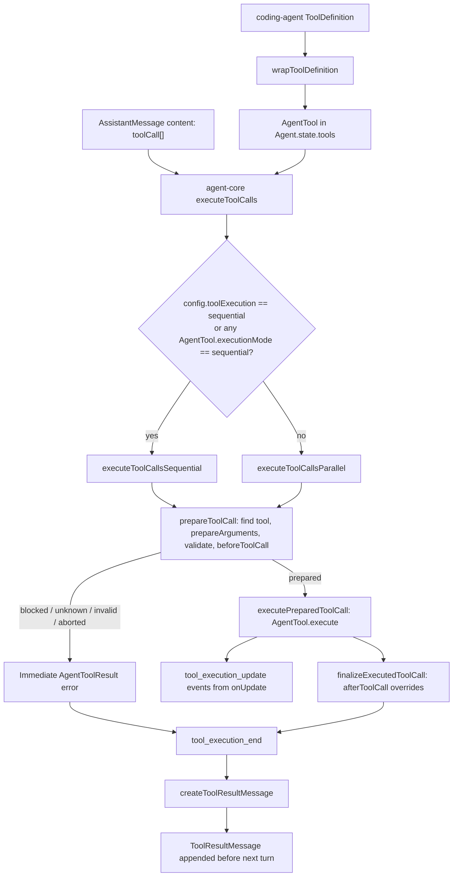

> 工具调用(tool call)在 pi 里分成两层: `pi-agent-core` 执行 `AgentTool` 的通用 prepare/validate/execute/finalize 流程, `pi-coding-agent` 负责把产品内置和扩展的 `ToolDefinition` 装配成这些 `AgentTool`。

## 能回答的问题

- 模型产出的 `toolCall` 怎样变成 `toolResult` message?
- `AgentTool` 和 `ToolDefinition` 的边界在哪里?
- `beforeToolCall`、`afterToolCall`、`prepareArguments` 分别在哪个阶段运行?
- parallel/sequential 工具批次如何选择,结果顺序如何保持?
- coding-agent 的内置工具全集和默认激活工具集分别是什么?

```mermaid
flowchart TD
  A["AssistantMessage content: toolCall[]"] --> B["agent-core executeToolCalls"]
  B --> C{"config.toolExecution == sequential<br/>or any AgentTool.executionMode == sequential?"}
  C -->|yes| D["executeToolCallsSequential"]
  C -->|no| E["executeToolCallsParallel"]
  D --> F["prepareToolCall: find tool, prepareArguments, validate, beforeToolCall"]
  E --> F
  F -->|blocked / unknown / invalid / aborted| G["Immediate AgentToolResult error"]
  F -->|prepared| H["executePreparedToolCall: AgentTool.execute"]
  H --> I["tool_execution_update events from onUpdate"]
  H --> J["finalizeExecutedToolCall: afterToolCall overrides"]
  G --> K["tool_execution_end"]
  J --> K
  K --> L["createToolResultMessage"]
  L --> M["ToolResultMessage appended before next turn"]
  N["coding-agent ToolDefinition"] --> O["wrapToolDefinition"]
  O --> P["AgentTool in Agent.state.tools"]
  P --> B
```

## 端到端步骤

1. `streamAssistantResponse` puts `context.tools` into the provider-facing `Context`; the main loop receives that assistant message, filters `message.content` for `type === "toolCall"`, then invokes `executeToolCalls` [E: packages/agent/src/agent-loop.ts:212] [E: packages/agent/src/agent-loop.ts:299] [E: packages/agent/src/agent-loop.ts:222] [E: packages/agent/src/agent-loop.ts:233].
2. `executeToolCalls` re-reads tool calls from the assistant message and switches the whole batch to sequential mode when global `config.toolExecution` is `"sequential"` or any requested `AgentTool.executionMode` is `"sequential"` [E: packages/agent/src/agent-loop.ts:416] [E: packages/agent/src/agent-loop.ts:417] [E: packages/agent/src/agent-loop.ts:418] [E: packages/agent/src/agent-loop.ts:420].
3. Sequential execution emits `tool_execution_start`, prepares one call, executes and finalizes it if preparation succeeds, emits `tool_execution_end`, creates and emits the `ToolResultMessage`, and then moves to the next call [E: packages/agent/src/agent-loop.ts:443] [E: packages/agent/src/agent-loop.ts:450] [E: packages/agent/src/agent-loop.ts:459] [E: packages/agent/src/agent-loop.ts:460] [E: packages/agent/src/agent-loop.ts:470] [E: packages/agent/src/agent-loop.ts:471] [E: packages/agent/src/agent-loop.ts:472].
4. Parallel execution still prepares calls in assistant source order, but prepared calls are stored as async thunks and executed through `Promise.all`; `tool_execution_end` is emitted inside each thunk, while `ToolResultMessage` artifacts are created afterward from `orderedFinalizedCalls` in the original array order [E: packages/agent/src/agent-loop.ts:497] [E: packages/agent/src/agent-loop.ts:505] [E: packages/agent/src/agent-loop.ts:520] [E: packages/agent/src/agent-loop.ts:530] [E: packages/agent/src/agent-loop.ts:538] [E: packages/agent/src/agent-loop.ts:542] [E: packages/agent/src/agent-loop.ts:543].
5. `prepareToolCall` resolves the target tool by `toolCall.name`; missing tools, validation errors, blocked calls, and aborted calls become immediate error-shaped `AgentToolResult` objects instead of throwing through the loop [E: packages/agent/src/agent-loop.ts:605] [E: packages/agent/src/agent-loop.ts:607] [E: packages/agent/src/agent-loop.ts:616] [E: packages/agent/src/agent-loop.ts:627] [E: packages/agent/src/agent-loop.ts:634] [E: packages/agent/src/agent-loop.ts:646] [E: packages/agent/src/agent-loop.ts:660].
6. `prepareArguments` is a pre-validation compatibility hook on `AgentTool`; when present, it rewrites raw model arguments before `validateToolArguments` sees them [E: packages/agent/src/agent-loop.ts:585] [E: packages/agent/src/agent-loop.ts:588] [E: packages/agent/src/agent-loop.ts:615] [E: packages/agent/src/agent-loop.ts:616].
7. `beforeToolCall` runs after validation and can block execution; `afterToolCall` runs after `AgentTool.execute` and can replace `content`, `details`, `isError`, or `terminate` before end/result events are emitted [E: packages/agent/src/types.ts:278] [E: packages/agent/src/types.ts:293] [E: packages/agent/src/agent-loop.ts:616] [E: packages/agent/src/agent-loop.ts:617] [E: packages/agent/src/agent-loop.ts:634] [E: packages/agent/src/agent-loop.ts:722] [E: packages/agent/src/agent-loop.ts:735] [E: packages/agent/src/agent-loop.ts:738] [E: packages/agent/src/agent-loop.ts:739] [E: packages/agent/src/agent-loop.ts:741] [E: packages/agent/src/agent-loop.ts:743].
8. `executePreparedToolCall` calls `AgentTool.execute(toolCallId, params, signal, onUpdate)`, turns `onUpdate` callbacks into `tool_execution_update` events, waits for queued update event promises, and converts thrown errors into error `AgentToolResult` values [E: packages/agent/src/agent-loop.ts:677] [E: packages/agent/src/agent-loop.ts:678] [E: packages/agent/src/agent-loop.ts:679] [E: packages/agent/src/agent-loop.ts:680] [E: packages/agent/src/agent-loop.ts:681] [E: packages/agent/src/agent-loop.ts:685] [E: packages/agent/src/agent-loop.ts:697] [E: packages/agent/src/agent-loop.ts:699] [E: packages/agent/src/agent-loop.ts:703].
9. A finalized tool result becomes a provider-visible `ToolResultMessage` with `role: "toolResult"`, `toolCallId`, `toolName`, `content`, `details`, `isError`, and a timestamp; the main loop appends those result messages to `currentContext.messages` before the next assistant turn [E: packages/agent/src/agent-loop.ts:775] [E: packages/agent/src/agent-loop.ts:777] [E: packages/agent/src/agent-loop.ts:778] [E: packages/agent/src/agent-loop.ts:779] [E: packages/agent/src/agent-loop.ts:782] [E: packages/agent/src/agent-loop.ts:783] [E: packages/agent/src/agent-loop.ts:786] [E: packages/agent/src/agent-loop.ts:787] [E: packages/agent/src/agent-loop.ts:237].
10. The batch-level early-stop hint is conjunctive: `shouldTerminateToolBatch` returns true only when the batch is non-empty and every finalized result has `terminate === true` [E: packages/agent/src/agent-loop.ts:581].

## `AgentTool` 是 agent-core 的运行时合约

`AgentTool` extends the provider-facing `Tool` shape and adds `label`, optional `prepareArguments`, `execute`, and optional per-tool `executionMode`; the low-level loop only needs this shape plus `AgentContext.tools` [E: packages/agent/src/types.ts:387] [E: packages/agent/src/types.ts:389] [E: packages/agent/src/types.ts:394] [E: packages/agent/src/types.ts:396] [E: packages/agent/src/types.ts:409] [E: packages/agent/src/types.ts:413] [E: packages/agent/src/types.ts:419].

`AgentToolResult` is the common result envelope for final and partial tool output: model-visible `content`, structured `details`, and optional `terminate` [E: packages/agent/src/types.ts:362] [E: packages/agent/src/types.ts:364] [E: packages/agent/src/types.ts:366] [E: packages/agent/src/types.ts:375]. This means the reusable core knows how to validate, execute, stream updates, emit lifecycle events, and append tool results, but it does not know coding-agent-specific prompt snippets, renderers, shell settings, or extension metadata [I].

## `ToolDefinition` 是 coding-agent 的产品装配合约

`ToolDefinition` carries the LLM-facing name/description/schema plus coding-agent additions such as `promptSnippet`, `promptGuidelines`, `renderShell`, custom renderers, and an `execute` signature that receives an `ExtensionContext` [E: packages/coding-agent/src/core/extensions/types.ts:451] [E: packages/coding-agent/src/core/extensions/types.ts:453] [E: packages/coding-agent/src/core/extensions/types.ts:457] [E: packages/coding-agent/src/core/extensions/types.ts:459] [E: packages/coding-agent/src/core/extensions/types.ts:461] [E: packages/coding-agent/src/core/extensions/types.ts:463] [E: packages/coding-agent/src/core/extensions/types.ts:467] [E: packages/coding-agent/src/core/extensions/types.ts:482] [E: packages/coding-agent/src/core/extensions/types.ts:487] [E: packages/coding-agent/src/core/extensions/types.ts:491] [E: packages/coding-agent/src/core/extensions/types.ts:494].

`wrapToolDefinition` is the explicit adapter boundary: it copies `name`, `label`, `description`, `parameters`, `prepareArguments`, and `executionMode` onto an `AgentTool`, then adapts `execute` by adding `ctxFactory?.()` as the fifth `ToolDefinition.execute` argument [E: packages/coding-agent/src/core/tools/tool-definition-wrapper.ts:5] [E: packages/coding-agent/src/core/tools/tool-definition-wrapper.ts:10] [E: packages/coding-agent/src/core/tools/tool-definition-wrapper.ts:11] [E: packages/coding-agent/src/core/tools/tool-definition-wrapper.ts:12] [E: packages/coding-agent/src/core/tools/tool-definition-wrapper.ts:13] [E: packages/coding-agent/src/core/tools/tool-definition-wrapper.ts:15] [E: packages/coding-agent/src/core/tools/tool-definition-wrapper.ts:16] [E: packages/coding-agent/src/core/tools/tool-definition-wrapper.ts:17] [E: packages/coding-agent/src/core/tools/tool-definition-wrapper.ts:18].

它也显式复制 `constrainedSampling`，反向的 `createToolDefinitionFromAgentTool()` 同样保留该字段 [E: packages/coding-agent/src/core/tools/tool-definition-wrapper.ts:14] [E: packages/coding-agent/src/core/tools/tool-definition-wrapper.ts:44]。这项 metadata 在执行 loop 前随 provider-facing tool schema 进入请求；它不改变本页的 prepare/execute/finalize 生命周期，provider adapter 的 strict/grammar 判定由 `subsys.ai.constrained-sampling` 覆盖 [I]。

The reverse adapter, `createToolDefinitionFromAgentTool`, exists for `baseToolsOverride`: it synthesizes a minimal `ToolDefinition` from a plain `AgentTool` so `AgentSession` can keep a definition-first registry even when callers provide runtime tools directly [E: packages/coding-agent/src/core/tools/tool-definition-wrapper.ts:36] [E: packages/coding-agent/src/core/tools/tool-definition-wrapper.ts:38] [E: packages/coding-agent/src/core/tools/tool-definition-wrapper.ts:39] [E: packages/coding-agent/src/core/tools/tool-definition-wrapper.ts:40] [E: packages/coding-agent/src/core/tools/tool-definition-wrapper.ts:41] [E: packages/coding-agent/src/core/tools/tool-definition-wrapper.ts:43] [E: packages/coding-agent/src/core/tools/tool-definition-wrapper.ts:42] [E: packages/coding-agent/src/core/tools/tool-definition-wrapper.ts:45] [E: packages/coding-agent/src/core/agent-session.ts:2765] [E: packages/coding-agent/src/core/agent-session.ts:2769] [E: packages/coding-agent/src/core/agent-session.ts:2777].

## pi-coding-agent 的工具装配边界

The built-in coding-agent tool ground truth is `ToolName = "read" | "bash" | "powershell" | "edit" | "write" | "grep" | "find" | "ls"` and `allToolNames` contains the same eight names [E: packages/coding-agent/src/core/tools/index.ts:95] [E: packages/coding-agent/src/core/tools/index.ts:96]. `createAllToolDefinitions` returns a record with definitions for those eight names, including `powershell`; `createCodingToolDefinitions` still returns only the four write-capable coding tools (`read`/`bash`/`edit`/`write`) and `createReadOnlyToolDefinitions` still returns only the four read/search/list tools, neither preset includes `powershell` [E: packages/coding-agent/src/core/tools/index.ts:164] [E: packages/coding-agent/src/core/tools/index.ts:165] [E: packages/coding-agent/src/core/tools/index.ts:169] [E: packages/coding-agent/src/core/tools/index.ts:173] [E: packages/coding-agent/src/core/tools/index.ts:174] [E: packages/coding-agent/src/core/tools/index.ts:178] [E: packages/coding-agent/src/core/tools/index.ts:182] [E: packages/coding-agent/src/core/tools/index.ts:186] [E: packages/coding-agent/src/core/tools/index.ts:191].

`AgentSession._buildRuntime` pulls product settings into built-in tool options, using image auto-resize for `read` and shell command prefix/path for `bash`, then calls `createAllToolDefinitions` unless `baseToolsOverride` is provided [E: packages/coding-agent/src/core/agent-session.ts:2762] [E: packages/coding-agent/src/core/agent-session.ts:2763] [E: packages/coding-agent/src/core/agent-session.ts:2764] [E: packages/coding-agent/src/core/agent-session.ts:2765] [E: packages/coding-agent/src/core/agent-session.ts:2772] [E: packages/coding-agent/src/core/agent-session.ts:2773] [E: packages/coding-agent/src/core/agent-session.ts:2774].

`AgentSession._refreshToolRegistry` merges built-in definitions, extension-registered tools, and SDK `customTools`, applies allowed/excluded filters, stores `ToolDefinition` entries with source metadata, wraps registered definitions into `AgentTool`s, and finally calls `setActiveToolsByName` [E: packages/coding-agent/src/core/agent-session.ts:2664] [E: packages/coding-agent/src/core/agent-session.ts:2669] [E: packages/coding-agent/src/core/agent-session.ts:2670] [E: packages/coding-agent/src/core/agent-session.ts:2672] [E: packages/coding-agent/src/core/agent-session.ts:2675] [E: packages/coding-agent/src/core/agent-session.ts:2679] [E: packages/coding-agent/src/core/agent-session.ts:2680] [E: packages/coding-agent/src/core/agent-session.ts:2682] [E: packages/coding-agent/src/core/agent-session.ts:2686] [E: packages/coding-agent/src/core/agent-session.ts:2687] [E: packages/coding-agent/src/core/agent-session.ts:2691] [E: packages/coding-agent/src/core/agent-session.ts:2693] [E: packages/coding-agent/src/core/agent-session.ts:2694] [E: packages/coding-agent/src/core/agent-session.ts:2697] [E: packages/coding-agent/src/core/agent-session.ts:2715] [E: packages/coding-agent/src/core/agent-session.ts:2716] [E: packages/coding-agent/src/core/agent-session.ts:2726] [E: packages/coding-agent/src/core/agent-session.ts:2754].

Default active tools are only `read`, `bash`, `edit`, and `write` when there is no `baseToolsOverride`; `_refreshToolRegistry` still wraps all allowed base definitions into `_toolRegistry`, and `setActiveToolsByName` activates requested names only when they exist in that registry [E: packages/coding-agent/src/core/agent-session.ts:2716] [E: packages/coding-agent/src/core/agent-session.ts:2718] [E: packages/coding-agent/src/core/agent-session.ts:2726] [E: packages/coding-agent/src/core/agent-session.ts:2801] [E: packages/coding-agent/src/core/agent-session.ts:2803] [E: packages/coding-agent/src/core/agent-session.ts:2804] [E: packages/coding-agent/src/core/agent-session.ts:971] [E: packages/coding-agent/src/core/agent-session.ts:975] [E: packages/coding-agent/src/core/agent-session.ts:981].

## AgentHarness 的 context 绑定变体

`AgentHarnessTool` 保留 `AgentTool` 的静态字段，但把 `execute` 扩成第五个应用 context 参数 [E: packages/agent/src/harness/types.ts:81] [E: packages/agent/src/harness/types.ts:85] [E: packages/agent/src/harness/types.ts:87] [E: packages/agent/src/harness/types.ts:92]。`AgentHarness` 在每个 turn snapshot 先解析静态或 async `toolContext` [E: packages/agent/src/harness/agent-harness.ts:381] [E: packages/agent/src/harness/agent-harness.ts:384] [E: packages/agent/src/harness/agent-harness.ts:399]，再把 context 绑定进 active tools 后交给底层 `Agent` [E: packages/agent/src/harness/agent-harness.ts:420] [E: packages/agent/src/harness/agent-harness.ts:438]。

这不是另一条 tool-call lifecycle：绑定后的对象仍回到本页的 `AgentTool.execute`/event/result 流程；差别只在执行前由 harness 冻结一次应用 context [I]。四个内置 harness execution tools 的 I/O 和操作注入见 `subsys.agent-core.execution-tools`。

## 关键决策点

- Batch scheduling is conservative around sequential tools: one sequential target forces the entire assistant tool-call batch through sequential execution, so mixed batches do not interleave a sequential tool with parallel peers [E: packages/agent/src/agent-loop.ts:417] [E: packages/agent/src/agent-loop.ts:418] [E: packages/agent/src/agent-loop.ts:420].
- Validation and policy hooks happen before execution, so invalid arguments or blocked calls still produce model-visible tool-result messages that can be sent back in-band [E: packages/agent/src/agent-loop.ts:616] [E: packages/agent/src/agent-loop.ts:634] [E: packages/agent/src/agent-loop.ts:660] [E: packages/agent/src/agent-loop.ts:775].
- Partial output is event-only until the tool returns: `onUpdate` emits `tool_execution_update`, but the final `ToolResultMessage` is built from the finalized result object [E: packages/agent/src/agent-loop.ts:681] [E: packages/agent/src/agent-loop.ts:685] [E: packages/agent/src/agent-loop.ts:775] [E: packages/agent/src/agent-loop.ts:782].
- Product UI rendering belongs to `ToolDefinition`, not `AgentTool`: render callbacks live in coding-agent extension types, while core `AgentTool` exposes only its runtime contract fields [E: packages/coding-agent/src/core/extensions/types.ts:491] [E: packages/coding-agent/src/core/extensions/types.ts:494] [I].

## 指向 T1/T2 深挖

- [spine.agent-loop](agent-loop.md): agent turn lifecycle, queue draining, and how tool results feed the next assistant request.
- [subsys.agent-core.tool-invocation](../subsystems/agent-core/tool-invocation.md): `prepareToolCall` / `executePreparedToolCall` / event semantics as a subsystem-level drilldown.
- [subsys.coding-agent.agent-session](../subsystems/coding-agent/agent-session.md): `AgentSession` runtime rebuilds, extension binding, active tool changes, and prompt rebuilds.
- [surface.tools.bash](../surface/tools/bash.md): one concrete built-in tool definition, execution operations, streaming details, and shell configuration.

## Sources

- packages/agent/src/agent-loop.ts
- packages/agent/src/types.ts
- packages/agent/src/harness/agent-harness.ts
- packages/agent/src/harness/types.ts
- packages/coding-agent/src/core/tools/index.ts
- packages/coding-agent/src/core/extensions/types.ts
- packages/coding-agent/src/core/tools/tool-definition-wrapper.ts
- packages/coding-agent/src/core/agent-session.ts

## 相关

- [spine.agent-loop](agent-loop.md)
- [subsys.agent-core.tool-invocation](../subsystems/agent-core/tool-invocation.md)
- [subsys.coding-agent.agent-session](../subsystems/coding-agent/agent-session.md)
- [surface.tools.bash](../surface/tools/bash.md)
- [subsys.agent-core.execution-tools](../subsystems/agent-core/execution-tools.md)
- [subsys.ai.constrained-sampling](../subsystems/ai/constrained-sampling.md)
