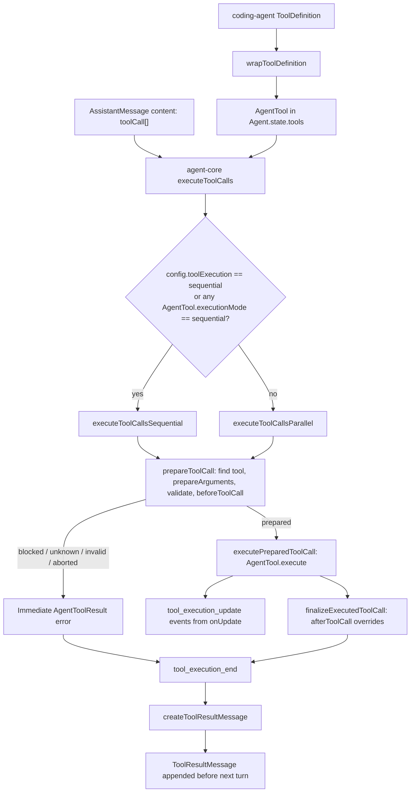

> 工具调用(tool call)在 pi 里分成两层: `pi-agent-core` 执行 `AgentTool` 的通用 prepare/validate/execute/finalize 流程, `pi-coding-agent` 负责把产品内置和扩展的 `ToolDefinition` 装配成这些 `AgentTool`。内置 `read` / `bash` / `powershell` / `edit` / `write` 默认带 `constrainedSampling: { type: "json_schema", strict: "prefer" }`，不再要求 `PI_EXPERIMENTAL`。

## 能回答的问题

- 模型产出的 `toolCall` 怎样变成 `toolResult` message?
- `AgentTool` 和 `ToolDefinition` 的边界在哪里?
- `beforeToolCall`、`afterToolCall`、`prepareArguments` 分别在哪个阶段运行?
- parallel/sequential 工具批次如何选择,结果顺序如何保持?
- coding-agent 的内置工具全集和默认激活工具集分别是什么?
- 哪些内置工具默认走 strict-prefer JSON-schema sampling，扩展如何关掉它?

```mermaid
flowchart TD
  A["AssistantMessage content: toolCall[]"] --> B["agent-core executeToolCalls"]
  B --> C{"config.toolExecution == sequential<br/>or any AgentTool.executionMode == sequential?"}
  C -->|yes| D["executeToolCallsSequential"]
  C -->|no| E["executeToolCallsParallel"]
  D --> F["prepareToolCall: find tool, prepareArguments, validate, beforeToolCall"]
  E --> F
  F -->|blocked / unknown / invalid / aborted| G["Immediate AgentToolResult error"]
  F -->|prepared| H["executePreparedToolCall: AgentTool.execute"]
  H --> I["tool_execution_update events from onUpdate"]
  H --> J["finalizeExecutedToolCall: afterToolCall overrides"]
  G --> K["tool_execution_end"]
  J --> K
  K --> L["createToolResultMessage"]
  L --> M["ToolResultMessage appended before next turn"]
  N["coding-agent ToolDefinition"] --> O["wrapToolDefinition"]
  O --> P["AgentTool in Agent.state.tools"]
  P --> B
```

## 端到端步骤

1. `streamAssistantResponse` 把 `context.tools` 放进 provider-facing `Context`；主循环收到 assistant message 后筛 `type === "toolCall"`，再调用 `executeToolCalls`。[E: packages/agent/src/agent-loop.ts:212] [E: packages/agent/src/agent-loop.ts:299] [E: packages/agent/src/agent-loop.ts:222] [E: packages/agent/src/agent-loop.ts:233]
2. `executeToolCalls` 重新从 assistant message 读出 tool calls；当全局 `config.toolExecution` 为 `"sequential"`，或任一被请求 `AgentTool.executionMode` 为 `"sequential"` 时，整批改走 sequential。[E: packages/agent/src/agent-loop.ts:416] [E: packages/agent/src/agent-loop.ts:417] [E: packages/agent/src/agent-loop.ts:420]
3. Sequential 执行先 emit `tool_execution_start`，prepare 一次 call，成功则 execute + finalize，再 emit `tool_execution_end`，创建并 emit `ToolResultMessage`，然后处理下一个 call。[E: packages/agent/src/agent-loop.ts:443] [E: packages/agent/src/agent-loop.ts:450] [E: packages/agent/src/agent-loop.ts:459] [E: packages/agent/src/agent-loop.ts:460] [E: packages/agent/src/agent-loop.ts:470] [E: packages/agent/src/agent-loop.ts:471]
4. Parallel 执行仍按 assistant 源顺序 prepare，但把已 prepare 的 call 存成 async thunk，经 `Promise.all` 执行；`tool_execution_end` 在每个 thunk 内发出，`ToolResultMessage` 之后按 `orderedFinalizedCalls` 的原始数组顺序创建。[E: packages/agent/src/agent-loop.ts:497] [E: packages/agent/src/agent-loop.ts:505] [E: packages/agent/src/agent-loop.ts:520] [E: packages/agent/src/agent-loop.ts:547] [E: packages/agent/src/agent-loop.ts:551] [E: packages/agent/src/agent-loop.ts:552]
5. `prepareToolCall` 按 `toolCall.name` 解析目标工具；缺失工具、validation 错误、blocked call、aborted call 都变成 error-shaped `AgentToolResult`，而不是把异常抛出 loop。[E: packages/agent/src/agent-loop.ts:616] [E: packages/agent/src/agent-loop.ts:618] [E: packages/agent/src/agent-loop.ts:625] [E: packages/agent/src/agent-loop.ts:643] [E: packages/agent/src/agent-loop.ts:655] [E: packages/agent/src/agent-loop.ts:668]
6. `prepareArguments` 是 `AgentTool` 上的 pre-validation compatibility hook；存在时会在 `validateToolArguments` 之前改写 raw model arguments。[E: packages/agent/src/agent-loop.ts:593] [E: packages/agent/src/agent-loop.ts:597] [E: packages/agent/src/agent-loop.ts:624]
7. `beforeToolCall` 在 validation 之后运行，可以 block execution；`afterToolCall` 在 `AgentTool.execute` 之后运行，可以在 end/result events 发出前替换 `content`、`details`、`isError`、`usage` 或 `terminate`。[E: packages/agent/src/types.ts:278] [E: packages/agent/src/types.ts:293] [E: packages/agent/src/agent-loop.ts:626] [E: packages/agent/src/agent-loop.ts:643] [E: packages/agent/src/agent-loop.ts:720] [E: packages/agent/src/agent-loop.ts:733] [E: packages/agent/src/agent-loop.ts:747]
8. `executePreparedToolCall` 调用 `AgentTool.execute(toolCallId, params, signal, onUpdate)`，把 `onUpdate` 转成 `tool_execution_update` events，等待 queued update event promises，并把 thrown errors 转成 error `AgentToolResult`。[E: packages/agent/src/agent-loop.ts:686] [E: packages/agent/src/agent-loop.ts:686] [E: packages/agent/src/agent-loop.ts:694] [E: packages/agent/src/agent-loop.ts:706] [E: packages/agent/src/agent-loop.ts:711]
9. finalized tool result 变成 provider-visible `ToolResultMessage`，字段包括 `role: "toolResult"`、`toolCallId`、`toolName`、`content`、`details`、`usage`、可选 `addedToolNames`、`isError` 和 timestamp；主循环在下一轮 assistant turn 前把这些 result messages 追加到 `currentContext.messages`。[E: packages/agent/src/agent-loop.ts:793] [E: packages/agent/src/agent-loop.ts:795] [E: packages/agent/src/agent-loop.ts:791] [E: packages/agent/src/agent-loop.ts:238]
10. batch-level early-stop hint 是合取：`shouldTerminateToolBatch` 只在 batch 非空且每个 finalized result 都有 `terminate === true` 时返回 true。[E: packages/agent/src/agent-loop.ts:589]

## `AgentTool` 是 agent-core 的运行时合约

`AgentTool` 扩展 provider-facing `Tool` shape，并加上 `label`、可选 `prepareArguments`、`execute`、以及可选 per-tool `executionMode`；底层 loop 只需要这个 shape 加上 `AgentContext.tools`。[E: packages/agent/src/types.ts:387] [E: packages/agent/src/types.ts:389] [E: packages/agent/src/types.ts:394] [E: packages/agent/src/types.ts:396] [E: packages/agent/src/types.ts:411]

`AgentToolResult` 是 final / partial tool output 的公共信封：模型可见的 `content`、结构化 `details`、可选 `usage`、可选 `addedToolNames`、可选 `terminate`。[E: packages/agent/src/types.ts:362] [E: packages/agent/src/types.ts:364] [E: packages/agent/src/types.ts:366] [E: packages/agent/src/types.ts:368] [E: packages/agent/src/types.ts:370] [E: packages/agent/src/types.ts:375] reusable core 知道如何 validate、execute、stream updates、emit lifecycle events 并追加 tool results，但它不知道 coding-agent 特有的 prompt snippets、renderers、shell settings 或 extension metadata。[I]

## `ToolDefinition` 是 coding-agent 的产品装配合约

`ToolDefinition` 携带 LLM-facing name/description/schema，再加上 `promptSnippet`、`promptGuidelines`、`renderShell`、custom renderers，以及接收 `ExtensionContext` 的 `execute`。[E: packages/coding-agent/src/core/extensions/types.ts:451] [E: packages/coding-agent/src/core/extensions/types.ts:453] [E: packages/coding-agent/src/core/extensions/types.ts:457] [E: packages/coding-agent/src/core/extensions/types.ts:459] [E: packages/coding-agent/src/core/extensions/types.ts:463] [E: packages/coding-agent/src/core/extensions/types.ts:465] [E: packages/coding-agent/src/core/extensions/types.ts:482] [E: packages/coding-agent/src/core/extensions/types.ts:491] [E: packages/coding-agent/src/core/extensions/types.ts:494]

`wrapToolDefinition` 是显式 adapter 边界：它把 `name`、`label`、`description`、`parameters`、`constrainedSampling`、`prepareArguments`、`executionMode` 拷到 `AgentTool`，再用 `ctxFactory?.()` 作为第五个 `ToolDefinition.execute` 参数适配 `execute`。[E: packages/coding-agent/src/core/tools/tool-definition-wrapper.ts:5] [E: packages/coding-agent/src/core/tools/tool-definition-wrapper.ts:10] [E: packages/coding-agent/src/core/tools/tool-definition-wrapper.ts:14] [E: packages/coding-agent/src/core/tools/tool-definition-wrapper.ts:17]

反向 adapter `createToolDefinitionFromAgentTool` 同样保留 `constrainedSampling`，供 `baseToolsOverride` 使用：它从普通 `AgentTool` 合成最小 `ToolDefinition`，让 `AgentSession` 在调用方直接提供 runtime tools 时仍保持 definition-first registry。[E: packages/coding-agent/src/core/tools/tool-definition-wrapper.ts:36] [E: packages/coding-agent/src/core/tools/tool-definition-wrapper.ts:42] [E: packages/coding-agent/src/core/agent-session.ts:2779] [E: packages/coding-agent/src/core/agent-session.ts:2776]

`constrainedSampling` 在执行 loop 前随 provider-facing tool schema 进入请求；它不改变本页的 prepare/execute/finalize 生命周期，provider adapter 的 strict/grammar 判定由 `subsys.ai.constrained-sampling` 覆盖。[I]

## 默认 strict-prefer JSON-schema sampling

`read`、`edit`、`write` 在各自 factory 里直接声明 `constrainedSampling: { type: "json_schema", strict: "prefer" }`。[E: packages/coding-agent/src/core/tools/read.ts:77] [E: packages/coding-agent/src/core/tools/edit.ts:156] [E: packages/coding-agent/src/core/tools/write.ts:57] `bash` 与 `powershell` 共用 `createShellToolDefinition()`，该 helper 写入同一字段；`powershell` 只是换 shell config 后调用它。[E: packages/coding-agent/src/core/tools/bash.ts:238] [E: packages/coding-agent/src/core/tools/powershell.ts:53]

测试把这五个名字锁成 `strictToolNames`，并断言即使 `PI_EXPERIMENTAL` 为 `undefined` / `"0"` / `"1"` 也仍然 prefer strict；`grep` / `find` / `ls` 的 `constrainedSampling` 保持 `undefined`。扩展可把 `constrainedSampling: false` 写回定义。[E: packages/coding-agent/test/builtin-tool-strict-mode.test.ts:13] [E: packages/coding-agent/test/builtin-tool-strict-mode.test.ts:18] [E: packages/coding-agent/test/builtin-tool-strict-mode.test.ts:23] [E: packages/coding-agent/test/builtin-tool-strict-mode.test.ts:27] [E: packages/coding-agent/test/builtin-tool-strict-mode.test.ts:38]

## pi-coding-agent 的工具装配边界

coding-agent 内置工具 ground truth 是 `ToolName = "read" | "bash" | "powershell" | "edit" | "write" | "grep" | "find" | "ls"`，`allToolNames` 含同一组八个名字。[E: packages/coding-agent/src/core/tools/index.ts:95] [E: packages/coding-agent/src/core/tools/index.ts:96] `createAllToolDefinitions` 返回含 `powershell` 的八工具 record；`createCodingToolDefinitions` 仍只返回四个 write-capable coding tools（`read`/`bash`/`edit`/`write`），`createReadOnlyToolDefinitions` 仍只返回四个 read/search/list tools，两个 preset **都不含** `powershell`。[E: packages/coding-agent/src/core/tools/index.ts:164] [E: packages/coding-agent/src/core/tools/index.ts:173] [E: packages/coding-agent/src/core/tools/index.ts:182]

`AgentSession._buildRuntime` 把产品 settings 注入内置工具选项：`read` 用 image auto-resize，`bash` 用 shell command prefix/path，然后在没有 `baseToolsOverride` 时调用 `createAllToolDefinitions`。[E: packages/coding-agent/src/core/agent-session.ts:2776] [E: packages/coding-agent/src/core/agent-session.ts:2770] [E: packages/coding-agent/src/core/agent-session.ts:2771] [E: packages/coding-agent/src/core/agent-session.ts:2772] [E: packages/coding-agent/src/core/agent-session.ts:2779]

`AgentSession._refreshToolRegistry` 合并 built-in definitions、extension-registered tools 和 SDK `customTools`，应用 allowed/excluded filters，保存带 source metadata 的 `ToolDefinition`，把 registered definitions wrap 成 `AgentTool`，最后调用 `setActiveToolsByName`。[E: packages/coding-agent/src/core/agent-session.ts:2671] [E: packages/coding-agent/src/core/agent-session.ts:2686] [E: packages/coding-agent/src/core/agent-session.ts:2723] [E: packages/coding-agent/src/core/agent-session.ts:2733] [E: packages/coding-agent/src/core/agent-session.ts:2761]

没有 `baseToolsOverride` 时，默认 active tools 只有 `read`、`bash`、`edit`、`write`；`_refreshToolRegistry` 仍把所有 allowed base definitions wrap 进 `_toolRegistry`，`setActiveToolsByName` 只在 registry 里存在的名字上激活。[E: packages/coding-agent/src/core/agent-session.ts:2808] [E: packages/coding-agent/src/core/agent-session.ts:2810] [E: packages/coding-agent/src/core/agent-session.ts:970] [E: packages/coding-agent/src/core/agent-session.ts:974]

## AgentHarness 的 context 绑定变体

`AgentHarnessTool` 保留 `AgentTool` 的静态字段，但把 `execute` 换成 turn snapshot 上的六参签名：`onUpdate`、`toolContext`、`invocation`、`context`。[E: packages/agent/src/harness/types.ts:108] [E: packages/agent/src/harness/types.ts:114] `AgentHarness.create` 把这份 harness 附着到一份 durable `Session`；实现是 `createAgentHarness`，再经 `AgentLane.prompt` / `resume` / `steer` 进入 lane drive。这是 reusable harness 路径，不是 CLI 产品默认的 `Agent` + `AgentSession` 路径。[E: packages/agent/src/harness/agent-harness.ts:519] [E: packages/agent/src/harness/agent-harness.ts:550] [E: packages/agent/src/harness/agent-harness.ts:622] 四个内置 harness execution tools 的 I/O 见 `subsys.agent-core.execution-tools`。

## 关键决策点

- Batch scheduling 对 sequential tools 保守：一个 sequential target 会把整批 assistant tool-call 改走 sequential，mixed batch 不会让 sequential tool 与 parallel peers 交错。[E: packages/agent/src/agent-loop.ts:417] [E: packages/agent/src/agent-loop.ts:420]
- Validation 和 policy hooks 发生在 execution 之前，所以 invalid arguments 或 blocked calls 仍会产出模型可见的 tool-result messages，可以 in-band 送回。[E: packages/agent/src/agent-loop.ts:624] [E: packages/agent/src/agent-loop.ts:643] [E: packages/agent/src/agent-loop.ts:668] [E: packages/agent/src/agent-loop.ts:784]
- Partial output 在工具返回前只走 event：`onUpdate` emit `tool_execution_update`，最终 `ToolResultMessage` 来自 finalized result object。[E: packages/agent/src/agent-loop.ts:694] [E: packages/agent/src/agent-loop.ts:706] [E: packages/agent/src/agent-loop.ts:784] [E: packages/agent/src/agent-loop.ts:791]
- 产品 UI rendering 属于 `ToolDefinition`，不属于 `AgentTool`：render callbacks 住在 coding-agent extension types，core `AgentTool` 只暴露 runtime contract 字段。[E: packages/coding-agent/src/core/extensions/types.ts:491] [E: packages/coding-agent/src/core/extensions/types.ts:494] [I]
- strict-prefer sampling 是定义期 metadata，不是执行 schema 变更：测试明确断言 `read.parameters.required` 仍是 `["path"]`，`bash.parameters.required` 仍是 `["command"]`。[E: packages/coding-agent/test/builtin-tool-strict-mode.test.ts:30] [E: packages/coding-agent/test/builtin-tool-strict-mode.test.ts:31]

## 指向 T1/T2 深挖

- [spine.agent-loop](agent-loop.md): agent turn lifecycle、queue draining，以及 tool results 如何喂下一轮 assistant request。
- [subsys.agent-core.tool-invocation](../subsystems/agent-core/tool-invocation.md): `prepareToolCall` / `executePreparedToolCall` / event semantics 的子系统级走读。
- [subsys.coding-agent.agent-session](../subsystems/coding-agent/agent-session.md): `AgentSession` runtime rebuilds、extension binding、active tool changes、prompt rebuilds。
- [surface.tools.bash](../surface/tools/bash.md): 一个具体内置工具定义、execution operations、streaming details、shell configuration。
- [subsys.ai.constrained-sampling](../subsystems/ai/constrained-sampling.md): provider adapter 如何把 `constrainedSampling` 转成 grammar / strict JSON schema。

## Sources

- packages/agent/src/agent-loop.ts
- packages/agent/src/types.ts
- packages/agent/src/harness/agent-harness.ts
- packages/agent/src/harness/types.ts
- packages/coding-agent/src/core/tools/index.ts
- packages/coding-agent/src/core/tools/bash.ts
- packages/coding-agent/src/core/tools/read.ts
- packages/coding-agent/src/core/tools/edit.ts
- packages/coding-agent/src/core/tools/write.ts
- packages/coding-agent/src/core/tools/powershell.ts
- packages/coding-agent/src/core/extensions/types.ts
- packages/coding-agent/src/core/tools/tool-definition-wrapper.ts
- packages/coding-agent/src/core/agent-session.ts
- packages/coding-agent/test/builtin-tool-strict-mode.test.ts

## 相关

- [spine.agent-loop](agent-loop.md)
- [subsys.agent-core.tool-invocation](../subsystems/agent-core/tool-invocation.md)
- [subsys.coding-agent.agent-session](../subsystems/coding-agent/agent-session.md)
- [surface.tools.bash](../surface/tools/bash.md)
- [subsys.agent-core.execution-tools](../subsystems/agent-core/execution-tools.md)
- [subsys.ai.constrained-sampling](../subsystems/ai/constrained-sampling.md)
