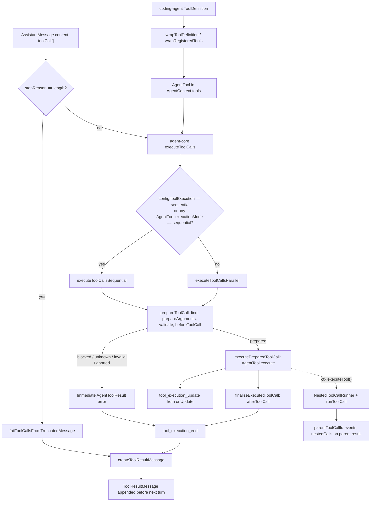

> 工具调用在 pi 里分成两层：`pi-agent-core` 把 assistant `toolCall` 变成 `toolResult`（prepare / validate / `beforeToolCall` / execute / `afterToolCall`），`pi-coding-agent` 把产品 `ToolDefinition` 经 `wrapToolDefinition` 装成这些 `AgentTool`。模型可见参数是 `JsonObject`。会话里 `ctx.executeTool()` 走同一 pipeline（`runToolCall`），但不写入独立 transcript 条目。可复用 durable `Harness` 的执行工具不走这条 `ToolDefinition` 路径，见 [subsys.durable.harness](../subsystems/durable/harness.md)。

## 能回答的问题

- 模型产出的 `toolCall` 怎样变成 `toolResult` message，`stopReason === "length"` 时为什么整批失败？
- `AgentTool` 和 `ToolDefinition` 的边界在哪里，`wrapToolDefinition` 复制哪些字段？
- `prepareArguments`、`beforeToolCall`、`afterToolCall` 分别在哪个阶段运行？
- parallel / sequential 批次如何选择，结果顺序如何保持？
- `ctx.executeTool()` 的 nested call 如何复用 pipeline，却不进入模型可见 transcript？
- coding-agent 的内置工具全集、coding / read-only preset、默认激活集分别是什么？

```mermaid
flowchart TD
  A["AssistantMessage content: toolCall[]"] --> L{"stopReason == length?"}
  L -->|yes| FAIL["failToolCallsFromTruncatedMessage"]
  L -->|no| B["agent-core executeToolCalls"]
  B --> C{"config.toolExecution == sequential<br/>or any AgentTool.executionMode == sequential?"}
  C -->|yes| D["executeToolCallsSequential"]
  C -->|no| E["executeToolCallsParallel"]
  D --> P["prepareToolCall: find, prepareArguments, validate, beforeToolCall"]
  E --> P
  P -->|blocked / unknown / invalid / aborted| G["Immediate AgentToolResult error"]
  P -->|prepared| H["executePreparedToolCall: AgentTool.execute"]
  H --> I["tool_execution_update from onUpdate"]
  H --> J["finalizeExecutedToolCall: afterToolCall"]
  G --> K["tool_execution_end"]
  J --> K
  FAIL --> R
  K --> R["createToolResultMessage"]
  R --> M["ToolResultMessage appended before next turn"]
  N["coding-agent ToolDefinition"] --> O["wrapToolDefinition / wrapRegisteredTools"]
  O --> Q["AgentTool in AgentContext.tools"]
  Q --> B
  H -.->|"ctx.executeTool()"| NT["NestedToolCallRunner + runToolCall"]
  NT --> NC["parentToolCallId events; nestedCalls on parent result"]
```

## 端到端步骤

1. `streamAssistantResponse` 把 `AgentMessage[]` 经 `convertToLlm` 再 `normalizeContext({ messages })` 交给 provider；provider-facing 工具声明来自 transcript 的 system messages，不是把 `AgentContext.tools` 塞进请求。`AgentContext.tools` 仍是本轮可执行实现。`declareToolChanges` 在请求前把 transcript 已声明集合与 `(context.tools ?? []).map(toToolDeclaration)` 的差写成 `toolsAdded` / `toolsRemoved`。[E: packages/agent/src/agent-loop.ts:397] [E: packages/agent/src/agent-loop.ts:333] [E: packages/agent/src/agent-loop.ts:347] [E: packages/agent/src/agent-loop.ts:349] [E: packages/agent/src/types.ts:500] [E: packages/agent/src/types.ts:504]
2. 主循环筛 `message.content` 里 `type === "toolCall"`。`stopReason === "length"` 时不执行：`failToolCallsFromTruncatedMessage` 给每个 call 发 `tool_execution_start` / error result / `tool_execution_end` / `toolResult`，并返回 `terminate: false`。否则走 `executeToolCalls`。[E: packages/agent/src/agent-loop.ts:259] [E: packages/agent/src/agent-loop.ts:267] [E: packages/agent/src/agent-loop.ts:268] [E: packages/agent/src/agent-loop.ts:269] [E: packages/agent/src/agent-loop.ts:270] [E: packages/agent/src/agent-loop.ts:478] [E: packages/agent/src/agent-loop.ts:502]
3. 每个 finalized result 被 push 进 `currentContext.messages` 与 `newMessages`。`hasMoreToolCalls = !executedToolBatch.terminate`：只有整批 `terminate` 才阻止下一轮 assistant。[E: packages/agent/src/agent-loop.ts:271] [E: packages/agent/src/agent-loop.ts:272] [E: packages/agent/src/agent-loop.ts:274] [E: packages/agent/src/agent-loop.ts:275]
4. `executeToolCalls` 再从 assistant message 读 tool calls。全局 `config.toolExecution === "sequential"`，或任一被请求 `AgentTool.executionMode === "sequential"` 时，整批走 sequential；否则（含 `toolExecution` 未设）走 parallel。[E: packages/agent/src/agent-loop.ts:508] [E: packages/agent/src/agent-loop.ts:515] [E: packages/agent/src/agent-loop.ts:516] [E: packages/agent/src/agent-loop.ts:519] [E: packages/agent/src/agent-loop.ts:520] [E: packages/agent/src/agent-loop.ts:522] [E: packages/agent/src/types.ts:317]
5. Sequential：对每个 call 先 `tool_execution_start`，再 `prepareToolCall`；immediate error 直接 finalize，prepared 则 `executePreparedToolCall` + `finalizeExecutedToolCall`；然后 `tool_execution_end`、创建并 emit `ToolResultMessage`，再处理下一个。abort 在当前 call 已经写入结果后 `break`。[E: packages/agent/src/agent-loop.ts:542] [E: packages/agent/src/agent-loop.ts:549] [E: packages/agent/src/agent-loop.ts:551] [E: packages/agent/src/agent-loop.ts:558] [E: packages/agent/src/agent-loop.ts:559] [E: packages/agent/src/agent-loop.ts:569] [E: packages/agent/src/agent-loop.ts:570] [E: packages/agent/src/agent-loop.ts:575]
6. Parallel：仍按 assistant 源顺序逐个 `tool_execution_start` + `prepareToolCall`。immediate 当场 `tool_execution_end`；prepared 存成 async thunk，`Promise.all` 并发执行。真正执行的 `tool_execution_end` 在 thunk 内、按完成顺序发出；`ToolResultMessage` 等全部 resolve 后按 `orderedFinalizedCalls` 的原始数组顺序创建。[E: packages/agent/src/agent-loop.ts:596] [E: packages/agent/src/agent-loop.ts:604] [E: packages/agent/src/agent-loop.ts:605] [E: packages/agent/src/agent-loop.ts:611] [E: packages/agent/src/agent-loop.ts:619] [E: packages/agent/src/agent-loop.ts:638] [E: packages/agent/src/agent-loop.ts:646] [E: packages/agent/src/agent-loop.ts:650]
7. `prepareToolCall` 按 `toolCall.name` 在 `tools`（默认 `currentContext.tools`）里查找。缺失工具、`prepareArguments` / `validateToolArguments` 抛错、`beforeToolCall` `{ block: true }`、abort，都变成 `kind: "immediate"` 的 error `AgentToolResult`，不把异常抛出 loop。[E: packages/agent/src/agent-loop.ts:707] [E: packages/agent/src/agent-loop.ts:715] [E: packages/agent/src/agent-loop.ts:719] [E: packages/agent/src/agent-loop.ts:744] [E: packages/agent/src/agent-loop.ts:756] [E: packages/agent/src/agent-loop.ts:769]
8. `prepareArguments` 是 validation 之前的兼容 hook：存在则改写 raw arguments，相同引用则原样返回。随后 `validateToolArguments` 校验（并可 coerce）schema。[E: packages/agent/src/agent-loop.ts:693] [E: packages/agent/src/agent-loop.ts:697] [E: packages/agent/src/agent-loop.ts:725] [E: packages/agent/src/agent-loop.ts:726] [E: packages/agent/src/types.ts:471]
9. `beforeToolCall` 在 validation 之后、execute 之前运行，可 `{ block: true, reason?, terminate? }`。`afterToolCall` 在 `AgentTool.execute` 之后、`tool_execution_end` 之前运行，可替换 `content`、`details`、`isError`、`usage`、`terminate`；提供 `content` 却不带 `structuredContent` 时会丢掉旧 `structuredContent`。[E: packages/agent/src/types.ts:326] [E: packages/agent/src/types.ts:341] [E: packages/agent/src/types.ts:92] [E: packages/agent/src/agent-loop.ts:727] [E: packages/agent/src/agent-loop.ts:864] [E: packages/agent/src/agent-loop.ts:879] [E: packages/agent/src/agent-loop.ts:883]
10. `executePreparedToolCall` 调用 `AgentTool.execute(toolCallId, params, signal, onUpdate)`。`onUpdate` 在 `acceptingUpdates` 为 true 时入队为 `tool_execution_update`；execute 结束后关掉更新并 `Promise.all` 已入队的 update。thrown error 变成 error `AgentToolResult`。[E: packages/agent/src/agent-loop.ts:829] [E: packages/agent/src/agent-loop.ts:833] [E: packages/agent/src/agent-loop.ts:780] [E: packages/agent/src/agent-loop.ts:838] [E: packages/agent/src/agent-loop.ts:839] [E: packages/agent/src/agent-loop.ts:841]
11. `createToolResultMessage` 写出 provider-visible `role: "toolResult"`：`toolCallId`、`toolName`、`content: result.content ?? []`、`details`、`usage`、`isError`、`timestamp`。它不拷贝 `structuredContent`，也不写 `nestedCalls`。[E: packages/agent/src/agent-loop.ts:922] [E: packages/agent/src/agent-loop.ts:924] [E: packages/agent/src/agent-loop.ts:929] [E: packages/agent/src/agent-loop.ts:930] [E: packages/agent/src/agent-loop.ts:932]
12. `shouldTerminateToolBatch` 是合取：batch 非空且每个 finalized `result.terminate === true`。truncated-length 失败批次固定 `terminate: false`。[E: packages/agent/src/agent-loop.ts:689] [E: packages/agent/src/agent-loop.ts:690] [E: packages/agent/src/agent-loop.ts:502]

## `AgentTool` 是 agent-core 的运行时合约

provider 消息里的 `ToolCall.arguments` 类型是 `JsonObject`（`{ [key: string]: JsonValue }`；`JsonValue` 为 `null | boolean | number | string | readonly JsonValue[] | JsonObject`）。这排除 `undefined`、function、class instance、bigint。`AgentToolCall` 是 `AssistantMessage.content` 里 `type === "toolCall"` 的抽取，因此同一限制进入 agent-core。[E: packages/ai/src/types.ts:417] [E: packages/ai/src/types.ts:421] [E: packages/ai/src/types.ts:452] [E: packages/ai/src/types.ts:453] [E: packages/agent/src/types.ts:58]

`AgentTool` 扩展 provider-facing `Tool`（`name` / `description` / `parameters` / 可选 `constrainedSampling`），并加上 `label`、可选 `prepareArguments`、可选 `outputSchema`、`execute`、可选 `replay`、可选 per-tool `executionMode`。loop 执行只需要这个 shape 加上 `AgentContext.tools`。[E: packages/ai/src/types.ts:715] [E: packages/ai/src/types.ts:719] [E: packages/agent/src/types.ts:464] [E: packages/agent/src/types.ts:466] [E: packages/agent/src/types.ts:471] [E: packages/agent/src/types.ts:476] [E: packages/agent/src/types.ts:481] [E: packages/agent/src/types.ts:496] [E: packages/agent/src/types.ts:504]

`AgentTool.execute` 的类型是四参：`(toolCallId, params, signal?, onUpdate?)`。失败应 throw 或返回 `isError: true`，不能只把失败写进 `content`。[E: packages/agent/src/types.ts:481]

`AgentToolResult` 是 final / partial 公共信封：模型可见 `content`、结构化 `details`、可选 `structuredContent`（匹配 `outputSchema`，不送给模型）、可选 `usage`、可选 `isError`、可选 `terminate`。`addedToolNames` 已不在该类型上。[E: packages/agent/src/types.ts:424] [E: packages/agent/src/types.ts:426] [E: packages/agent/src/types.ts:433] [E: packages/agent/src/types.ts:435] [E: packages/agent/src/types.ts:440] [E: packages/agent/src/types.ts:445]

`AgentTool.replay`（`"never" | "safe"`）标在运行时合约上，但 `executeToolCalls` / `prepareToolCall` 不读取它；durable `Harness` 的 effect 恢复走另一条 task 路径。[E: packages/agent/src/types.ts:488] [I]

`ToolResultMessage` 可带可选 `nestedCalls`：会话记录 nested 调用，不送给模型。agent-core 的 `createToolResultMessage` 不填这个字段。[E: packages/ai/src/types.ts:604] [E: packages/agent/src/agent-loop.ts:922]

## `ToolDefinition` 是 coding-agent 的产品装配合约

`ToolDefinition` 携带 LLM-facing `name` / `description` / `parameters`，再加上 `promptSnippet`、`promptGuidelines`、`renderShell`、`renderCall` / `renderResult`、`exposure`、`namespace`、`annotations`、`defaultActive`、`prepareLoadout`，以及接收第五参 `ExtensionToolContext` 的 `execute`。[E: packages/coding-agent/src/core/extensions/types.ts:565] [E: packages/coding-agent/src/core/extensions/types.ts:567] [E: packages/coding-agent/src/core/extensions/types.ts:573] [E: packages/coding-agent/src/core/extensions/types.ts:577] [E: packages/coding-agent/src/core/extensions/types.ts:627] [E: packages/coding-agent/src/core/extensions/types.ts:632] [E: packages/coding-agent/src/core/extensions/types.ts:636]

`ExtensionToolContext` 在 `ExtensionContext` 上加 `tools` 与 `executeTool(name, args, options?)`。无 `ctxFactory` 的 `wrapToolDefinition`（例如单独 `createBashTool()` 交给 plain `Agent`）拿不到这份 context。[E: packages/coding-agent/src/core/extensions/types.ts:383] [E: packages/coding-agent/src/core/extensions/types.ts:385] [E: packages/coding-agent/src/core/extensions/types.ts:394]

产品 UI rendering 属于 `ToolDefinition`，不属于 `AgentTool`：render callbacks 留在 coding-agent extension types；core `AgentTool` 只暴露 runtime 字段。[E: packages/coding-agent/src/core/extensions/types.ts:636] [E: packages/coding-agent/src/core/extensions/types.ts:639] [I]

## `wrapToolDefinition` 是显式 adapter 边界

`wrapToolDefinition` 把 `name`、`label`、`description`、`parameters`、`outputSchema`、`constrainedSampling`、`prepareArguments`、`executionMode` 拷到 `AgentTool`。它不拷贝 `promptSnippet`、renderers、`exposure`、`replay`。[E: packages/coding-agent/src/core/tools/tool-definition-wrapper.ts:8] [E: packages/coding-agent/src/core/tools/tool-definition-wrapper.ts:13] [E: packages/coding-agent/src/core/tools/tool-definition-wrapper.ts:17] [E: packages/coding-agent/src/core/tools/tool-definition-wrapper.ts:18] [E: packages/coding-agent/src/core/tools/tool-definition-wrapper.ts:20]

wrapper 的 `execute` 实现多收可选第五参 `ctx?: ExtensionToolContext`，再调用 `definition.execute(..., ctx ?? ctxFactory?.(toolCallId, signal))`。agent-core 只传四参，因此会话路径必须靠 `ctxFactory` 注入 context。[E: packages/coding-agent/src/core/tools/tool-definition-wrapper.ts:21] [E: packages/coding-agent/src/core/tools/tool-definition-wrapper.ts:22] [E: packages/coding-agent/src/core/tools/tool-definition-wrapper.ts:27] [E: packages/agent/src/agent-loop.ts:829]

`wrapRegisteredTool` 把 `runner.createToolContext(toolCallId, signal)` 当作 `ctxFactory`，所以 `AgentSession` 里的内置工具和扩展工具都能拿到 `executeTool`。[E: packages/coding-agent/src/core/extensions/wrapper.ts:17] [E: packages/coding-agent/src/core/extensions/wrapper.ts:18] [E: packages/coding-agent/src/core/extensions/wrapper.ts:27]

反向 adapter `createToolDefinitionFromAgentTool` 同样保留 `outputSchema` / `constrainedSampling` / `prepareArguments` / `executionMode`，供 `baseToolsOverride` 使用：从普通 `AgentTool` 合成最小 `ToolDefinition`，让 `AgentSession` 在调用方直接提供 runtime tools 时仍保持 definition-first registry。[E: packages/coding-agent/src/core/tools/tool-definition-wrapper.ts:46] [E: packages/coding-agent/src/core/tools/tool-definition-wrapper.ts:52] [E: packages/coding-agent/src/core/tools/tool-definition-wrapper.ts:53] [E: packages/coding-agent/src/core/agent-session.ts:3566] [E: packages/coding-agent/src/core/agent-session.ts:3570]

`constrainedSampling` 在执行 loop 前随 provider-facing tool schema 进入请求；它不改变本页的 prepare / execute / finalize 生命周期。provider adapter 的 strict / grammar 判定由 [subsys.ai.constrained-sampling](../subsystems/ai/constrained-sampling.md) 覆盖。[I]

## 内置八工具与 coding / read-only preset

coding-agent 内置工具 ground truth 是 `ToolName = "read" | "bash" | "powershell" | "edit" | "write" | "grep" | "find" | "ls"`，`allToolNames` 含同一组八个名字。[E: packages/coding-agent/src/core/tools/index.ts:95] [E: packages/coding-agent/src/core/tools/index.ts:96]

`createAllToolDefinitions` 返回含 `powershell` 的八工具 record。`createCodingToolDefinitions` 只返回四个 write-capable coding tools（`read` / `bash` / `edit` / `write`）。`createReadOnlyToolDefinitions` 只返回四个 read / search / list tools（`read` / `grep` / `find` / `ls`）。两个 preset **都不含** `powershell`。[E: packages/coding-agent/src/core/tools/index.ts:164] [E: packages/coding-agent/src/core/tools/index.ts:173] [E: packages/coding-agent/src/core/tools/index.ts:182] [E: packages/coding-agent/src/core/tools/index.ts:186]

`AgentSession._buildRuntime` 把 settings 注入内置工具选项：`read` 用 image auto-resize，`bash` 用 shell command prefix / path；没有 `baseToolsOverride` 时调用 `createAllToolDefinitions`（因此 registry 含全部八个，包括 `powershell`）。[E: packages/coding-agent/src/core/agent-session.ts:3563] [E: packages/coding-agent/src/core/agent-session.ts:3573] [E: packages/coding-agent/src/core/agent-session.ts:3574]

`_refreshToolRegistry` 合并 built-in definitions、extension-registered tools 和 SDK `customTools`，应用 allowed / excluded filters，保存带 source metadata 的 `ToolDefinition`，再 `wrapRegisteredTools` 成 `AgentTool`；extension / custom 同名覆盖 built-in。[E: packages/coding-agent/src/core/agent-session.ts:3448] [E: packages/coding-agent/src/core/agent-session.ts:3457] [E: packages/coding-agent/src/core/agent-session.ts:3500] [E: packages/coding-agent/src/core/agent-session.ts:3501] [E: packages/coding-agent/src/core/agent-session.ts:3513] [E: packages/coding-agent/src/core/agent-session.ts:3515]

没有 `baseToolsOverride` 时，默认 active tools 是 `read`、`bash`、`edit`、`write`。`_refreshToolRegistry` 仍把所有 allowed base definitions wrap 进 `_toolRegistry`；`setActiveToolsByName` 只激活 registry 里存在、且 exposure 不是 `"hidden"` 的名字。[E: packages/coding-agent/src/core/agent-session.ts:3602] [E: packages/coding-agent/src/core/agent-session.ts:3604] [E: packages/coding-agent/src/core/agent-session.ts:1488] [E: packages/coding-agent/src/core/agent-session.ts:1528]

`ctx.executeTool()` 的 callable 集合不是 `agent.state.tools` 全集：active `direct` 工具，加上每个已注册的 `codemode` 或 `deferred` 工具。[E: packages/coding-agent/src/core/agent-session.ts:1515] [E: packages/coding-agent/src/core/agent-session.ts:1518]

## Nested 调用：`runToolCall` 与 `NestedToolCallRunner`

`runToolCall` 对单次 call 跑与模型签发相同的步骤：`prepareArguments`、schema validation、`beforeToolCall`、execute、`afterToolCall`。它自己不 emit 事件、不追加 message。工具失败永不 reject：unknown / validation / blocked / thrown 都变成 `isError: true`。[E: packages/agent/src/agent-loop.ts:810] [E: packages/agent/src/agent-loop.ts:812] [E: packages/agent/src/agent-loop.ts:816] [E: packages/agent/src/agent-loop.ts:817]

`NestedToolCallRunner.execute(callerId, name, args)` 在工具执行中被 `ctx.executeTool()` 触发。nested id 是 `` `${callerId}/${n}` ``；`tool_execution_*` 事件带 `parentToolCallId`。agent-core loop 不知道这些 call。[E: packages/coding-agent/src/core/nested-tool-calls.ts:175] [E: packages/coding-agent/src/core/nested-tool-calls.ts:188] [E: packages/coding-agent/src/core/nested-tool-calls.ts:198] [E: packages/coding-agent/src/core/agent-session.ts:702] [E: packages/coding-agent/src/core/agent-session.ts:720]

若 agent 的 `toolExecution === "sequential"`，或目标 `AgentTool.executionMode === "sequential"`，且当前 scope 尚未持有 exclusive queue，nested call 会串行排队；持有 queue 的 call 自己的再入 nested 不再等待自己。[E: packages/coding-agent/src/core/nested-tool-calls.ts:201] [E: packages/coding-agent/src/core/nested-tool-calls.ts:204] [E: packages/coding-agent/src/core/nested-tool-calls.ts:206] [E: packages/coding-agent/src/core/agent-session.ts:710]

记录上限：最多 256 条；单条 arguments JSON 超过 8KiB 或合计超过 32KiB 时省略 `arguments` 并标 incomplete；error 文本截到 500 字符。结果本身不写入 record。[E: packages/coding-agent/src/core/nested-tool-calls.ts:26] [E: packages/coding-agent/src/core/nested-tool-calls.ts:27] [E: packages/coding-agent/src/core/nested-tool-calls.ts:28] [E: packages/coding-agent/src/core/nested-tool-calls.ts:57] [E: packages/ai/src/types.ts:588]

`AgentSession` 在 parent `toolResult` 的 `message_start` 上 `takeRecord`：有 snapshot 则写入 `message.nestedCalls`，并把 nested `usage` combine 进 parent `usage`。`agent_end` 时 `clear()`。[E: packages/coding-agent/src/core/agent-session.ts:1077] [E: packages/coding-agent/src/core/agent-session.ts:1079] [E: packages/coding-agent/src/core/agent-session.ts:1080] [E: packages/coding-agent/src/core/agent-session.ts:1082] [E: packages/coding-agent/src/core/agent-session.ts:1085]

内置 `codemode` 扩展对 `createCodemodeToolDefinition` 调用 `wrapToolDefinition`；脚本经 `ctx.executeTool` 调其它工具，只有脚本自身输出进入模型可见 `content`。[E: packages/coding-agent/src/extensions/codemode/tool.ts:396] [E: packages/coding-agent/src/extensions/codemode/tool.ts:397]

MCP 包装是 `createMcpToolDefinition`：把 server 工具编成 `ToolDefinition`（名字由 `createMcpToolName` 做成 `mcp__<server>__<tool>`，`outputSchema` 为 `CallToolResult`），再经 `wrapRegisteredTools` 进入同一 `AgentTool` 执行路径。[E: packages/coding-agent/src/extensions/mcp/tools.ts:260] [E: packages/coding-agent/src/extensions/mcp/tools.ts:93] [E: packages/coding-agent/src/extensions/mcp/tools.ts:280] [E: packages/coding-agent/src/core/extensions/wrapper.ts:17]

## 默认 strict-prefer JSON-schema sampling

`read`、`edit`、`write` 在各自 factory 里直接声明 `constrainedSampling: { type: "json_schema", strict: "prefer" }`。[E: packages/coding-agent/src/core/tools/read.ts:80] [E: packages/coding-agent/src/core/tools/edit.ts:156] [E: packages/coding-agent/src/core/tools/write.ts:57] `bash` 与 `powershell` 共用 `createShellToolDefinition()`，该 helper 写入同一字段；`powershell` 只是换 shell config 后调用它。[E: packages/coding-agent/src/core/tools/bash.ts:260] [E: packages/coding-agent/src/core/tools/powershell.ts:53]

测试把这五个名字锁成 `strictToolNames`，并断言即使 `PI_EXPERIMENTAL` 为 `undefined` / `"0"` / `"1"` 也仍然 prefer strict；`grep` / `find` / `ls` 的 `constrainedSampling` 保持 `undefined`。扩展可把 `constrainedSampling: false` 写回定义，`wrapToolDefinition` 会原样拷到 `AgentTool`。[E: packages/coding-agent/test/builtin-tool-strict-mode.test.ts:13] [E: packages/coding-agent/test/builtin-tool-strict-mode.test.ts:18] [E: packages/coding-agent/test/builtin-tool-strict-mode.test.ts:23] [E: packages/coding-agent/test/builtin-tool-strict-mode.test.ts:27] [E: packages/coding-agent/test/builtin-tool-strict-mode.test.ts:38]

strict-prefer 是定义期 metadata，不是执行 schema 变更：测试断言 `read.parameters.required` 仍是 `["path"]`，`bash.parameters.required` 仍是 `["command"]`。[E: packages/coding-agent/test/builtin-tool-strict-mode.test.ts:30] [E: packages/coding-agent/test/builtin-tool-strict-mode.test.ts:31]

## 关键决策点

- Batch scheduling 对 sequential tools 保守：一个 sequential target 会把整批 assistant tool-call 改走 sequential，mixed batch 不会让 sequential tool 与 parallel peers 交错。[E: packages/agent/src/agent-loop.ts:516] [E: packages/agent/src/agent-loop.ts:519]
- Parallel 不并行化 prepare：lookup、`prepareArguments`、validation、`beforeToolCall` 仍按源顺序串行，只有已 prepared 的 execute 进 `Promise.all`。[E: packages/agent/src/agent-loop.ts:596] [E: packages/agent/src/agent-loop.ts:604] [E: packages/agent/src/agent-loop.ts:619] [E: packages/agent/src/agent-loop.ts:646]
- `stopReason === "length"` 整批失败而不是“看起来合法就执行”：流式 JSON salvage 可能让截断 arguments 通过 parse / validate。[E: packages/agent/src/agent-loop.ts:267] [E: packages/agent/src/agent-loop.ts:478] [E: packages/agent/src/agent-loop.ts:490]
- Validation 和 policy hooks 发生在 execution 之前，所以 invalid arguments 或 blocked calls 仍会产出模型可见的 `toolResult`，可以 in-band 送回。[E: packages/agent/src/agent-loop.ts:725] [E: packages/agent/src/agent-loop.ts:744] [E: packages/agent/src/agent-loop.ts:769] [E: packages/agent/src/agent-loop.ts:922]
- Partial output 在工具返回前只走 event：`onUpdate` emit `tool_execution_update`，最终 `ToolResultMessage` 来自 finalized result；`content` 缺省时归一成 `[]`，避免 null 进入 session / provider payload。[E: packages/agent/src/agent-loop.ts:780] [E: packages/agent/src/agent-loop.ts:839] [E: packages/agent/src/agent-loop.ts:929]
- Nested call 复用 `runToolCall` 以便权限 / `tool_call` / `tool_result` hooks 同样生效，但不作为独立 transcript tool call；模型只看到 parent 的 `content`，会话侧另存有界 `nestedCalls`。[E: packages/agent/src/agent-loop.ts:810] [E: packages/coding-agent/src/core/extensions/types.ts:394] [E: packages/coding-agent/src/core/agent-session.ts:1080]
- 可复用 durable `Harness` 的 bash / read / edit / write 等执行工具由 `packages/durable` 的 `ToolTask` 调度，不经 coding-agent `ToolDefinition` 或 `wrapToolDefinition`。那条路径见 [subsys.durable.harness](../subsystems/durable/harness.md)。[I]

## 指向 T1/T2 深挖

- [spine.agent-loop](agent-loop.md): agent turn lifecycle、queue draining，以及 tool results 如何喂下一轮 assistant request。
- [subsys.agent-core.tool-invocation](../subsystems/agent-core/tool-invocation.md): `prepareToolCall` / `executePreparedToolCall` / sequential 与 parallel 事件顺序的子系统级走读。
- [subsys.coding-agent.agent-session](../subsystems/coding-agent/agent-session.md): `AgentSession` runtime rebuilds、extension binding、active tool changes、nested `executeTool` 绑定。
- [subsys.coding-agent.tool-wrapper](../subsystems/coding-agent/tool-wrapper.md): `wrapToolDefinition` 复制字段、`createToolDefinitionFromAgentTool`、definition registry 与 runtime registry。
- [surface.tools.bash](../surface/tools/bash.md): 一个具体内置工具定义、execution operations、streaming details、shell configuration。
- [subsys.ai.constrained-sampling](../subsystems/ai/constrained-sampling.md): provider adapter 如何把 `constrainedSampling` 转成 grammar / strict JSON schema。
- [subsys.durable.harness](../subsystems/durable/harness.md): 1.0 可复用 `Harness` / `ToolTask` / durable `./tools`。

## Sources

- packages/agent/src/agent-loop.ts
- packages/agent/src/types.ts
- packages/coding-agent/src/core/tools/index.ts
- packages/coding-agent/src/core/tools/bash.ts
- packages/coding-agent/src/core/tools/read.ts
- packages/coding-agent/src/core/tools/edit.ts
- packages/coding-agent/src/core/tools/write.ts
- packages/coding-agent/src/core/tools/powershell.ts
- packages/coding-agent/src/core/extensions/types.ts
- packages/coding-agent/src/core/extensions/wrapper.ts
- packages/coding-agent/src/core/tools/tool-definition-wrapper.ts
- packages/coding-agent/src/core/nested-tool-calls.ts
- packages/coding-agent/src/core/agent-session.ts
- packages/coding-agent/src/extensions/codemode/tool.ts
- packages/coding-agent/src/extensions/mcp/tools.ts
- packages/coding-agent/test/builtin-tool-strict-mode.test.ts
- packages/ai/src/types.ts

## 相关

- [spine.agent-loop](agent-loop.md)
- [subsys.agent-core.tool-invocation](../subsystems/agent-core/tool-invocation.md)
- [subsys.coding-agent.agent-session](../subsystems/coding-agent/agent-session.md)
- [subsys.coding-agent.tool-wrapper](../subsystems/coding-agent/tool-wrapper.md)
- [surface.tools.bash](../surface/tools/bash.md)
- [subsys.durable.harness](../subsystems/durable/harness.md)
- [subsys.ai.constrained-sampling](../subsystems/ai/constrained-sampling.md)
