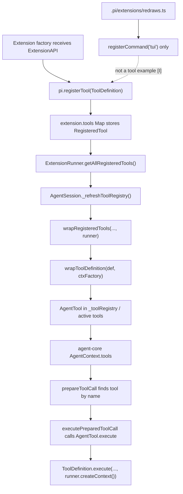

> `spine.trace-extension-tool` 追踪一个 extension tool 怎样从 `pi-coding-agent` 的 `registerTool` contribution point 进入 `pi-agent-core` 的 `AgentTool.execute` 调用路径。

## 能回答的问题

- 扩展调用 `registerTool` 后, tool definition 被存在哪里?
- `ExtensionRunner` 怎样收集多个扩展贡献的工具,同名工具怎样处理?
- `ToolDefinition` 怎样通过 `wrapToolDefinition` 变成 agent-core 可执行的 `AgentTool`?
- extension tool 的 `ExtensionContext` 是什么时候注入的?
- 新注册的扩展工具怎样进入 active tools,然后被模型调用?
- `.pi/extensions/redraws.ts` 是否真的是一个 `registerTool` dogfood 示例?

## 端到端路径

1. Extension loading creates an `Extension` object with empty contribution maps, including `tools: new Map()` and `commands: new Map()` [E: packages/coding-agent/src/core/extensions/loader.ts:416] [E: packages/coding-agent/src/core/extensions/loader.ts:418]. The loader then creates an `ExtensionAPI` for that extension and calls the extension factory with that API [E: packages/coding-agent/src/core/extensions/loader.ts:441] [E: packages/coding-agent/src/core/extensions/loader.ts:442].

2. The `ExtensionAPI.registerTool` contract accepts a `ToolDefinition` and returns `void` [E: packages/coding-agent/src/core/extensions/types.ts:1178] [E: packages/coding-agent/src/core/extensions/types.ts:1180]. The loader implementation stores the definition under `tool.name`, preserves `sourceInfo`, and calls `runtime.refreshTools()` [E: packages/coding-agent/src/core/extensions/loader.ts:227] [E: packages/coding-agent/src/core/extensions/loader.ts:229] [E: packages/coding-agent/src/core/extensions/loader.ts:230] [E: packages/coding-agent/src/core/extensions/loader.ts:231] [E: packages/coding-agent/src/core/extensions/loader.ts:233].

3. During initial extension loading, `refreshTools` is a no-op function on the shared runtime [E: packages/coding-agent/src/core/extensions/loader.ts:181]. After `AgentSession` binds core actions, `runner.bindCore` replaces runtime actions with session-backed implementations, including `refreshTools` [E: packages/coding-agent/src/core/extensions/runner.ts:307] [E: packages/coding-agent/src/core/extensions/runner.ts:325]; `AgentSession` supplies that action as `_refreshToolRegistry()` [E: packages/coding-agent/src/core/agent-session.ts:2279].

4. `ExtensionRunner.getAllRegisteredTools()` walks loaded extensions and reads each extension's `tools` map [E: packages/coding-agent/src/core/extensions/runner.ts:418] [E: packages/coding-agent/src/core/extensions/runner.ts:420] [E: packages/coding-agent/src/core/extensions/runner.ts:421]. When multiple extensions register the same tool name, the first encountered registration wins because the runner only sets a name that is not already present [E: packages/coding-agent/src/core/extensions/runner.ts:422] [E: packages/coding-agent/src/core/extensions/runner.ts:423].

5. `AgentSession._refreshToolRegistry()` pulls extension tools from `this._extensionRunner.getAllRegisteredTools()` and merges them with SDK custom tools before filtering by allowed/excluded tool names [E: packages/coding-agent/src/core/agent-session.ts:2341] [E: packages/coding-agent/src/core/agent-session.ts:2344] [E: packages/coding-agent/src/core/agent-session.ts:2348]. The same method starts a definition registry from built-in tools and then overwrites entries by custom or extension tool name, so an allowed extension tool can replace a built-in registry entry with the same name at the `ToolDefinition` layer [E: packages/coding-agent/src/core/agent-session.ts:2349] [E: packages/coding-agent/src/core/agent-session.ts:2360] [E: packages/coding-agent/src/core/agent-session.ts:2361].

6. The session wraps all custom/extension definitions with `wrapRegisteredTools(allCustomTools, runner)` and wraps built-ins through the same helper [E: packages/coding-agent/src/core/agent-session.ts:2384] [E: packages/coding-agent/src/core/agent-session.ts:2385]. `wrapRegisteredTools` maps `RegisteredTool.definition` values into `wrapToolDefinitions` and passes `() => runner.createContext()` as the context factory [E: packages/coding-agent/src/core/extensions/wrapper.ts:25] [E: packages/coding-agent/src/core/extensions/wrapper.ts:27] [E: packages/coding-agent/src/core/extensions/wrapper.ts:28].

7. `wrapToolDefinition` is the narrow adapter from coding-agent `ToolDefinition` to agent-core `AgentTool`: it copies `name`, `label`, `description`, `parameters`, `prepareArguments`, and `executionMode` onto the returned object [E: packages/coding-agent/src/core/tools/tool-definition-wrapper.ts:5] [E: packages/coding-agent/src/core/tools/tool-definition-wrapper.ts:10] [E: packages/coding-agent/src/core/tools/tool-definition-wrapper.ts:11] [E: packages/coding-agent/src/core/tools/tool-definition-wrapper.ts:12] [E: packages/coding-agent/src/core/tools/tool-definition-wrapper.ts:13] [E: packages/coding-agent/src/core/tools/tool-definition-wrapper.ts:14] [E: packages/coding-agent/src/core/tools/tool-definition-wrapper.ts:15]. Its `execute` adapter calls the original `definition.execute(...)` and appends `ctxFactory?.()` as the fifth `ExtensionContext` argument [E: packages/coding-agent/src/core/tools/tool-definition-wrapper.ts:16] [E: packages/coding-agent/src/core/tools/tool-definition-wrapper.ts:17].

8. `ExtensionRunner.createContext()` builds the `ExtensionContext` used by tool execution, with lazy getters for `ui`, `mode`, `hasUI`, `cwd`, `sessionManager`, `modelRegistry`, `model`, `signal`, and runtime actions such as `abort`, `compact`, and `getSystemPrompt` [E: packages/coding-agent/src/core/extensions/runner.ts:617] [E: packages/coding-agent/src/core/extensions/runner.ts:621] [E: packages/coding-agent/src/core/extensions/runner.ts:625] [E: packages/coding-agent/src/core/extensions/runner.ts:629] [E: packages/coding-agent/src/core/extensions/runner.ts:633] [E: packages/coding-agent/src/core/extensions/runner.ts:637] [E: packages/coding-agent/src/core/extensions/runner.ts:641] [E: packages/coding-agent/src/core/extensions/runner.ts:645] [E: packages/coding-agent/src/core/extensions/runner.ts:657] [E: packages/coding-agent/src/core/extensions/runner.ts:661] [E: packages/coding-agent/src/core/extensions/runner.ts:677] [E: packages/coding-agent/src/core/extensions/runner.ts:681].

9. `_refreshToolRegistry()` builds `_toolRegistry` from wrapped built-ins first and then sets wrapped extension/custom tools by name, so the runtime `AgentTool` map uses the extension/custom implementation for duplicate names that survive filters [E: packages/coding-agent/src/core/agent-session.ts:2395] [E: packages/coding-agent/src/core/agent-session.ts:2396] [E: packages/coding-agent/src/core/agent-session.ts:2397]. If no explicit active-tool override is passed, newly appeared registry names are appended to the next active set [E: packages/coding-agent/src/core/agent-session.ts:2415] [E: packages/coding-agent/src/core/agent-session.ts:2416] [E: packages/coding-agent/src/core/agent-session.ts:2418], and the session applies the deduplicated active names with `setActiveToolsByName` [E: packages/coding-agent/src/core/agent-session.ts:2423].

10. On the agent-core side, `AgentContext.tools` is an array of `AgentTool` objects [E: packages/agent/src/types.ts:403]. `prepareToolCall` resolves the model-requested tool by `toolCall.name` in `currentContext.tools` [E: packages/agent/src/agent-loop.ts:569], and `executePreparedToolCall` invokes `prepared.tool.execute(toolCallId, args, signal, onUpdate)` [E: packages/agent/src/agent-loop.ts:637] [E: packages/agent/src/agent-loop.ts:638] [E: packages/agent/src/agent-loop.ts:641]. For an extension tool, that `execute` is the wrapper from step 7, so the final call re-enters the extension's `ToolDefinition.execute` with a fresh runner context [I].

## `ToolDefinition` 是扩展工具的产品层合约

`ToolDefinition` carries the model-facing and product-facing fields: `name`, `label`, `description`, TypeBox `parameters`, optional `prepareArguments`, optional `executionMode`, and an `execute` method that receives `ExtensionContext` as its fifth parameter [E: packages/coding-agent/src/core/extensions/types.ts:435] [E: packages/coding-agent/src/core/extensions/types.ts:437] [E: packages/coding-agent/src/core/extensions/types.ts:439] [E: packages/coding-agent/src/core/extensions/types.ts:441] [E: packages/coding-agent/src/core/extensions/types.ts:447] [E: packages/coding-agent/src/core/extensions/types.ts:452] [E: packages/coding-agent/src/core/extensions/types.ts:461] [E: packages/coding-agent/src/core/extensions/types.ts:464] [E: packages/coding-agent/src/core/extensions/types.ts:469].

`AgentTool` is the reusable `pi-agent-core` contract: it extends the provider `Tool` shape with `label`, optional `prepareArguments`, `execute`, and optional `executionMode` [E: packages/agent/src/types.ts:371] [E: packages/agent/src/types.ts:373] [E: packages/agent/src/types.ts:378] [E: packages/agent/src/types.ts:380] [E: packages/agent/src/types.ts:393]. The package boundary is therefore explicit: `pi-coding-agent` owns extension API, source metadata, prompt snippets, UI renderers, and `ExtensionContext`; `pi-agent-core` only needs an `AgentTool` array in `AgentContext.tools` to validate and execute tool calls [I].

## `.pi/extensions/redraws.ts` 不是 registerTool 示例

The indexed source `.pi/extensions/redraws.ts` imports `ExtensionAPI` and exports a default extension factory [E: .pi/extensions/redraws.ts:7] [E: .pi/extensions/redraws.ts:10], but the contribution it makes is `pi.registerCommand("tui", ...)`, not `pi.registerTool(...)` [E: .pi/extensions/redraws.ts:11]. Its handler reads TUI redraw stats through `ctx.ui.custom` and notifies the user, so this file demonstrates command/UI extension behavior rather than an LLM-callable tool contribution [E: .pi/extensions/redraws.ts:13] [E: .pi/extensions/redraws.ts:16] [E: .pi/extensions/redraws.ts:21]. Treating `redraws.ts` as a concrete `registerTool` example would be unsupported by the current source [I].

## 关键决策点

- Contribution collection is definition-first: extension registration stores `ToolDefinition` plus `sourceInfo`, and session refresh later adapts definitions into `AgentTool`s [E: packages/coding-agent/src/core/extensions/loader.ts:230] [E: packages/coding-agent/src/core/extensions/loader.ts:231] [E: packages/coding-agent/src/core/agent-session.ts:2384].
- Duplicate names have two visible tie-breakers: `ExtensionRunner.getAllRegisteredTools()` keeps the first extension registration per name, while `_toolRegistry` later lets surviving extension/custom tools override built-ins by map assignment [E: packages/coding-agent/src/core/extensions/runner.ts:422] [E: packages/coding-agent/src/core/agent-session.ts:2395] [E: packages/coding-agent/src/core/agent-session.ts:2397].
- `ExtensionContext` is not captured when the extension registers the tool; it is produced by `runner.createContext()` at execution time through the wrapper's context factory [E: packages/coding-agent/src/core/extensions/wrapper.ts:28] [E: packages/coding-agent/src/core/tools/tool-definition-wrapper.ts:17] [E: packages/coding-agent/src/core/extensions/runner.ts:617].
- New extension tools can become active without a separate explicit `setActiveTools` call when a registry refresh sees names absent from the previous registry and no active-tool override was supplied [E: packages/coding-agent/src/core/agent-session.ts:2415] [E: packages/coding-agent/src/core/agent-session.ts:2418].

## 指向 T1/T2 深挖

- `spine.extension-lifecycle`: should cover how extension files are discovered, imported, cached, reloaded, and invalidated before contribution maps reach this trace.
- `surface.extensions.contribution-points`: should catalog `registerTool`, `registerCommand`, `registerShortcut`, `registerProvider`, and other `ExtensionAPI` contribution methods.
- `subsys.coding-agent.extension-wrapper`: should detail `wrapRegisteredTool(s)`, context factory behavior, and how extension rendering/interception stays outside the agent-core tool contract.
- `spine.tool-call-anatomy`: covers the lower-level `AgentTool` prepare/validate/execute/result loop after the active tool has reached `AgentContext.tools`.

## Sources

- .pi/extensions/redraws.ts —— 反例(此 dogfood 扩展 `registerCommand` 而非 `registerTool`;见正文「`.pi/extensions/redraws.ts` 不是 registerTool 示例」节)
- packages/coding-agent/src/core/extensions/types.ts
- packages/coding-agent/src/core/extensions/loader.ts
- packages/coding-agent/src/core/extensions/runner.ts
- packages/coding-agent/src/core/extensions/wrapper.ts
- packages/coding-agent/src/core/tools/tool-definition-wrapper.ts
- packages/coding-agent/src/core/agent-session.ts
- packages/agent/src/types.ts
- packages/agent/src/agent-loop.ts

## 相关

- spine.extension-lifecycle
- surface.extensions.contribution-points
- subsys.coding-agent.extension-wrapper
- spine.tool-call-anatomy
