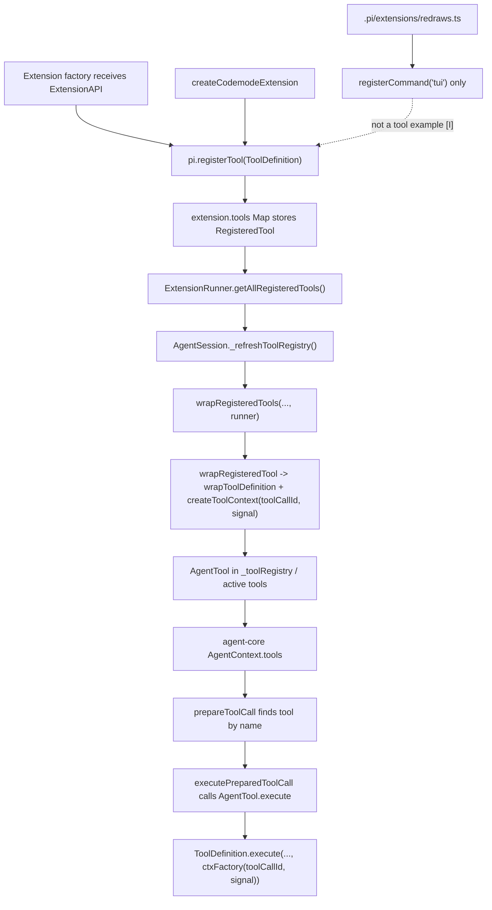

> `spine.trace-extension-tool` 追踪一个 extension tool 怎样从 `pi-coding-agent` 的 `registerTool` contribution point 进入 `pi-agent-core` 的 `AgentTool.execute` 调用路径。内置 `createCodemodeExtension` 是真实 `registerTool` 示例；`.pi/extensions/redraws.ts` 只 `registerCommand`，不是 tool 示例。

## 能回答的问题

- 扩展调用 `registerTool` 后，tool definition 被存在哪里？
- `ExtensionRunner` 怎样收集多个扩展贡献的工具，同名工具怎样处理？
- `ToolDefinition` 怎样通过 `wrapToolDefinition` 变成 agent-core 可执行的 `AgentTool`？
- extension tool 的 `ExtensionToolContext` 是什么时候注入的？
- 新注册的扩展工具怎样进入 active tools，然后被模型调用？`defaultActive: false` 会怎样？
- `.pi/extensions/redraws.ts` 是否真的是一个 `registerTool` dogfood 示例？

```mermaid
flowchart TD
 A["Extension factory receives ExtensionAPI"] --> B["pi.registerTool(ToolDefinition)"]
 B --> C["extension.tools Map stores RegisteredTool"]
 C --> D["ExtensionRunner.getAllRegisteredTools()"]
 D --> E["AgentSession._refreshToolRegistry()"]
 E --> F["wrapRegisteredTools(..., runner)"]
 F --> G["wrapRegisteredTool -> wrapToolDefinition + createToolContext(toolCallId, signal)"]
 G --> H["AgentTool in _toolRegistry / active tools"]
 H --> I["agent-core AgentContext.tools"]
 I --> J["prepareToolCall finds tool by name"]
 J --> K["executePreparedToolCall calls AgentTool.execute"]
 K --> L["ToolDefinition.execute(..., ctxFactory(toolCallId, signal))"]

 CM["createCodemodeExtension"] --> B
 R[".pi/extensions/redraws.ts"] --> S["registerCommand('tui') only"]
 S -. "not a tool example [I]" .-> B
```

## 端到端路径

1. Extension loading creates an `Extension` object with empty contribution maps, including `tools: new Map()` and `commands: new Map()`。[E: packages/coding-agent/src/core/extensions/loader.ts:604] [E: packages/coding-agent/src/core/extensions/loader.ts:607] The loader then creates an `ExtensionAPI` for that extension and calls the extension factory with that API。[E: packages/coding-agent/src/core/extensions/loader.ts:622] [E: packages/coding-agent/src/core/extensions/loader.ts:624]

2. The `ExtensionAPI.registerTool` contract accepts a `ToolDefinition` and returns `void`。[E: packages/coding-agent/src/core/extensions/types.ts:1630] [E: packages/coding-agent/src/core/extensions/types.ts:1632] The loader implementation rejects a non-object `parameters` schema, stores the definition under `tool.name`, preserves `sourceInfo`, and calls `runtime.refreshTools()`。[E: packages/coding-agent/src/core/extensions/loader.ts:289] [E: packages/coding-agent/src/core/extensions/loader.ts:291] [E: packages/coding-agent/src/core/extensions/loader.ts:296] [E: packages/coding-agent/src/core/extensions/loader.ts:297] [E: packages/coding-agent/src/core/extensions/loader.ts:298] [E: packages/coding-agent/src/core/extensions/loader.ts:300]

3. During initial extension loading, `refreshTools` is a no-op function on the shared runtime。[E: packages/coding-agent/src/core/extensions/loader.ts:181] After `AgentSession` binds core actions, `runner.bindCore` replaces runtime actions with session-backed implementations, including `refreshTools`。[E: packages/coding-agent/src/core/extensions/runner.ts:410] [E: packages/coding-agent/src/core/extensions/runner.ts:432] `AgentSession` supplies that action as `_refreshToolRegistry()`。[E: packages/coding-agent/src/core/agent-session.ts:3379]

4. `ExtensionRunner.getAllRegisteredTools()` walks loaded extensions and reads each extension's `tools` map。[E: packages/coding-agent/src/core/extensions/runner.ts:630] [E: packages/coding-agent/src/core/extensions/runner.ts:632] [E: packages/coding-agent/src/core/extensions/runner.ts:633] When multiple extensions register the same tool name, the first encountered registration wins because the runner only sets a name that is not already present。[E: packages/coding-agent/src/core/extensions/runner.ts:634] [E: packages/coding-agent/src/core/extensions/runner.ts:635]

5. `AgentSession._refreshToolRegistry()` pulls extension tools from `this._extensionRunner.getAllRegisteredTools()` and merges them with SDK custom tools before filtering by allowed/excluded tool names。[E: packages/coding-agent/src/core/agent-session.ts:3448] [E: packages/coding-agent/src/core/agent-session.ts:3457] [E: packages/coding-agent/src/core/agent-session.ts:3460] [E: packages/coding-agent/src/core/agent-session.ts:3464] The same method starts a definition registry from built-in tools and then overwrites entries by custom or extension tool name, so an allowed extension tool can replace a built-in registry entry with the same name at the `ToolDefinition` layer。[E: packages/coding-agent/src/core/agent-session.ts:3465] [E: packages/coding-agent/src/core/agent-session.ts:3476] [E: packages/coding-agent/src/core/agent-session.ts:3477]

6. The session wraps all custom/extension definitions with `wrapRegisteredTools(allCustomTools, runner)` and wraps built-ins through the same helper。[E: packages/coding-agent/src/core/agent-session.ts:3500] [E: packages/coding-agent/src/core/agent-session.ts:3501] `wrapRegisteredTools` only maps each `RegisteredTool` through `wrapRegisteredTool`。[E: packages/coding-agent/src/core/extensions/wrapper.ts:27] [E: packages/coding-agent/src/core/extensions/wrapper.ts:28] `wrapRegisteredTool` calls `wrapToolDefinition(registeredTool.definition, (toolCallId, signal) => runner.createToolContext(toolCallId, signal))`；context factory 在 **execute 时** 才跑，不在注册时捕获。[E: packages/coding-agent/src/core/extensions/wrapper.ts:17] [E: packages/coding-agent/src/core/extensions/wrapper.ts:18]

7. `wrapToolDefinition` 是 coding-agent `ToolDefinition` 到 agent-core `AgentTool` 的窄适配器：它拷贝 `name`、`label`、`description`、`parameters`、`outputSchema`、`constrainedSampling`、`prepareArguments`、`executionMode`。[E: packages/coding-agent/src/core/tools/tool-definition-wrapper.ts:8] [E: packages/coding-agent/src/core/tools/tool-definition-wrapper.ts:13] [E: packages/coding-agent/src/core/tools/tool-definition-wrapper.ts:16] [E: packages/coding-agent/src/core/tools/tool-definition-wrapper.ts:17] [E: packages/coding-agent/src/core/tools/tool-definition-wrapper.ts:18] [E: packages/coding-agent/src/core/tools/tool-definition-wrapper.ts:20] 其 `execute` adapter 调原 `definition.execute(...)`，并把 `ctx ?? ctxFactory?.(toolCallId, signal)` 作为第五个 `ExtensionToolContext` 参数注入。agent-core 只传四个参数，所以产品路径依赖 factory。[E: packages/coding-agent/src/core/tools/tool-definition-wrapper.ts:21] [E: packages/coding-agent/src/core/tools/tool-definition-wrapper.ts:27]

8. `ExtensionRunner.createToolContext(toolCallId, signal)` 在 `createContext()` 之上加上 `tools` 与 `executeTool()`，供 nested tool 调用。`createContext()` 本身用 lazy getters 提供 `ui`、`mode`、`hasUI`、`cwd`、`sessionManager`、`modelRegistry`、`model`、`signal`，以及 `abort` / `compact` / `getSystemPrompt` 等 runtime actions。[E: packages/coding-agent/src/core/extensions/runner.ts:961] [E: packages/coding-agent/src/core/extensions/runner.ts:964] [E: packages/coding-agent/src/core/extensions/runner.ts:877] [E: packages/coding-agent/src/core/extensions/runner.ts:882] [E: packages/coding-agent/src/core/extensions/runner.ts:926] [E: packages/coding-agent/src/core/extensions/runner.ts:930] [E: packages/coding-agent/src/core/extensions/runner.ts:946] [E: packages/coding-agent/src/core/extensions/runner.ts:950]

9. `_refreshToolRegistry()` 先用 wrapped built-ins 建 `_toolRegistry`，再按 name set wrapped extension/custom tools，所以 runtime `AgentTool` map 对通过 filter 的重名工具使用 extension/custom 实现。[E: packages/coding-agent/src/core/agent-session.ts:3513] [E: packages/coding-agent/src/core/agent-session.ts:3514] [E: packages/coding-agent/src/core/agent-session.ts:3515] 没有显式 `activeToolNames` override 时，只有 `_isActivatedOnRegistration(name)` 为 true 的新名字会被 append：exposure 必须是 `direct` 或 `model-only`，且 `defaultActive !== false`。[E: packages/coding-agent/src/core/agent-session.ts:3534] [E: packages/coding-agent/src/core/agent-session.ts:3536] [E: packages/coding-agent/src/core/agent-session.ts:3548] [E: packages/coding-agent/src/core/agent-session.ts:3554] 最后 `this._setActiveTools([...new Set(nextActiveToolNames)])` 应用去重后的 active set。[E: packages/coding-agent/src/core/agent-session.ts:3544]

10. On the agent-core side, `AgentContext.tools` is an array of `AgentTool` objects。[E: packages/agent/src/types.ts:504] `prepareToolCall` resolves the model-requested tool by `toolCall.name` in `currentContext.tools`。[E: packages/agent/src/agent-loop.ts:715] [E: packages/agent/src/agent-loop.ts:716] `executePreparedToolCall` invokes `prepared.tool.execute(toolCallId, args, signal, onUpdate)`（四个参数）。[E: packages/agent/src/agent-loop.ts:829] [E: packages/agent/src/agent-loop.ts:830] [E: packages/agent/src/agent-loop.ts:833] For an extension tool, that `execute` is the wrapper from step 7, so the final call re-enters the extension's `ToolDefinition.execute` with a fresh `ExtensionToolContext`。[I]

## `ToolDefinition` 是扩展工具的产品层合约

`ToolDefinition` carries the model-facing and product-facing fields: `name`, `label`, `description`, TypeBox `parameters`, optional `outputSchema`, optional `prepareArguments`, optional `executionMode`, optional `exposure` / `defaultActive`, and an `execute` method that receives `ExtensionToolContext` as its fifth parameter。[E: packages/coding-agent/src/core/extensions/types.ts:565] [E: packages/coding-agent/src/core/extensions/types.ts:567] [E: packages/coding-agent/src/core/extensions/types.ts:577] [E: packages/coding-agent/src/core/extensions/types.ts:590] [E: packages/coding-agent/src/core/extensions/types.ts:595] [E: packages/coding-agent/src/core/extensions/types.ts:608] [E: packages/coding-agent/src/core/extensions/types.ts:624] [E: packages/coding-agent/src/core/extensions/types.ts:627] [E: packages/coding-agent/src/core/extensions/types.ts:632]

`AgentTool` is the reusable `pi-agent-core` contract: it extends the provider `Tool` shape with `label`, optional `prepareArguments`, optional `outputSchema`, `execute`（四参数，无 ExtensionContext）, and optional `executionMode`。[E: packages/agent/src/types.ts:464] [E: packages/agent/src/types.ts:466] [E: packages/agent/src/types.ts:471] [E: packages/agent/src/types.ts:476] [E: packages/agent/src/types.ts:481] [E: packages/agent/src/types.ts:496] The package boundary is therefore explicit: `pi-coding-agent` owns extension API, source metadata, prompt snippets, UI renderers, and `ExtensionToolContext`; `pi-agent-core` only needs an `AgentTool` array in `AgentContext.tools` to validate and execute tool calls。[I]

## 真实 `registerTool` 示例 vs `.pi/extensions/redraws.ts`

内置 `createCodemodeExtension` 调用 `pi.registerTool({ ...createCodemodeToolDefinition(...), defaultActive: false })`。`defaultActive: false` 使 `_isActivatedOnRegistration` 为 false，因此 registry refresh **不会**因为新名字自动把它加入 active set；需要 `--tools`、`defaultTools` 或 `setActiveTools()`（MCP 扩展也会在需要时激活它）。[E: packages/coding-agent/src/extensions/codemode/index.ts:31] [E: packages/coding-agent/src/extensions/codemode/index.ts:33] [E: packages/coding-agent/src/extensions/codemode/index.ts:41] [E: packages/coding-agent/src/core/agent-session.ts:3554]

The indexed source `.pi/extensions/redraws.ts` imports `ExtensionAPI` and exports a default extension factory，[E: .pi/extensions/redraws.ts:7] [E: .pi/extensions/redraws.ts:10] but the contribution it makes is `pi.registerCommand("tui", ...)`，not `pi.registerTool(...)`。[E: .pi/extensions/redraws.ts:11] Its handler reads TUI redraw stats through `ctx.ui.custom` and notifies the user, so this file demonstrates command/UI extension behavior rather than an LLM-callable tool contribution。[E: .pi/extensions/redraws.ts:13] [E: .pi/extensions/redraws.ts:16] [E: .pi/extensions/redraws.ts:21] Treating `redraws.ts` as a concrete `registerTool` example would be unsupported by the current source。[I]

## 关键决策点

- Contribution collection is definition-first: extension registration stores `ToolDefinition` plus `sourceInfo`, and session refresh later adapts definitions into `AgentTool`s。[E: packages/coding-agent/src/core/extensions/loader.ts:297] [E: packages/coding-agent/src/core/extensions/loader.ts:298] [E: packages/coding-agent/src/core/agent-session.ts:3500]
- Duplicate names have two visible tie-breakers: `ExtensionRunner.getAllRegisteredTools()` keeps the first extension registration per name, while `_toolRegistry` later lets surviving extension/custom tools override built-ins by map assignment。[E: packages/coding-agent/src/core/extensions/runner.ts:634] [E: packages/coding-agent/src/core/agent-session.ts:3513] [E: packages/coding-agent/src/core/agent-session.ts:3515]
- `ExtensionToolContext` is not captured when the extension registers the tool; it is produced by `runner.createToolContext(toolCallId, signal)` at execution time through the wrapper's context factory。[E: packages/coding-agent/src/core/tools/tool-definition-wrapper.ts:21] [E: packages/coding-agent/src/core/extensions/wrapper.ts:18] [E: packages/coding-agent/src/core/extensions/runner.ts:961]
- New extension tools become active without a separate explicit `setActiveTools` call only when `_isActivatedOnRegistration` is true（`direct`/`model-only` 且 `defaultActive !== false`）。`codemode` 这类 `defaultActive: false` 工具不会自动激活。[E: packages/coding-agent/src/core/agent-session.ts:3534] [E: packages/coding-agent/src/core/agent-session.ts:3554] [E: packages/coding-agent/src/extensions/codemode/index.ts:41]

## 指向 T1/T2 深挖

- `spine.extension-lifecycle`: should cover how extension files are discovered, imported, cached, reloaded, and invalidated before contribution maps reach this trace.
- `surface.extensions.contribution-points`: should catalog `registerTool`, `registerCommand`, `registerShortcut`, `registerProvider`, and other `ExtensionAPI` contribution methods.
- `subsys.coding-agent.extension-wrapper`: should detail `wrapRegisteredTool(s)`, context factory behavior, and how extension rendering/interception stays outside the agent-core tool contract.
- `spine.tool-call-anatomy`: covers the lower-level `AgentTool` prepare/validate/execute/result loop after the active tool has reached `AgentContext.tools`.

## Sources

- packages/coding-agent/src/extensions/codemode/index.ts —— 真实 `registerTool` 示例（`defaultActive: false`）
- .pi/extensions/redraws.ts —— 反例（此 dogfood 扩展 `registerCommand` 而非 `registerTool`；见正文「真实 `registerTool` 示例 vs `.pi/extensions/redraws.ts`」节）
- packages/coding-agent/src/core/extensions/types.ts
- packages/coding-agent/src/core/extensions/loader.ts
- packages/coding-agent/src/core/extensions/runner.ts
- packages/coding-agent/src/core/extensions/wrapper.ts
- packages/coding-agent/src/core/tools/tool-definition-wrapper.ts
- packages/coding-agent/src/core/agent-session.ts
- packages/agent/src/types.ts
- packages/agent/src/agent-loop.ts

## 相关

- [spine.extension-lifecycle](extension-lifecycle.md) - 扩展发现、加载、replaceable 内置与 bindCore。
- [surface.extensions.contribution-points](../surface/extensions/contribution-points.md) - `ExtensionAPI` 贡献点 catalog。
- [subsys.coding-agent.extension-wrapper](../subsystems/coding-agent/extension-wrapper.md) - `wrapRegisteredTool` 与 context factory。
- [spine.tool-call-anatomy](tool-call-anatomy.md) - `AgentTool` prepare/validate/execute/result。
