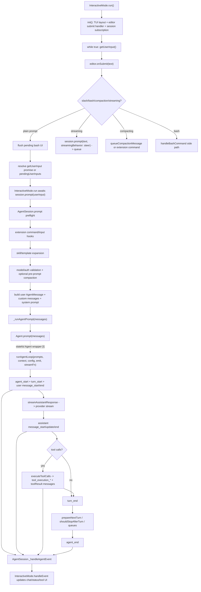

> `spine.trace-interactive-turn` 走读一次 TUI interactive turn:用户在 `InteractiveMode` 提交文本,`AgentSession.prompt` 做产品层 preflight 与消息装配,再进入 `pi-agent-core` 的 `runAgentLoop` 生成 assistant response、tool results 与 UI events。

## 能回答的问题

- 一次普通交互式 turn 从 editor submit 到 `runAgentLoop` 的主路径是什么?
- `InteractiveMode` 在什么时候直接调用 `AgentSession.prompt`,什么时候只排队 steer/follow-up?
- `AgentSession.prompt` 在真正启动 agent 前做了哪些 product-layer 工作?
- `runAgentLoop` 发出的事件如何回到 TUI 的 chat、status、tool components?
- `coding-agent` 和 `agent` 两个包在一次 interactive turn 上的责任边界在哪里?

## 端到端步骤

1. `InteractiveMode` 是 `coding-agent` 的 TUI orchestrator:构造函数保存 `AgentSessionRuntime`,创建 `TUI`,并准备 `chatContainer`、`pendingMessagesContainer`、`statusContainer` 等 UI containers。[E: packages/coding-agent/src/modes/interactive/interactive-mode.ts:397] [E: packages/coding-agent/src/modes/interactive/interactive-mode.ts:407] [E: packages/coding-agent/src/modes/interactive/interactive-mode.ts:411] [E: packages/coding-agent/src/modes/interactive/interactive-mode.ts:412] [E: packages/coding-agent/src/modes/interactive/interactive-mode.ts:413]

2. `init()` 阶段把 editor submit handler 和 key handlers 挂到默认 editor,启动 TUI,然后 rebind 当前 session,所以 interactive turn 的输入与 session events 都在 UI 已启动后工作。[E: packages/coding-agent/src/modes/interactive/interactive-mode.ts:662] [E: packages/coding-agent/src/modes/interactive/interactive-mode.ts:663] [E: packages/coding-agent/src/modes/interactive/interactive-mode.ts:666] [E: packages/coding-agent/src/modes/interactive/interactive-mode.ts:734]

3. `InteractiveMode.run()` 是主入口:它先 `await this.init()`,再处理 startup initial messages,最后进入无限循环,每轮 `await this.getUserInput()` 后调用 `this.session.prompt(userInput)`。[E: packages/coding-agent/src/modes/interactive/interactive-mode.ts:772] [E: packages/coding-agent/src/modes/interactive/interactive-mode.ts:773] [E: packages/coding-agent/src/modes/interactive/interactive-mode.ts:815] [E: packages/coding-agent/src/modes/interactive/interactive-mode.ts:817] [E: packages/coding-agent/src/modes/interactive/interactive-mode.ts:824] [E: packages/coding-agent/src/modes/interactive/interactive-mode.ts:827] [E: packages/coding-agent/src/modes/interactive/interactive-mode.ts:836] [E: packages/coding-agent/src/modes/interactive/interactive-mode.ts:837] [E: packages/coding-agent/src/modes/interactive/interactive-mode.ts:839]

4. `getUserInput()` 不是直接读 terminal;它先消费 `pendingUserInputs`,否则创建一个 Promise 并把 resolver 放进 `onInputCallback`。这让 editor submit handler 可以把 UI callback 转成 `run()` loop 里的 awaited text。[E: packages/coding-agent/src/modes/interactive/interactive-mode.ts:3284] [E: packages/coding-agent/src/modes/interactive/interactive-mode.ts:3285] [E: packages/coding-agent/src/modes/interactive/interactive-mode.ts:3290] [E: packages/coding-agent/src/modes/interactive/interactive-mode.ts:3291]

5. editor submit handler 先 trim 空输入,再处理 slash commands、bash、compaction、streaming 这些 side paths;只有普通文本会进入 normal message submission 分支。[E: packages/coding-agent/src/modes/interactive/interactive-mode.ts:2552] [E: packages/coding-agent/src/modes/interactive/interactive-mode.ts:2554] [E: packages/coding-agent/src/modes/interactive/interactive-mode.ts:2558] [E: packages/coding-agent/src/modes/interactive/interactive-mode.ts:2687] [E: packages/coding-agent/src/modes/interactive/interactive-mode.ts:2705] [E: packages/coding-agent/src/modes/interactive/interactive-mode.ts:2718] [E: packages/coding-agent/src/modes/interactive/interactive-mode.ts:2729]

6. 普通文本提交会先把 pending bash components 从 pending area 移到 chat,然后如果 `getUserInput()` 正在等待就调用 `onInputCallback(text)`,否则把 text 放进 `pendingUserInputs`;最后把 text 加入 editor history。[E: packages/coding-agent/src/modes/interactive/interactive-mode.ts:2729] [E: packages/coding-agent/src/modes/interactive/interactive-mode.ts:2731] [E: packages/coding-agent/src/modes/interactive/interactive-mode.ts:2732] [E: packages/coding-agent/src/modes/interactive/interactive-mode.ts:2734] [E: packages/coding-agent/src/modes/interactive/interactive-mode.ts:2736]

7. 如果提交发生在 agent streaming 中,`InteractiveMode` 不等待当前 run 结束再普通 submit,而是调用 `this.session.prompt(text, { streamingBehavior: "steer" })`,随后刷新 pending messages display。[E: packages/coding-agent/src/modes/interactive/interactive-mode.ts:2718] [E: packages/coding-agent/src/modes/interactive/interactive-mode.ts:2721] [E: packages/coding-agent/src/modes/interactive/interactive-mode.ts:2722] `AgentSession.prompt` 对 streaming prompt 要求显式 `streamingBehavior`,并按 `"followUp"` 或 `"steer"` 分别进入 `_queueFollowUp` 或 `_queueSteer`。[E: packages/coding-agent/src/core/agent-session.ts:1070] [E: packages/coding-agent/src/core/agent-session.ts:1071] [E: packages/coding-agent/src/core/agent-session.ts:1076] [E: packages/coding-agent/src/core/agent-session.ts:1077] [E: packages/coding-agent/src/core/agent-session.ts:1079]

8. `AgentSession.prompt` 先处理 extension command:当输入以 `/` 开头且匹配扩展命令时,命令 handler 自己负责后续 LLM interaction,当前 prompt 直接返回。[E: packages/coding-agent/src/core/agent-session.ts:1033] [E: packages/coding-agent/src/core/agent-session.ts:1034] [E: packages/coding-agent/src/core/agent-session.ts:1035] [E: packages/coding-agent/src/core/agent-session.ts:1037] [E: packages/coding-agent/src/core/agent-session.ts:1038]

9. 没被 extension command 吃掉的输入会经过 extension input hooks;hook 可以 `handled` 直接结束,也可以 `transform` text/images,并且 source 默认是 `"interactive"`。[E: packages/coding-agent/src/core/agent-session.ts:1045] [E: packages/coding-agent/src/core/agent-session.ts:1046] [E: packages/coding-agent/src/core/agent-session.ts:1049] [E: packages/coding-agent/src/core/agent-session.ts:1052] [E: packages/coding-agent/src/core/agent-session.ts:1056] [E: packages/coding-agent/src/core/agent-session.ts:1057]

10. 正常 prompt 在非 streaming 路径会 flush pending bash messages,校验当前 model 存在且 auth 已配置,并在必要时先对上一条 assistant message 做 compaction/continue 处理。[E: packages/coding-agent/src/core/agent-session.ts:1086] [E: packages/coding-agent/src/core/agent-session.ts:1089] [E: packages/coding-agent/src/core/agent-session.ts:1093] [E: packages/coding-agent/src/core/agent-session.ts:1107] [E: packages/coding-agent/src/core/agent-session.ts:1108] [E: packages/coding-agent/src/core/agent-session.ts:1109]

11. `AgentSession.prompt` 把 expanded text 变成 `role: "user"` 的 `AgentMessage`,附加 images 和 `_pendingNextTurnMessages`,再触发 `before_agent_start` extension event;extension 可以添加 custom messages 或覆盖本 turn 的 system prompt。[E: packages/coding-agent/src/core/agent-session.ts:1113] [E: packages/coding-agent/src/core/agent-session.ts:1116] [E: packages/coding-agent/src/core/agent-session.ts:1117] [E: packages/coding-agent/src/core/agent-session.ts:1118] [E: packages/coding-agent/src/core/agent-session.ts:1120] [E: packages/coding-agent/src/core/agent-session.ts:1127] [E: packages/coding-agent/src/core/agent-session.ts:1128] [E: packages/coding-agent/src/core/agent-session.ts:1133] [E: packages/coding-agent/src/core/agent-session.ts:1140] [E: packages/coding-agent/src/core/agent-session.ts:1153]

12. preflight 成功后,`AgentSession.prompt` 调用 `_runAgentPrompt(messages)`;`_runAgentPrompt` 调用 `this.agent.prompt(messages)`,并在每次 run 后用 `_handlePostAgentRun()` 决定是否 `agent.continue()` 以处理 retry、compaction 或 agent_end extension handlers 新排入的 queued messages。[E: packages/coding-agent/src/core/agent-session.ts:1170] [E: packages/coding-agent/src/core/agent-session.ts:1171] [E: packages/coding-agent/src/core/agent-session.ts:974] [E: packages/coding-agent/src/core/agent-session.ts:976] [E: packages/coding-agent/src/core/agent-session.ts:977] [E: packages/coding-agent/src/core/agent-session.ts:978] [E: packages/coding-agent/src/core/agent-session.ts:993] [E: packages/coding-agent/src/core/agent-session.ts:1007] [E: packages/coding-agent/src/core/agent-session.ts:1013]

13. `AgentSession` 到 `runAgentLoop` 的直接中间 call site 在 stateful `Agent` 包装器内,不在本节点 index 的三份 source 列中;本 trace 只把 `this.agent.prompt(messages)` 到 `runAgentLoop(prompts, context, config, emit, streamFn)` 作为跨文件桥接推断,不把它标成 explicit evidence。[I] `runAgentLoop` 本身接收 prompts、context、config、emit、signal、streamFn,把 prompts 放进 `newMessages` 与 `currentContext.messages`,然后发 `agent_start`、`turn_start`、每条 prompt 的 `message_start`/`message_end`。[E: packages/agent/src/agent-loop.ts:95] [E: packages/agent/src/agent-loop.ts:96] [E: packages/agent/src/agent-loop.ts:97] [E: packages/agent/src/agent-loop.ts:98] [E: packages/agent/src/agent-loop.ts:99] [E: packages/agent/src/agent-loop.ts:100] [E: packages/agent/src/agent-loop.ts:101] [E: packages/agent/src/agent-loop.ts:103] [E: packages/agent/src/agent-loop.ts:106] [E: packages/agent/src/agent-loop.ts:109] [E: packages/agent/src/agent-loop.ts:110] [E: packages/agent/src/agent-loop.ts:112] [E: packages/agent/src/agent-loop.ts:113]

14. `runLoop` 是低层 turn engine:它先读取 steering messages,在内层 loop 注入 pending messages,然后调用 `streamAssistantResponse` 产生 assistant message。[E: packages/agent/src/agent-loop.ts:155] [E: packages/agent/src/agent-loop.ts:167] [E: packages/agent/src/agent-loop.ts:174] [E: packages/agent/src/agent-loop.ts:182] [E: packages/agent/src/agent-loop.ts:193]

15. `streamAssistantResponse` 是 `agent` 包到 provider stream 的边界:它可先 `transformContext`,再 `convertToLlm`,构造 `Context`,解析 API key,并调用 `streamFn || streamSimple`。[E: packages/agent/src/agent-loop.ts:283] [E: packages/agent/src/agent-loop.ts:285] [E: packages/agent/src/agent-loop.ts:289] [E: packages/agent/src/agent-loop.ts:292] [E: packages/agent/src/agent-loop.ts:298] [E: packages/agent/src/agent-loop.ts:301] [E: packages/agent/src/agent-loop.ts:304]

16. assistant stream events 被折叠成 message events:start 会 push partial assistant 并 emit `message_start`,delta 类事件会替换最后一条 context message 并 emit `message_update`,done/error 会取 final message 并 emit `message_end`。[E: packages/agent/src/agent-loop.ts:313] [E: packages/agent/src/agent-loop.ts:316] [E: packages/agent/src/agent-loop.ts:317] [E: packages/agent/src/agent-loop.ts:319] [E: packages/agent/src/agent-loop.ts:331] [E: packages/agent/src/agent-loop.ts:333] [E: packages/agent/src/agent-loop.ts:335] [E: packages/agent/src/agent-loop.ts:344] [E: packages/agent/src/agent-loop.ts:353]

17. assistant message 结束后,`runLoop` 根据 stop reason、tool calls、tool results、`prepareNextTurn`、`shouldStopAfterTurn`、steering queue 和 follow-up queue 决定继续下一次 provider request 还是 emit `agent_end`。[E: packages/agent/src/agent-loop.ts:196] [E: packages/agent/src/agent-loop.ts:203] [E: packages/agent/src/agent-loop.ts:208] [E: packages/agent/src/agent-loop.ts:218] [E: packages/agent/src/agent-loop.ts:226] [E: packages/agent/src/agent-loop.ts:241] [E: packages/agent/src/agent-loop.ts:253] [E: packages/agent/src/agent-loop.ts:257] [E: packages/agent/src/agent-loop.ts:268]

18. `AgentSession` 在构造时订阅底层 `agent` events,内部 `_handleAgentEvent` 会先更新 queue display state,再发 extension events,再把事件通知 `AgentSession.subscribe` 的 listeners;`message_end` 时它把 user/assistant/toolResult message append 到 session manager。[E: packages/coding-agent/src/core/agent-session.ts:355] [E: packages/coding-agent/src/core/agent-session.ts:514] [E: packages/coding-agent/src/core/agent-session.ts:517] [E: packages/coding-agent/src/core/agent-session.ts:525] [E: packages/coding-agent/src/core/agent-session.ts:531] [E: packages/coding-agent/src/core/agent-session.ts:538] [E: packages/coding-agent/src/core/agent-session.ts:541] [E: packages/coding-agent/src/core/agent-session.ts:544] [E: packages/coding-agent/src/core/agent-session.ts:560]

19. `InteractiveMode.subscribeToAgent()` 通过 `this.session.subscribe` 接收 `AgentSessionEvent`,每个事件交给 `handleEvent`。`message_start` 的 user message 进入 chat,assistant message 创建 `AssistantMessageComponent`;`message_update` 更新 streaming component 并为 tool calls 创建或更新 `ToolExecutionComponent`;`tool_execution_*` 更新工具组件;`agent_end` 清理 progress、loader、streaming component 和 pending tools。[E: packages/coding-agent/src/modes/interactive/interactive-mode.ts:2740] [E: packages/coding-agent/src/modes/interactive/interactive-mode.ts:2741] [E: packages/coding-agent/src/modes/interactive/interactive-mode.ts:2746] [E: packages/coding-agent/src/modes/interactive/interactive-mode.ts:2799] [E: packages/coding-agent/src/modes/interactive/interactive-mode.ts:2800] [E: packages/coding-agent/src/modes/interactive/interactive-mode.ts:2804] [E: packages/coding-agent/src/modes/interactive/interactive-mode.ts:2818] [E: packages/coding-agent/src/modes/interactive/interactive-mode.ts:2821] [E: packages/coding-agent/src/modes/interactive/interactive-mode.ts:2823] [E: packages/coding-agent/src/modes/interactive/interactive-mode.ts:2826] [E: packages/coding-agent/src/modes/interactive/interactive-mode.ts:2844] [E: packages/coding-agent/src/modes/interactive/interactive-mode.ts:2892] [E: packages/coding-agent/src/modes/interactive/interactive-mode.ts:2916] [E: packages/coding-agent/src/modes/interactive/interactive-mode.ts:2919] [E: packages/coding-agent/src/modes/interactive/interactive-mode.ts:2925] [E: packages/coding-agent/src/modes/interactive/interactive-mode.ts:2935] [E: packages/coding-agent/src/modes/interactive/interactive-mode.ts:2937] [E: packages/coding-agent/src/modes/interactive/interactive-mode.ts:2939] [E: packages/coding-agent/src/modes/interactive/interactive-mode.ts:2939] [E: packages/coding-agent/src/modes/interactive/interactive-mode.ts:2941] [E: packages/coding-agent/src/modes/interactive/interactive-mode.ts:2945]

## 关键决策点

### 普通 prompt vs streaming steer

普通 prompt 由 `getUserInput()` 返回给 `run()` loop 后调用 `session.prompt(userInput)`;streaming 期间的 submit 不走这个 awaited loop,而是在 submit handler 里直接调用 `session.prompt(..., { streamingBehavior: "steer" })` 并进入 queue display。[E: packages/coding-agent/src/modes/interactive/interactive-mode.ts:837] [E: packages/coding-agent/src/modes/interactive/interactive-mode.ts:839] [E: packages/coding-agent/src/modes/interactive/interactive-mode.ts:2718] [E: packages/coding-agent/src/modes/interactive/interactive-mode.ts:2721]

### product-layer preflight

`AgentSession.prompt` 承担 product-layer 工作:extension command/input interception、skill/template expansion、model/auth validation、compaction precheck、custom messages 和 per-turn system prompt modification 都发生在进入底层 agent run 之前。[E: packages/coding-agent/src/core/agent-session.ts:1033] [E: packages/coding-agent/src/core/agent-session.ts:1045] [E: packages/coding-agent/src/core/agent-session.ts:1064] [E: packages/coding-agent/src/core/agent-session.ts:1065] [E: packages/coding-agent/src/core/agent-session.ts:1066] [E: packages/coding-agent/src/core/agent-session.ts:1089] [E: packages/coding-agent/src/core/agent-session.ts:1093] [E: packages/coding-agent/src/core/agent-session.ts:1108] [E: packages/coding-agent/src/core/agent-session.ts:1133] [E: packages/coding-agent/src/core/agent-session.ts:1140] [E: packages/coding-agent/src/core/agent-session.ts:1153]

### event stream vs persistence

一次 turn 的 UI 更新不是 `runAgentLoop` 直接改 TUI,而是 `agent-loop.ts` emit events,`AgentSession._handleAgentEvent` 转发并持久化,`InteractiveMode.handleEvent` 再把事件渲染为 chat/status/tool components。[E: packages/agent/src/agent-loop.ts:109] [E: packages/coding-agent/src/core/agent-session.ts:541] [E: packages/coding-agent/src/core/agent-session.ts:544] [E: packages/coding-agent/src/modes/interactive/interactive-mode.ts:2746] 其中“不是直接改 TUI”是由事件链和 `agent-loop.ts` 本节点证据窗口内不持有 TUI 对象归纳出的边界判断。[I]

## 包边界

`pi-coding-agent` 负责产品装配:interactive UI、slash/bash/compaction/extension handling、auth/model checks、tool registry/system prompt refresh、session persistence 和 extension events 都在 `packages/coding-agent` 的 `InteractiveMode` 与 `AgentSession` 内完成。[E: packages/coding-agent/src/modes/interactive/interactive-mode.ts:2552] [E: packages/coding-agent/src/modes/interactive/interactive-mode.ts:2558] [E: packages/coding-agent/src/modes/interactive/interactive-mode.ts:2687] [E: packages/coding-agent/src/modes/interactive/interactive-mode.ts:2705] [E: packages/coding-agent/src/core/agent-session.ts:1033] [E: packages/coding-agent/src/core/agent-session.ts:1045] [E: packages/coding-agent/src/core/agent-session.ts:1089] [E: packages/coding-agent/src/core/agent-session.ts:1093] [E: packages/coding-agent/src/core/agent-session.ts:1153] [E: packages/coding-agent/src/core/agent-session.ts:2333] [E: packages/coding-agent/src/core/agent-session.ts:538] [E: packages/coding-agent/src/core/agent-session.ts:544] [E: packages/coding-agent/src/core/agent-session.ts:560]

`pi-agent-core` 负责可复用 runtime loop:它接收已经装配好的 context/config/tools/model/streamFn,按 assistant streaming、tool execution、queues 和 stop conditions 推进 turn,但不认识 TUI containers、slash command UI 或 session manager。[E: packages/agent/src/agent-loop.ts:95] [E: packages/agent/src/agent-loop.ts:155] [E: packages/agent/src/agent-loop.ts:275] [I]

## 指向 T1/T2 深挖

- `spine.agent-loop`:低层 `runLoop`、assistant streaming、tool calls、queue drain 和 stop conditions 的权威 T0 说明。
- `surface.modes.interactive`:TUI interactive mode 的 commands、selectors、keybindings、startup UI 和非普通 turn 输入面。
- `subsys.coding-agent.interactive-orchestration`:交互式 TUI 状态、pending containers、extension UI、compaction queue 和事件循环的 T2 细化。

## Sources

- packages/coding-agent/src/modes/interactive/interactive-mode.ts
- packages/coding-agent/src/core/agent-session.ts
- packages/agent/src/agent-loop.ts

## 相关

- spine.agent-loop
- surface.modes.interactive
- subsys.coding-agent.interactive-orchestration
