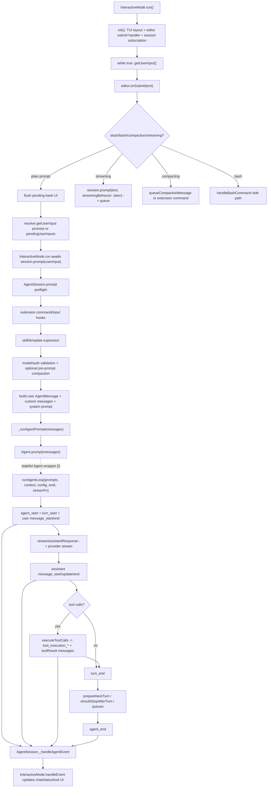

> `spine.trace-interactive-turn` 走读一次 TUI interactive turn:用户在 `InteractiveMode` 提交文本,`AgentSession.prompt` 做产品层 preflight 与消息装配,再进入 `pi-agent-core` 的 `runAgentLoop` 生成 assistant response、tool results 与 UI events。

## 能回答的问题

- 一次普通交互式 turn 从 editor submit 到 `runAgentLoop` 的主路径是什么?
- `InteractiveMode` 在什么时候直接调用 `AgentSession.prompt`,什么时候只排队 steer/follow-up?
- `AgentSession.prompt` 在真正启动 agent 前做了哪些 product-layer 工作?
- `runAgentLoop` 发出的事件如何回到 TUI 的 chat、status、tool components?
- `coding-agent` 和 `agent` 两个包在一次 interactive turn 上的责任边界在哪里?

```mermaid
flowchart TD
  A["InteractiveMode.run()"] --> B["init(): TUI layout + editor submit handler + session subscription"]
  B --> C["while true: getUserInput()"]
  C --> D["editor.onSubmit(text)"]
  D --> E{"slash/bash/compaction/streaming?"}
  E -- "plain prompt" --> F["flush pending bash UI"]
  F --> G["resolve getUserInput promise or pendingUserInputs"]
  G --> H["InteractiveMode.run awaits session.prompt(userInput)"]
  E -- "streaming" --> S["session.prompt(text, streamingBehavior: steer) -> queue"]
  E -- "compacting" --> Q["queueCompactionMessage or extension command"]
  E -- "bash" --> X["handleBashCommand side path"]
  H --> I["AgentSession.prompt preflight"]
  I --> J["extension command/input hooks"]
  J --> K["skill/template expansion"]
  K --> L["model/auth validation + optional pre-prompt compaction"]
  L --> M["build user AgentMessage + custom messages + system prompt"]
  M --> N["_runAgentPrompt(messages)"]
  N --> O["Agent.prompt(messages)"]
  O -. "stateful Agent wrapper [I]" .-> P["runAgentLoop(prompts, context, config, emit, streamFn)"]
  P --> R["agent_start + turn_start + user message_start/end"]
  R --> T["streamAssistantResponse -> provider stream"]
  T --> U["assistant message_start/update/end"]
  U --> V{"tool calls?"}
  V -- "yes" --> W["executeToolCalls -> tool_execution_* + toolResult messages"]
  V -- "no" --> Y["turn_end"]
  W --> Y
  Y --> Z["prepareNextTurn / shouldStopAfterTurn / queues"]
  Z --> AA["agent_end"]
  R --> AB["AgentSession._handleAgentEvent"]
  U --> AB
  W --> AB
  AA --> AB
  AB --> AC["InteractiveMode.handleEvent updates chat/status/tool UI"]
```

## 端到端步骤

1. `InteractiveMode` 是 `coding-agent` 的 TUI server:构造函数保存 `AgentSessionRuntime`,创建 `TUI`,并准备 `chatContainer`、`pendingMessagesContainer`、`statusContainer` 等 UI containers。[E: packages/coding-agent/src/modes/interactive/interactive-mode.ts:568] [E: packages/coding-agent/src/modes/interactive/interactive-mode.ts:550] [E: packages/coding-agent/src/modes/interactive/interactive-mode.ts:592] [E: packages/coding-agent/src/modes/interactive/interactive-mode.ts:597] [E: packages/coding-agent/src/modes/interactive/interactive-mode.ts:598]

2. `init()` 阶段把 editor submit handler 和 key handlers 挂到默认 editor,启动 TUI,然后 rebind 当前 session,所以 interactive turn 的输入与 session events 都在 UI 已启动后工作。[E: packages/coding-agent/src/modes/interactive/interactive-mode.ts:1034] [E: packages/coding-agent/src/modes/interactive/interactive-mode.ts:1035] [E: packages/coding-agent/src/modes/interactive/interactive-mode.ts:957] [E: packages/coding-agent/src/modes/interactive/interactive-mode.ts:1039]

3. `InteractiveMode.run()` 是主入口:它先 `await this.init()`,再处理 startup initial messages,最后进入无限循环,每轮 `await this.getUserInput()` 后调用 `this.session.prompt(userInput)`。[E: packages/coding-agent/src/modes/interactive/interactive-mode.ts:1085] [E: packages/coding-agent/src/modes/interactive/interactive-mode.ts:1086] [E: packages/coding-agent/src/modes/interactive/interactive-mode.ts:1162] [E: packages/coding-agent/src/modes/interactive/interactive-mode.ts:1164] [E: packages/coding-agent/src/modes/interactive/interactive-mode.ts:1171] [E: packages/coding-agent/src/modes/interactive/interactive-mode.ts:1174] [E: packages/coding-agent/src/modes/interactive/interactive-mode.ts:1183] [E: packages/coding-agent/src/modes/interactive/interactive-mode.ts:1184] [E: packages/coding-agent/src/modes/interactive/interactive-mode.ts:1186]

4. `getUserInput()` 不是直接读 terminal;它先消费 `pendingUserInputs`,否则创建一个 Promise 并把 resolver 放进 `onInputCallback`。这让 editor submit handler 可以把 UI callback 转成 `run()` loop 里的 awaited text。[E: packages/coding-agent/src/modes/interactive/interactive-mode.ts:3894] [E: packages/coding-agent/src/modes/interactive/interactive-mode.ts:3895] [E: packages/coding-agent/src/modes/interactive/interactive-mode.ts:3900] [E: packages/coding-agent/src/modes/interactive/interactive-mode.ts:3901]

5. editor submit handler 先 trim 空输入,再处理 slash commands、bash、compaction、streaming 这些 side paths;只有普通文本会进入 normal message submission 分支。[E: packages/coding-agent/src/modes/interactive/interactive-mode.ts:2978] [E: packages/coding-agent/src/modes/interactive/interactive-mode.ts:2980] [E: packages/coding-agent/src/modes/interactive/interactive-mode.ts:2984] [E: packages/coding-agent/src/modes/interactive/interactive-mode.ts:3120] [E: packages/coding-agent/src/modes/interactive/interactive-mode.ts:3138] [E: packages/coding-agent/src/modes/interactive/interactive-mode.ts:3151] [E: packages/coding-agent/src/modes/interactive/interactive-mode.ts:3162]

6. 普通文本提交会先把 pending bash components 从 pending area 移到 chat,然后如果 `getUserInput()` 正在等待就调用 `onInputCallback(text)`,否则把 text 放进 `pendingUserInputs`;最后把 text 加入 editor history。[E: packages/coding-agent/src/modes/interactive/interactive-mode.ts:3162] [E: packages/coding-agent/src/modes/interactive/interactive-mode.ts:3164] [E: packages/coding-agent/src/modes/interactive/interactive-mode.ts:3165] [E: packages/coding-agent/src/modes/interactive/interactive-mode.ts:3167] [E: packages/coding-agent/src/modes/interactive/interactive-mode.ts:3169]

7. 如果提交发生在 agent streaming 中,`InteractiveMode` 不等待当前 run 结束再普通 submit,而是调用 `this.session.prompt(text, { streamingBehavior: "steer" })`,随后刷新 pending messages display。[E: packages/coding-agent/src/modes/interactive/interactive-mode.ts:3151] [E: packages/coding-agent/src/modes/interactive/interactive-mode.ts:3154] [E: packages/coding-agent/src/modes/interactive/interactive-mode.ts:3155] `AgentSession.prompt` 对 streaming prompt 要求显式 `streamingBehavior`,并按 `"followUp"` 或 `"steer"` 分别进入 `_queueFollowUp` 或 `_queueSteer`。[E: packages/coding-agent/src/core/agent-session.ts:1211] [E: packages/coding-agent/src/core/agent-session.ts:1212] [E: packages/coding-agent/src/core/agent-session.ts:1217] [E: packages/coding-agent/src/core/agent-session.ts:1218] [E: packages/coding-agent/src/core/agent-session.ts:1220]

8. `AgentSession.prompt` 先处理 extension command:当输入以 `/` 开头且匹配扩展命令时,命令 handler 自己负责后续 LLM interaction,当前 prompt 直接返回。[E: packages/coding-agent/src/core/agent-session.ts:1168] [E: packages/coding-agent/src/core/agent-session.ts:1169] [E: packages/coding-agent/src/core/agent-session.ts:1170] [E: packages/coding-agent/src/core/agent-session.ts:1172] [E: packages/coding-agent/src/core/agent-session.ts:1173]

9. 没被 extension command 吃掉的输入会经过 extension input hooks;hook 可以 `handled` 直接结束,也可以 `transform` text/images,并且 source 默认是 `"interactive"`。[E: packages/coding-agent/src/core/agent-session.ts:1186] [E: packages/coding-agent/src/core/agent-session.ts:1187] [E: packages/coding-agent/src/core/agent-session.ts:1190] [E: packages/coding-agent/src/core/agent-session.ts:1193] [E: packages/coding-agent/src/core/agent-session.ts:1197] [E: packages/coding-agent/src/core/agent-session.ts:1198]

10. 正常 prompt 在非 streaming 路径会 flush pending bash messages,校验当前 model 存在且 auth 已配置,并在必要时先对上一条 assistant message 做 compaction/continue 处理。[E: packages/coding-agent/src/core/agent-session.ts:1227] [E: packages/coding-agent/src/core/agent-session.ts:1231] [E: packages/coding-agent/src/core/agent-session.ts:1148] [E: packages/coding-agent/src/core/agent-session.ts:1252] [E: packages/coding-agent/src/core/agent-session.ts:1253] [E: packages/coding-agent/src/core/agent-session.ts:1254]

11. `AgentSession.prompt` 把 expanded text 变成 `role: "user"` 的 `AgentMessage`,附加 images 和 `_pendingNextTurnMessages`,再触发 `before_agent_start` extension event;extension 可以添加 custom messages 或覆盖本 turn 的 system prompt。[E: packages/coding-agent/src/core/agent-session.ts:1258] [E: packages/coding-agent/src/core/agent-session.ts:1261] [E: packages/coding-agent/src/core/agent-session.ts:1262] [E: packages/coding-agent/src/core/agent-session.ts:1263] [E: packages/coding-agent/src/core/agent-session.ts:1265] [E: packages/coding-agent/src/core/agent-session.ts:1272] [E: packages/coding-agent/src/core/agent-session.ts:1273] [E: packages/coding-agent/src/core/agent-session.ts:1278] [E: packages/coding-agent/src/core/agent-session.ts:1285] [E: packages/coding-agent/src/core/agent-session.ts:1299]

12. preflight 成功后,`AgentSession.prompt` 调用 `_runAgentPrompt(messages)`;`_runAgentPrompt` 调用 `this.agent.prompt(messages)`,并在每次 run 后用 `_handlePostAgentRun()` 决定是否 `agent.continue()` 以处理 retry、compaction 或 agent_end extension handlers 新排入的 queued messages。[E: packages/coding-agent/src/core/agent-session.ts:1316] [E: packages/coding-agent/src/core/agent-session.ts:1317] [E: packages/coding-agent/src/core/agent-session.ts:1106] [E: packages/coding-agent/src/core/agent-session.ts:1109] [E: packages/coding-agent/src/core/agent-session.ts:1110] [E: packages/coding-agent/src/core/agent-session.ts:1111] [E: packages/coding-agent/src/core/agent-session.ts:1128] [E: packages/coding-agent/src/core/agent-session.ts:1142] [E: packages/coding-agent/src/core/agent-session.ts:1148]

13. `AgentSession` 到 `runAgentLoop` 的直接中间 call site 在 stateful `Agent` 包装器内,不在本节点 index 的三份 source 列中;本 trace 只把 `this.agent.prompt(messages)` 到 `runAgentLoop(prompts, context, config, emit, streamFn)` 作为跨文件桥接推断,不把它标成 explicit evidence。[I] `runAgentLoop` 本身接收 prompts、context、config、emit、signal、streamFn,把 prompts 放进 `newMessages` 与 `currentContext.messages`,然后发 `agent_start`、`turn_start`、每条 prompt 的 `message_start`/`message_end`。[E: packages/agent/src/agent-loop.ts:96] [E: packages/agent/src/agent-loop.ts:97] [E: packages/agent/src/agent-loop.ts:98] [E: packages/agent/src/agent-loop.ts:99] [E: packages/agent/src/agent-loop.ts:100] [E: packages/agent/src/agent-loop.ts:101] [E: packages/agent/src/agent-loop.ts:102] [E: packages/agent/src/agent-loop.ts:104] [E: packages/agent/src/agent-loop.ts:107] [E: packages/agent/src/agent-loop.ts:110] [E: packages/agent/src/agent-loop.ts:111] [E: packages/agent/src/agent-loop.ts:113] [E: packages/agent/src/agent-loop.ts:114]

14. `runLoop` 是低层 turn engine:它先读取 steering messages,在内层 loop 注入 pending messages,然后调用 `streamAssistantResponse` 产生 assistant message。[E: packages/agent/src/agent-loop.ts:156] [E: packages/agent/src/agent-loop.ts:168] [E: packages/agent/src/agent-loop.ts:175] [E: packages/agent/src/agent-loop.ts:201] [E: packages/agent/src/agent-loop.ts:212]

15. `runAgentLoop` 先把显式 `streamFn` 或 `getDefaultStreamFn()` 的结果传入 `runLoop`;`streamAssistantResponse` 是 `agent` 包到 provider stream 的边界:它可先 `transformContext`,再 `convertToLlm`,构造 `Context`,解析 API key,并调用这个已解析的 `streamFunction`。[E: packages/agent/src/agent-loop.ts:117] [E: packages/agent/src/agent-loop.ts:212] [E: packages/agent/src/agent-loop.ts:287] [E: packages/agent/src/agent-loop.ts:289] [E: packages/agent/src/agent-loop.ts:293] [E: packages/agent/src/agent-loop.ts:296] [E: packages/agent/src/agent-loop.ts:303] [E: packages/agent/src/agent-loop.ts:306]

16. assistant stream events 被折叠成 message events:start 会 push partial assistant 并 emit `message_start`,delta 类事件会替换最后一条 context message 并 emit `message_update`,done/error 会取 final message 并 emit `message_end`。[E: packages/agent/src/agent-loop.ts:315] [E: packages/agent/src/agent-loop.ts:318] [E: packages/agent/src/agent-loop.ts:319] [E: packages/agent/src/agent-loop.ts:321] [E: packages/agent/src/agent-loop.ts:333] [E: packages/agent/src/agent-loop.ts:335] [E: packages/agent/src/agent-loop.ts:337] [E: packages/agent/src/agent-loop.ts:346] [E: packages/agent/src/agent-loop.ts:355]

17. assistant message 结束后,`runLoop` 根据 stop reason、tool calls、tool results、`prepareNextTurn`、`shouldStopAfterTurn`、steering queue 和 follow-up queue 决定继续下一次 provider request 还是 emit `agent_end`。[E: packages/agent/src/agent-loop.ts:215] [E: packages/agent/src/agent-loop.ts:222] [E: packages/agent/src/agent-loop.ts:233] [E: packages/agent/src/agent-loop.ts:243] [E: packages/agent/src/agent-loop.ts:261] [E: packages/agent/src/agent-loop.ts:226] [E: packages/agent/src/agent-loop.ts:257] [E: packages/agent/src/agent-loop.ts:261] [E: packages/agent/src/agent-loop.ts:272]

18. `AgentSession` 在构造时订阅底层 `agent` events,内部 `_handleAgentEvent` 会先更新 queue display state,再发 extension events,再把事件通知 `AgentSession.subscribe` 的 listeners;`message_end` 时它把 user/assistant/toolResult message append 到 session manager。[E: packages/coding-agent/src/core/agent-session.ts:403] [E: packages/coding-agent/src/core/agent-session.ts:644] [E: packages/coding-agent/src/core/agent-session.ts:647] [E: packages/coding-agent/src/core/agent-session.ts:655] [E: packages/coding-agent/src/core/agent-session.ts:661] [E: packages/coding-agent/src/core/agent-session.ts:668] [E: packages/coding-agent/src/core/agent-session.ts:671] [E: packages/coding-agent/src/core/agent-session.ts:674] [E: packages/coding-agent/src/core/agent-session.ts:690]

19. `InteractiveMode.subscribeToAgent()` 通过 `this.session.subscribe` 接收 `AgentSessionEvent`,每个事件交给 `handleEvent`。`message_start` 的 user message 进入 chat,assistant message 创建 `AssistantMessageComponent`;`message_update` 更新 streaming component 并为 tool calls 创建或更新 `ToolExecutionComponent`;`tool_execution_*` 更新工具组件;`agent_end` 清理 progress、loader、streaming component 和 pending tools。[E: packages/coding-agent/src/modes/interactive/interactive-mode.ts:3173] [E: packages/coding-agent/src/modes/interactive/interactive-mode.ts:3174] [E: packages/coding-agent/src/modes/interactive/interactive-mode.ts:3179] [E: packages/coding-agent/src/modes/interactive/interactive-mode.ts:3238] [E: packages/coding-agent/src/modes/interactive/interactive-mode.ts:3239] [E: packages/coding-agent/src/modes/interactive/interactive-mode.ts:3243] [E: packages/coding-agent/src/modes/interactive/interactive-mode.ts:3258] [E: packages/coding-agent/src/modes/interactive/interactive-mode.ts:4234] [E: packages/coding-agent/src/modes/interactive/interactive-mode.ts:3263] [E: packages/coding-agent/src/modes/interactive/interactive-mode.ts:3266] [E: packages/coding-agent/src/modes/interactive/interactive-mode.ts:3284] [E: packages/coding-agent/src/modes/interactive/interactive-mode.ts:3337] [E: packages/coding-agent/src/modes/interactive/interactive-mode.ts:3361] [E: packages/coding-agent/src/modes/interactive/interactive-mode.ts:3364] [E: packages/coding-agent/src/modes/interactive/interactive-mode.ts:3370] [E: packages/coding-agent/src/modes/interactive/interactive-mode.ts:3380] [E: packages/coding-agent/src/modes/interactive/interactive-mode.ts:3382] [E: packages/coding-agent/src/modes/interactive/interactive-mode.ts:3384] [E: packages/coding-agent/src/modes/interactive/interactive-mode.ts:3384] [E: packages/coding-agent/src/modes/interactive/interactive-mode.ts:3386] [E: packages/coding-agent/src/modes/interactive/interactive-mode.ts:3390]

## 关键决策点

### 普通 prompt vs streaming steer

普通 prompt 由 `getUserInput()` 返回给 `run()` loop 后调用 `session.prompt(userInput)`;streaming 期间的 submit 不走这个 awaited loop,而是在 submit handler 里直接调用 `session.prompt(..., { streamingBehavior: "steer" })` 并进入 queue display。[E: packages/coding-agent/src/modes/interactive/interactive-mode.ts:1184] [E: packages/coding-agent/src/modes/interactive/interactive-mode.ts:1186] [E: packages/coding-agent/src/modes/interactive/interactive-mode.ts:3151] [E: packages/coding-agent/src/modes/interactive/interactive-mode.ts:3154]

### product-layer preflight

`AgentSession.prompt` 承担 product-layer 工作:extension command/input interception、skill/template expansion、model/auth validation、compaction precheck、custom messages 和 per-turn system prompt modification 都发生在进入底层 agent run 之前。[E: packages/coding-agent/src/core/agent-session.ts:1168] [E: packages/coding-agent/src/core/agent-session.ts:1186] [E: packages/coding-agent/src/core/agent-session.ts:1205] [E: packages/coding-agent/src/core/agent-session.ts:1206] [E: packages/coding-agent/src/core/agent-session.ts:1207] [E: packages/coding-agent/src/core/agent-session.ts:1231] [E: packages/coding-agent/src/core/agent-session.ts:1148] [E: packages/coding-agent/src/core/agent-session.ts:1253] [E: packages/coding-agent/src/core/agent-session.ts:1278] [E: packages/coding-agent/src/core/agent-session.ts:1285] [E: packages/coding-agent/src/core/agent-session.ts:1299]

### event stream vs persistence

一次 turn 的 UI 更新不是 `runAgentLoop` 直接改 TUI,而是 `agent-loop.ts` emit events,`AgentSession._handleAgentEvent` 转发并持久化,`InteractiveMode.handleEvent` 再把事件渲染为 chat/status/tool components。[E: packages/agent/src/agent-loop.ts:110] [E: packages/coding-agent/src/core/agent-session.ts:671] [E: packages/coding-agent/src/core/agent-session.ts:674] [E: packages/coding-agent/src/modes/interactive/interactive-mode.ts:3179] 其中“不是直接改 TUI”是由事件链和 `agent-loop.ts` 本节点证据窗口内不持有 TUI 对象归纳出的边界判断。[I]

## 包边界

`pi-coding-agent` 负责产品装配:interactive UI、slash/bash/compaction/extension handling、auth/model checks、tool registry/system prompt refresh、session persistence 和 extension events 都在 `packages/coding-agent` 的 `InteractiveMode` 与 `AgentSession` 内完成。[E: packages/coding-agent/src/modes/interactive/interactive-mode.ts:2978] [E: packages/coding-agent/src/modes/interactive/interactive-mode.ts:2984] [E: packages/coding-agent/src/modes/interactive/interactive-mode.ts:3120] [E: packages/coding-agent/src/modes/interactive/interactive-mode.ts:3138] [E: packages/coding-agent/src/core/agent-session.ts:1168] [E: packages/coding-agent/src/core/agent-session.ts:1186] [E: packages/coding-agent/src/core/agent-session.ts:1231] [E: packages/coding-agent/src/core/agent-session.ts:1148] [E: packages/coding-agent/src/core/agent-session.ts:1299] [E: packages/coding-agent/src/core/agent-session.ts:2664] [E: packages/coding-agent/src/core/agent-session.ts:668] [E: packages/coding-agent/src/core/agent-session.ts:674] [E: packages/coding-agent/src/core/agent-session.ts:690]

`pi-agent-core` 负责可复用 runtime loop:它接收已经装配好的 context/config/tools/model/streamFn,按 assistant streaming、tool execution、queues 和 stop conditions 推进 turn,但不认识 TUI containers、slash command UI 或 session manager。[E: packages/agent/src/agent-loop.ts:96] [E: packages/agent/src/agent-loop.ts:156] [E: packages/agent/src/agent-loop.ts:279] [I]

## 指向 T1/T2 深挖

- `spine.agent-loop`:低层 `runLoop`、assistant streaming、tool calls、queue drain 和 stop conditions 的权威 T0 说明。
- `surface.modes.interactive`:TUI interactive mode 的 commands、selectors、keybindings、startup UI 和非普通 turn 输入面。
- `subsys.coding-agent.interactive-orchestration`:交互式 TUI 状态、pending containers、extension UI、compaction queue 和事件循环的 T2 细化。

## Sources

- packages/coding-agent/src/modes/interactive/interactive-mode.ts
- packages/coding-agent/src/core/agent-session.ts
- packages/agent/src/agent-loop.ts

## 相关

- spine.agent-loop
- surface.modes.interactive
- subsys.coding-agent.interactive-orchestration
