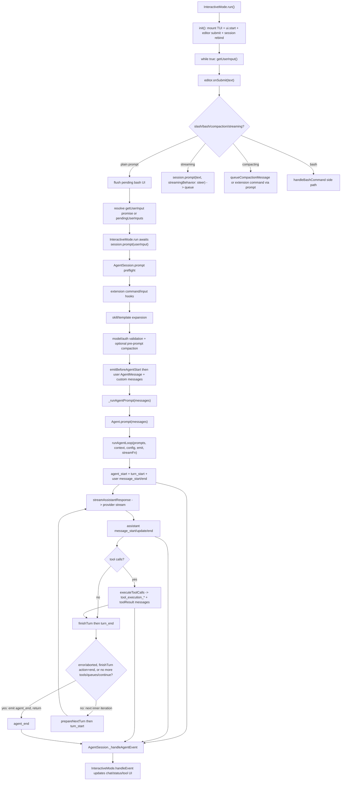

> `spine.trace-interactive-turn` 走读一次 TUI interactive turn：用户在 `InteractiveMode` 提交文本，`AgentSession.prompt` 做产品层 preflight 与消息装配，再进入 `pi-agent-core` 的 `Agent.prompt` → `runAgentLoop` 生成 assistant response、tool results 与 UI events。

## 能回答的问题

- 一次普通交互式 turn 从 editor submit 到 `runAgentLoop` 的主路径是什么？
- `InteractiveMode` 在什么时候直接调用 `AgentSession.prompt`，什么时候只排队 steer/follow-up？
- compaction 进行中 TUI 为什么不把普通文本交给 `AgentSession.prompt`？
- `AgentSession.prompt` 在真正启动 agent 前做了哪些 product-layer 工作？
- `runAgentLoop` 发出的事件如何回到 TUI 的 chat、status、tool components？
- `coding-agent` 和 `agent` 两个包在一次 interactive turn 上的责任边界在哪里？

```mermaid
flowchart TD
 A["InteractiveMode.run()"] --> B["init(): mount TUI + ui.start + editor submit + session rebind"]
 B --> C["while true: getUserInput()"]
 C --> D["editor.onSubmit(text)"]
 D --> E{"slash/bash/compaction/streaming?"}
 E -- "plain prompt" --> F["flush pending bash UI"]
 F --> G["resolve getUserInput promise or pendingUserInputs"]
 G --> H["InteractiveMode.run awaits session.prompt(userInput)"]
 E -- "streaming" --> S["session.prompt(text, streamingBehavior: steer) -> queue"]
 E -- "compacting" --> Q["queueCompactionMessage or extension command via prompt"]
 E -- "bash" --> X["handleBashCommand side path"]
 H --> I["AgentSession.prompt preflight"]
 I --> J["extension command/input hooks"]
 J --> K["skill/template expansion"]
 K --> L["model/auth validation + optional pre-prompt compaction"]
 L --> M["emitBeforeAgentStart then user AgentMessage + custom messages"]
 M --> N["_runAgentPrompt(messages)"]
 N --> O["Agent.prompt(messages)"]
 O --> P["runAgentLoop(prompts, context, config, emit, streamFn)"]
 P --> R["agent_start + turn_start + user message_start/end"]
 R --> T["streamAssistantResponse -> provider stream"]
 T --> U["assistant message_start/update/end"]
 U --> V{"tool calls?"}
 V -- "yes" --> W["executeToolCalls -> tool_execution_* + toolResult messages"]
 V -- "no" --> Y["finishTurn then turn_end"]
 W --> Y
 Y --> Z{"error/aborted, finishTurn action=end, or no more tools/queues/continue?"}
 Z -- "yes: emit agent_end, return" --> AA["agent_end"]
 Z -- "no: next inner iteration" --> PN["prepareNextTurn then turn_start"]
 PN --> T
 R --> AB["AgentSession._handleAgentEvent"]
 U --> AB
 W --> AB
 AA --> AB
 AB --> AC["InteractiveMode.handleEvent updates chat/status/tool UI"]
```

## 端到端步骤

1. `InteractiveMode` 是 `coding-agent` 的 TUI server：构造函数保存 `AgentSessionRuntime`，按 `options.tuiMode ?? settingsManager.getTuiMode()` 创建 renderer，并准备 `chatContainer`、`pendingMessagesContainer`、`statusContainer` 等 UI containers。[E: packages/coding-agent/src/modes/interactive/interactive-mode.ts:597] [E: packages/coding-agent/src/modes/interactive/interactive-mode.ts:600] [E: packages/coding-agent/src/modes/interactive/interactive-mode.ts:611] [E: packages/coding-agent/src/modes/interactive/interactive-mode.ts:624] [E: packages/coding-agent/src/modes/interactive/interactive-mode.ts:629] [E: packages/coding-agent/src/modes/interactive/interactive-mode.ts:630] 默认 editor 以 `embedWorkingStatus: true` 构造；`showStatusIndicator()` 会先尝试把 compaction / retry / branch-summary / working spinner 嵌进 editor 顶边框，嵌入成功后不再往 `statusContainer` 放 indicator。[E: packages/coding-agent/src/modes/interactive/interactive-mode.ts:640] [E: packages/coding-agent/src/modes/interactive/interactive-mode.ts:2276] [E: packages/coding-agent/src/modes/interactive/interactive-mode.ts:2282] [E: packages/coding-agent/src/modes/interactive/interactive-mode.ts:2283] [E: packages/coding-agent/src/modes/interactive/interactive-mode.ts:2286]

2. `init()` 先 mount 组件树并 `ui.start()` 启动 TUI，再 `ensureTool("fd")` / `ensureTool("rg")`，然后 `setupKeyHandlers()` / `setupEditorSubmitHandler()` 挂 editor 输入，最后 `rebindCurrentSession()`。interactive turn 的输入与 session events 都在 UI 已启动后工作。[E: packages/coding-agent/src/modes/interactive/interactive-mode.ts:932] [E: packages/coding-agent/src/modes/interactive/interactive-mode.ts:987] [E: packages/coding-agent/src/modes/interactive/interactive-mode.ts:1083] [E: packages/coding-agent/src/modes/interactive/interactive-mode.ts:1084] [E: packages/coding-agent/src/modes/interactive/interactive-mode.ts:1088]

3. `InteractiveMode.run()` 是主入口：它先 `await this.init()`，非 offline 时后台 refresh model catalogs，再处理 startup initial messages，最后进入无限循环，每轮 `await this.getUserInput()` 后调用 `this.session.prompt(userInput)`。[E: packages/coding-agent/src/modes/interactive/interactive-mode.ts:1134] [E: packages/coding-agent/src/modes/interactive/interactive-mode.ts:1135] [E: packages/coding-agent/src/modes/interactive/interactive-mode.ts:1219] [E: packages/coding-agent/src/modes/interactive/interactive-mode.ts:1221] [E: packages/coding-agent/src/modes/interactive/interactive-mode.ts:1228] [E: packages/coding-agent/src/modes/interactive/interactive-mode.ts:1231] [E: packages/coding-agent/src/modes/interactive/interactive-mode.ts:1240] [E: packages/coding-agent/src/modes/interactive/interactive-mode.ts:1241] [E: packages/coding-agent/src/modes/interactive/interactive-mode.ts:1243]

4. `getUserInput()` 不是直接读 terminal；它先消费 `pendingUserInputs`，否则创建一个 Promise 并把 resolver 放进 `onInputCallback`。这让 editor submit handler 可以把 UI callback 转成 `run()` loop 里的 awaited text。[E: packages/coding-agent/src/modes/interactive/interactive-mode.ts:4178] [E: packages/coding-agent/src/modes/interactive/interactive-mode.ts:4179] [E: packages/coding-agent/src/modes/interactive/interactive-mode.ts:4184] [E: packages/coding-agent/src/modes/interactive/interactive-mode.ts:4185]

5. editor submit handler 先 trim 空输入，再处理 slash commands、bash、compaction、streaming 这些 side paths；只有普通文本会进入 normal message submission 分支。[E: packages/coding-agent/src/modes/interactive/interactive-mode.ts:3152] [E: packages/coding-agent/src/modes/interactive/interactive-mode.ts:3154] [E: packages/coding-agent/src/modes/interactive/interactive-mode.ts:3158] [E: packages/coding-agent/src/modes/interactive/interactive-mode.ts:3300] [E: packages/coding-agent/src/modes/interactive/interactive-mode.ts:3318] [E: packages/coding-agent/src/modes/interactive/interactive-mode.ts:3331] [E: packages/coding-agent/src/modes/interactive/interactive-mode.ts:3342]

6. 普通文本提交会先把 pending bash components 从 pending area 移到 chat，然后如果 `getUserInput()` 正在等待就调用 `onInputCallback(text)`，否则把 text 放进 `pendingUserInputs`；最后把 text 加入 editor history。[E: packages/coding-agent/src/modes/interactive/interactive-mode.ts:3342] [E: packages/coding-agent/src/modes/interactive/interactive-mode.ts:3344] [E: packages/coding-agent/src/modes/interactive/interactive-mode.ts:3345] [E: packages/coding-agent/src/modes/interactive/interactive-mode.ts:3349]

7. 如果提交发生在 agent streaming 中，`InteractiveMode` 不等待当前 run 结束再普通 submit，而是调用 `this.session.prompt(text, { streamingBehavior: "steer" })`，随后刷新 pending messages display。[E: packages/coding-agent/src/modes/interactive/interactive-mode.ts:3331] [E: packages/coding-agent/src/modes/interactive/interactive-mode.ts:3334] [E: packages/coding-agent/src/modes/interactive/interactive-mode.ts:3335] 如果提交发生在 compaction 中，扩展命令仍走 `session.prompt(text)`，其它文本走 `queueCompactionMessage(text, "steer")`，避免撞上 `AgentSession.prompt` 在 compaction 期间的 throw。[E: packages/coding-agent/src/modes/interactive/interactive-mode.ts:3318] [E: packages/coding-agent/src/modes/interactive/interactive-mode.ts:3322] [E: packages/coding-agent/src/modes/interactive/interactive-mode.ts:3324] [E: packages/coding-agent/src/core/agent-session.ts:1939] `AgentSession.prompt` 对 streaming prompt 要求显式 `streamingBehavior`，并按 `"followUp"` 或 `"steer"` 分别进入 `_queueFollowUp` 或 `_queueSteer`。[E: packages/coding-agent/src/core/agent-session.ts:1966] [E: packages/coding-agent/src/core/agent-session.ts:1967] [E: packages/coding-agent/src/core/agent-session.ts:1972] [E: packages/coding-agent/src/core/agent-session.ts:1975]

8. `AgentSession.prompt` 先处理 extension command：当输入以 `/` 开头且匹配扩展命令时，命令 handler 自己负责后续 LLM interaction，当前 prompt 直接返回。[E: packages/coding-agent/src/core/agent-session.ts:1930] [E: packages/coding-agent/src/core/agent-session.ts:1931] [E: packages/coding-agent/src/core/agent-session.ts:1932] [E: packages/coding-agent/src/core/agent-session.ts:1935] [E: packages/coding-agent/src/core/agent-session.ts:2069]

9. 没被 extension command 吃掉的输入会经过 extension input hooks；hook 可以 `handled` 直接结束，也可以 `transform` text/images，并且 source 默认是 `"interactive"`。[E: packages/coding-agent/src/core/agent-session.ts:1946] [E: packages/coding-agent/src/core/agent-session.ts:1949] [E: packages/coding-agent/src/core/agent-session.ts:1952] [E: packages/coding-agent/src/core/agent-session.ts:1870] [E: packages/coding-agent/src/core/agent-session.ts:1880]

10. 正常 prompt 在非 streaming 路径会 flush pending bash 与 custom messages，校验当前 model 存在且 auth 已配置，并在必要时先对上一条 assistant message 做 compaction/continue 处理。[E: packages/coding-agent/src/core/agent-session.ts:1982] [E: packages/coding-agent/src/core/agent-session.ts:1983] [E: packages/coding-agent/src/core/agent-session.ts:1986] [E: packages/coding-agent/src/core/agent-session.ts:1990] [E: packages/coding-agent/src/core/agent-session.ts:2007] [E: packages/coding-agent/src/core/agent-session.ts:2009]

11. `AgentSession.prompt` 在构造 user message **之前**触发 `before_agent_start`，让 extension 的模型选择决定后续 image resize；然后把 expanded text 变成 `role: "user"` 的 `AgentMessage`，附加 images 和 `_pendingNextTurnMessages`，再把 extension custom messages 与可选 system-prompt update 注入 `messages`。[E: packages/coding-agent/src/core/agent-session.ts:2015] [E: packages/coding-agent/src/core/agent-session.ts:2028] [E: packages/coding-agent/src/core/agent-session.ts:2035] [E: packages/coding-agent/src/core/agent-session.ts:2042] [E: packages/coding-agent/src/core/agent-session.ts:2047] [E: packages/coding-agent/src/core/agent-session.ts:2058]

12. preflight 成功后，`AgentSession.prompt` 调用 `_runAgentPrompt(messages)`；`_runAgentPrompt` 调用 `this.agent.prompt(messages)`，并在每次 run 后用 `_handlePostAgentRun()` / `_runBeforeSettleBoundary()` 决定是否 `agent.continue()`，以处理 retry、compaction 或 settle-boundary 新排入的工作。[E: packages/coding-agent/src/core/agent-session.ts:2062] [E: packages/coding-agent/src/core/agent-session.ts:2063] [E: packages/coding-agent/src/core/agent-session.ts:1775] [E: packages/coding-agent/src/core/agent-session.ts:1785] [E: packages/coding-agent/src/core/agent-session.ts:1787] [E: packages/coding-agent/src/core/agent-session.ts:1792] [E: packages/coding-agent/src/core/agent-session.ts:1794]

13. `Agent.prompt` 拒绝并发 active run，把输入归一成 `AgentMessage[]`，再 `runPromptMessages` → `runAgentLoop(messages, createContextSnapshot(), createLoopConfig(), processEvents, signal, streamFunction)`。[E: packages/agent/src/agent.ts:373] [E: packages/agent/src/agent.ts:379] [E: packages/agent/src/agent.ts:380] [E: packages/agent/src/agent.ts:436] [E: packages/agent/src/agent.ts:437] `runAgentLoop` 把 prompts 经 `declareToolChanges` 放进 `newMessages` 与 `currentContext.messages`，然后发 `agent_start`、`turn_start`、每条 prompt 的 `message_start`/`message_end`。[E: packages/agent/src/agent-loop.ts:102] [E: packages/agent/src/agent-loop.ts:110] [E: packages/agent/src/agent-loop.ts:117] [E: packages/agent/src/agent-loop.ts:118] [E: packages/agent/src/agent-loop.ts:119]

14. `runLoop` 是低层 turn engine：它先读取 steering messages，在内层 loop 注入 pending messages，然后调用 `streamAssistantResponse` 产生 assistant message。[E: packages/agent/src/agent-loop.ts:163] [E: packages/agent/src/agent-loop.ts:176] [E: packages/agent/src/agent-loop.ts:183] [E: packages/agent/src/agent-loop.ts:211] [E: packages/agent/src/agent-loop.ts:242]

15. `runAgentLoop` 先把显式 `streamFn` 或 `getDefaultStreamFn()` 的结果传入 `runLoop`；`streamAssistantResponse` 是 `agent` 包到 provider stream 的边界：它可先 `transformContext`，再 `convertToLlm`，`normalizeContext` 成 `TranscriptContext`，解析 API key，并调用这个已解析的 `streamFunction`。[E: packages/agent/src/agent-loop.ts:124] [E: packages/agent/src/agent-loop.ts:242] [E: packages/agent/src/agent-loop.ts:389] [E: packages/agent/src/agent-loop.ts:391] [E: packages/agent/src/agent-loop.ts:395] [E: packages/agent/src/agent-loop.ts:397] [E: packages/agent/src/agent-loop.ts:400] [E: packages/agent/src/agent-loop.ts:403]

16. assistant stream events 被折叠成 message events：start 会 push partial assistant 并 emit `message_start`，delta 类事件会替换最后一条 context message 并 emit `message_update`，done/error 会取 final message 并 emit `message_end`。[E: packages/agent/src/agent-loop.ts:414] [E: packages/agent/src/agent-loop.ts:417] [E: packages/agent/src/agent-loop.ts:418] [E: packages/agent/src/agent-loop.ts:420] [E: packages/agent/src/agent-loop.ts:432] [E: packages/agent/src/agent-loop.ts:434] [E: packages/agent/src/agent-loop.ts:435] [E: packages/agent/src/agent-loop.ts:443] [E: packages/agent/src/agent-loop.ts:454]

17. assistant message 结束后，`runLoop` 先 `await config.finishTurn?(lastCompletedTurn)`，再 emit `turn_end`。error/aborted 路径同样先 `finishTurn` 再 `turn_end` + `agent_end`。`{ action: "end" }` 立即 `agent_end`；`{ action: "continue" }` 设 `explicitContinuation`。无更多 tool/queue/continue 才 `agent_end`。`prepareNextTurn` 只在内层 loop 决定还会再 stream 一次 assistant 时调用。[E: packages/agent/src/agent-loop.ts:245] [E: packages/agent/src/agent-loop.ts:252] [E: packages/agent/src/agent-loop.ts:253] [E: packages/agent/src/agent-loop.ts:254] [E: packages/agent/src/agent-loop.ts:286] [E: packages/agent/src/agent-loop.ts:287] [E: packages/agent/src/agent-loop.ts:289] [E: packages/agent/src/agent-loop.ts:294] [E: packages/agent/src/agent-loop.ts:186] `Agent.createLoopConfig` 把 `prepareNextTurnWithContext` 包装成 loop 的 `prepareNextTurn`。[E: packages/agent/src/agent.ts:484] [E: packages/agent/src/agent.ts:487] `AgentSession` 把 extension `turn_end` 装配进 `finishTurn` hook。[E: packages/coding-agent/src/core/agent-session.ts:858] [E: packages/coding-agent/src/core/agent-session.ts:860] [E: packages/coding-agent/src/core/agent-session.ts:865]

18. `AgentSession` 在构造时订阅底层 `agent` events，内部 `_handleAgentEvent` 会先更新 queue display state，再发 extension events，再把事件通知 `AgentSession.subscribe` 的 listeners；`message_end` 时它把 user/assistant/toolResult/system message append 到 session manager，custom message 走 `appendCustomMessageEntry`。新 persist session 的 JSONL 文件要等到第一条 user 或 assistant 消息才创建。[E: packages/coding-agent/src/core/agent-session.ts:485] [E: packages/coding-agent/src/core/agent-session.ts:1074] [E: packages/coding-agent/src/core/agent-session.ts:1090] [E: packages/coding-agent/src/core/agent-session.ts:1111] [E: packages/coding-agent/src/core/agent-session.ts:1112] [E: packages/coding-agent/src/core/agent-session.ts:1115] [E: packages/coding-agent/src/core/agent-session.ts:1118] [E: packages/coding-agent/src/core/agent-session.ts:1133] [E: packages/coding-agent/src/core/session-manager.ts:1166] [E: packages/coding-agent/src/core/session-manager.ts:1176]

19. `InteractiveMode.subscribeToAgent()` 通过 `this.session.subscribe` 接收 `AgentSessionEvent`，每个事件交给 `handleEvent`。`message_start` 的 user message 进入 chat，assistant message 创建 `AssistantMessageComponent`；`message_update` 更新 streaming component 并为 tool calls 创建或更新 `ToolExecutionComponent`；`tool_execution_*` 更新工具组件（nested calls 带 `parentToolCallId` 的 start 被跳过）；`agent_end` 清理 progress、loader、streaming component 和 pending tools。[E: packages/coding-agent/src/modes/interactive/interactive-mode.ts:3353] [E: packages/coding-agent/src/modes/interactive/interactive-mode.ts:3354] [E: packages/coding-agent/src/modes/interactive/interactive-mode.ts:3359] [E: packages/coding-agent/src/modes/interactive/interactive-mode.ts:3456] [E: packages/coding-agent/src/modes/interactive/interactive-mode.ts:3461] [E: packages/coding-agent/src/modes/interactive/interactive-mode.ts:3476] [E: packages/coding-agent/src/modes/interactive/interactive-mode.ts:3481] [E: packages/coding-agent/src/modes/interactive/interactive-mode.ts:3484] [E: packages/coding-agent/src/modes/interactive/interactive-mode.ts:3557] [E: packages/coding-agent/src/modes/interactive/interactive-mode.ts:3559] [E: packages/coding-agent/src/modes/interactive/interactive-mode.ts:3583] [E: packages/coding-agent/src/modes/interactive/interactive-mode.ts:3592] [E: packages/coding-agent/src/modes/interactive/interactive-mode.ts:3602] [E: packages/coding-agent/src/modes/interactive/interactive-mode.ts:3606] [E: packages/coding-agent/src/modes/interactive/interactive-mode.ts:3612]

## 关键决策点

### 普通 prompt vs streaming steer vs compaction queue

普通 prompt 由 `getUserInput()` 返回给 `run()` loop 后调用 `session.prompt(userInput)`；streaming 期间的 submit 不走这个 awaited loop，而是在 submit handler 里直接调用 `session.prompt(..., { streamingBehavior: "steer" })` 并进入 queue display。[E: packages/coding-agent/src/modes/interactive/interactive-mode.ts:1241] [E: packages/coding-agent/src/modes/interactive/interactive-mode.ts:1243] [E: packages/coding-agent/src/modes/interactive/interactive-mode.ts:3331] [E: packages/coding-agent/src/modes/interactive/interactive-mode.ts:3334] compaction 期间 TUI 不把普通文本交给 `AgentSession.prompt`，因为后者会 throw。[E: packages/coding-agent/src/modes/interactive/interactive-mode.ts:3318] [E: packages/coding-agent/src/core/agent-session.ts:1939]

### product-layer preflight

`AgentSession.prompt` 承担 product-layer 工作：extension command/input interception、skill/template expansion、model/auth validation、compaction precheck、custom messages 和 per-turn system prompt modification 都发生在进入底层 agent run 之前。[E: packages/coding-agent/src/core/agent-session.ts:1930] [E: packages/coding-agent/src/core/agent-session.ts:1946] [E: packages/coding-agent/src/core/agent-session.ts:1960] [E: packages/coding-agent/src/core/agent-session.ts:1986] [E: packages/coding-agent/src/core/agent-session.ts:2015] [E: packages/coding-agent/src/core/agent-session.ts:2058]

### compaction 挡住 tree navigation

`AgentSession.navigateTree()` 在 `isStreaming` 或 `isCompacting` 时 throw，不会排队，也不会返回 `{ cancelled: true }`。`isCompacting` 覆盖 manual/auto compaction 与 branch summarization。[E: packages/coding-agent/src/core/agent-session.ts:1575] [E: packages/coding-agent/src/core/agent-session.ts:3919] [E: packages/coding-agent/src/core/agent-session.ts:3922] TUI `/tree` 在 abort 当前 response 后仍会再检查 `isCompacting`，避免替换正在进行的 compaction UI。[E: packages/coding-agent/src/modes/interactive/interactive-mode.ts:5560] [E: packages/coding-agent/src/modes/interactive/interactive-mode.ts:5564]

### event stream vs persistence

一次 turn 的 UI 更新不是 `runAgentLoop` 直接改 TUI，而是 `agent-loop.ts` emit events，`AgentSession._handleAgentEvent` 转发并持久化，`InteractiveMode.handleEvent` 再把事件渲染为 chat/status/tool components。[E: packages/agent/src/agent-loop.ts:117] [E: packages/coding-agent/src/core/agent-session.ts:1112] [E: packages/coding-agent/src/core/agent-session.ts:1115] [E: packages/coding-agent/src/modes/interactive/interactive-mode.ts:3359] 其中“不是直接改 TUI”是由事件链和 `agent-loop.ts` 本节点证据窗口内不持有 TUI 对象归纳出的边界判断。[I]

## 包边界

`pi-coding-agent` 负责产品装配：interactive UI、slash/bash/compaction/extension handling、auth/model checks、tool registry/system prompt refresh、session persistence 和 extension events 都在 `packages/coding-agent` 的 `InteractiveMode` 与 `AgentSession` 内完成。[E: packages/coding-agent/src/modes/interactive/interactive-mode.ts:3152] [E: packages/coding-agent/src/modes/interactive/interactive-mode.ts:3158] [E: packages/coding-agent/src/modes/interactive/interactive-mode.ts:3300] [E: packages/coding-agent/src/modes/interactive/interactive-mode.ts:3318] [E: packages/coding-agent/src/core/agent-session.ts:1930] [E: packages/coding-agent/src/core/agent-session.ts:1946] [E: packages/coding-agent/src/core/agent-session.ts:1986] [E: packages/coding-agent/src/core/agent-session.ts:1111] [E: packages/coding-agent/src/core/agent-session.ts:1115] [E: packages/coding-agent/src/core/agent-session.ts:860]

`pi-agent-core` 负责可复用 runtime loop：`Agent.prompt` 把已装配好的 messages 交给 `runAgentLoop`，后者按 assistant streaming、tool execution、queues 和 `finishTurn` 推进 turn，但不认识 TUI containers、slash command UI 或 session manager。[E: packages/agent/src/agent.ts:437] [E: packages/agent/src/agent-loop.ts:102] [E: packages/agent/src/agent-loop.ts:163] [I]

## 指向 T1/T2 深挖

- `spine.agent-loop`：低层 `runLoop`、assistant streaming、tool calls、queue drain 和 stop conditions 的权威 T0 说明。
- `surface.modes.interactive`：TUI interactive mode 的 commands、selectors、keybindings、startup UI 和非普通 turn 输入面。
- `subsys.coding-agent.interactive-orchestration`：交互式 TUI 状态、pending containers、extension UI、compaction queue 和事件循环的 T2 细化。

## Sources

- packages/coding-agent/src/modes/interactive/interactive-mode.ts
- packages/coding-agent/src/core/agent-session.ts
- packages/agent/src/agent.ts
- packages/agent/src/agent-loop.ts
- packages/coding-agent/src/core/session-manager.ts

## 相关

- [spine.agent-loop](agent-loop.md) - 可复用 `runAgentLoop` / `finishTurn` / queue 的权威走读。
- [surface.modes.interactive](../surface/modes/interactive.md) - TUI interactive mode 的 commands、selectors、keybindings。
- [subsys.coding-agent.interactive-orchestration](../subsystems/coding-agent/interactive-orchestration.md) - TUI 状态机、pending containers 与事件循环。
