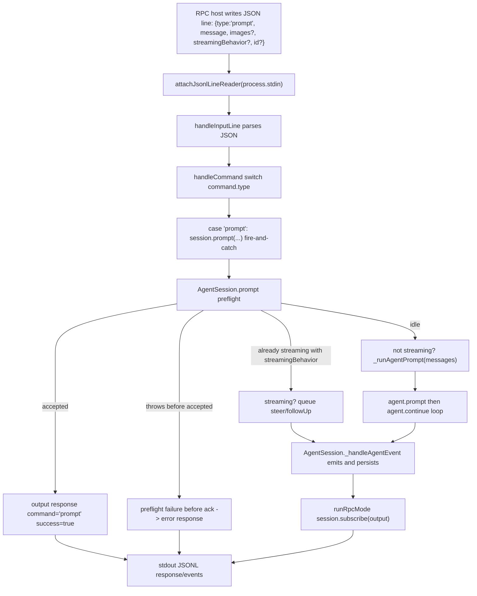

> `spine.trace-rpc-prompt` 走读一次 `{type:"prompt"}` RPC command 如何从 JSONL stdin 进入 `runRpcMode`,经 `AgentSession.prompt` preflight 接受后立即返回 prompt acknowledgement,再把同一轮 agent events 继续作为 JSONL stdout events 流给 host。

## 能回答的问题

- RPC `prompt` command 的 wire shape 是什么,`id` 如何用于 response correlation?
- 为什么 `prompt` 的 RPC success response 表示 preflight accepted,不是整轮 agent run finished?
- `streamingBehavior: "steer" | "followUp"` 在 RPC prompt path 里什么时候必需,分别进入哪个 queue?
- prompt 文本在进入 LLM 前会经过 extension command、input hook、skill command 和 prompt template 哪些处理?
- AgentSession events 如何继续通过 RPC stdout 输出,并在哪里持久化到 session?
- RPC prompt path 的 `coding-agent` 边界在哪里,它怎样把 headless I/O 层接到共享 `AgentSession`?

## 端到端步骤

1. RPC prompt 的 ground truth 类型是 `RpcCommand` union 里的 `{ id?: string; type: "prompt"; message: string; images?: ImageContent[]; streamingBehavior?: "steer" | "followUp" }`;同一 union 还把 `steer`、`follow_up`、`abort` 等 prompting commands 分成独立 command type,所以本 trace 只覆盖 `type: "prompt"` 这一条路。[E: packages/coding-agent/src/modes/rpc/rpc-types.ts:20][E: packages/coding-agent/src/modes/rpc/rpc-types.ts:22][E: packages/coding-agent/src/modes/rpc/rpc-types.ts:23][E: packages/coding-agent/src/modes/rpc/rpc-types.ts:24]
2. `runRpcMode(runtimeHost)` 是 headless JSON stdin/stdout mode:函数体先 `takeOverStdout()`,把当前 `runtimeHost.session` 保存为局部 `session`,后面用 `attachJsonlLineReader(process.stdin, ...)` 接 stdin,并用 `output()` 写 raw stdout。[E: packages/coding-agent/src/modes/rpc/rpc-mode.ts:53][E: packages/coding-agent/src/modes/rpc/rpc-mode.ts:54][E: packages/coding-agent/src/modes/rpc/rpc-mode.ts:55][E: packages/coding-agent/src/modes/rpc/rpc-mode.ts:59][E: packages/coding-agent/src/modes/rpc/rpc-mode.ts:60][E: packages/coding-agent/src/modes/rpc/rpc-mode.ts:781]
3. RPC stdout 的公共出口是 `output(obj)`,它把 object 交给 `serializeJsonLine` 后写入 guarded raw stdout;success response 统一是 `{ id, type: "response", command, success: true, data? }`,error response 统一是 `{ id, type: "response", command, success: false, error }`。[E: packages/coding-agent/src/modes/rpc/rpc-mode.ts:59][E: packages/coding-agent/src/modes/rpc/rpc-mode.ts:60][E: packages/coding-agent/src/modes/rpc/rpc-mode.ts:63][E: packages/coding-agent/src/modes/rpc/rpc-mode.ts:69][E: packages/coding-agent/src/modes/rpc/rpc-mode.ts:71][E: packages/coding-agent/src/modes/rpc/rpc-mode.ts:74]
4. `rebindSession()` 在进入 input loop 前执行,它把 RPC extension UI context 绑定到 session,再 `session.subscribe((event) => output(event))`;因此 prompt 被接受后的 `AgentSessionEvent` 会走同一个 JSONL stdout 出口。[E: packages/coding-agent/src/modes/rpc/rpc-mode.ts:316][E: packages/coding-agent/src/modes/rpc/rpc-mode.ts:318][E: packages/coding-agent/src/modes/rpc/rpc-mode.ts:319][E: packages/coding-agent/src/modes/rpc/rpc-mode.ts:320][E: packages/coding-agent/src/modes/rpc/rpc-mode.ts:354][E: packages/coding-agent/src/modes/rpc/rpc-mode.ts:355][E: packages/coding-agent/src/modes/rpc/rpc-mode.ts:378]
5. stdin line reader 由 `attachJsonlLineReader(process.stdin, ...)` 安装,每一行进入 `handleInputLine`;`handleInputLine` 先 `JSON.parse(line)`,parse failure 立即输出 `command: "parse"` 的 error response。[E: packages/coding-agent/src/modes/rpc/rpc-mode.ts:723][E: packages/coding-agent/src/modes/rpc/rpc-mode.ts:726][E: packages/coding-agent/src/modes/rpc/rpc-mode.ts:728][E: packages/coding-agent/src/modes/rpc/rpc-mode.ts:731][E: packages/coding-agent/src/modes/rpc/rpc-mode.ts:781][E: packages/coding-agent/src/modes/rpc/rpc-mode.ts:782]
6. `handleInputLine` 会先识别 `type: "extension_ui_response"` 并解析 pending extension UI request;普通 RPC command 才会 cast 为 `RpcCommand`,交给 `handleCommand(command)`,若 `handleCommand` 返回 response 则输出并等待 stdout backpressure。[E: packages/coding-agent/src/modes/rpc/rpc-mode.ts:744][E: packages/coding-agent/src/modes/rpc/rpc-mode.ts:747][E: packages/coding-agent/src/modes/rpc/rpc-mode.ts:750][E: packages/coding-agent/src/modes/rpc/rpc-mode.ts:755][E: packages/coding-agent/src/modes/rpc/rpc-mode.ts:757][E: packages/coding-agent/src/modes/rpc/rpc-mode.ts:759]
7. `handleCommand` dispatch 的 prompt branch 不 `await` 整个 prompt;它用 `void session.prompt(...)` 启动异步任务,传入 `message`、`images`、`streamingBehavior`、`source: "rpc"` 和 `preflightResult` callback,然后返回 `undefined`,所以通用 `if (response) output(response)` 分支不会再输出第二个 synchronous response。[E: packages/coding-agent/src/modes/rpc/rpc-mode.ts:382][E: packages/coding-agent/src/modes/rpc/rpc-mode.ts:390][E: packages/coding-agent/src/modes/rpc/rpc-mode.ts:394][E: packages/coding-agent/src/modes/rpc/rpc-mode.ts:395][E: packages/coding-agent/src/modes/rpc/rpc-mode.ts:396][E: packages/coding-agent/src/modes/rpc/rpc-mode.ts:397][E: packages/coding-agent/src/modes/rpc/rpc-mode.ts:398][E: packages/coding-agent/src/modes/rpc/rpc-mode.ts:411]
8. RPC prompt success response 是 preflight acceptance signal:`preflightResult(true)` 首次触发时把 `preflightSucceeded` 置为 true 并输出 `success(id, "prompt")`;如果 `session.prompt(...)` 在 preflight 成功前 reject,catch 才输出 `error(id, "prompt", e.message)`。[E: packages/coding-agent/src/modes/rpc/rpc-mode.ts:393][E: packages/coding-agent/src/modes/rpc/rpc-mode.ts:399][E: packages/coding-agent/src/modes/rpc/rpc-mode.ts:401][E: packages/coding-agent/src/modes/rpc/rpc-mode.ts:402][E: packages/coding-agent/src/modes/rpc/rpc-mode.ts:406][E: packages/coding-agent/src/modes/rpc/rpc-mode.ts:407][E: packages/coding-agent/src/modes/rpc/rpc-mode.ts:408]
9. `AgentSession.prompt` 的 option contract 包含 `streamingBehavior`、`source` 和 `preflightResult`;后续实现只在 streaming path 读取 `streamingBehavior`,把 `source` 传给 input handlers,并在 acceptance/rejection 处调用 `preflightResult`。[E: packages/coding-agent/src/core/agent-session.ts:208][E: packages/coding-agent/src/core/agent-session.ts:210][E: packages/coding-agent/src/core/agent-session.ts:212][E: packages/coding-agent/src/core/agent-session.ts:1049][E: packages/coding-agent/src/core/agent-session.ts:1050][E: packages/coding-agent/src/core/agent-session.ts:1070][E: packages/coding-agent/src/core/agent-session.ts:1071][E: packages/coding-agent/src/core/agent-session.ts:1081][E: packages/coding-agent/src/core/agent-session.ts:1162][E: packages/coding-agent/src/core/agent-session.ts:1170]
10. `AgentSession.prompt` 先处理 slash-prefixed extension command:当 `expandPromptTemplates` 为 true 且 text 以 `/` 开头时调用 `_tryExecuteExtensionCommand`;若 extension command 命中,它只执行 command handler、调用 `preflightResult(true)`、直接返回,不会构造 user message 给 agent。[E: packages/coding-agent/src/core/agent-session.ts:1025][E: packages/coding-agent/src/core/agent-session.ts:1026][E: packages/coding-agent/src/core/agent-session.ts:1033][E: packages/coding-agent/src/core/agent-session.ts:1034][E: packages/coding-agent/src/core/agent-session.ts:1035][E: packages/coding-agent/src/core/agent-session.ts:1037][E: packages/coding-agent/src/core/agent-session.ts:1038]
11. 不是 extension command 时,`AgentSession.prompt` 会把 `source: "rpc"` 传给 extension input handlers:它在 `hasHandlers("input")` 时调用 `emitInput(currentText, currentImages, options?.source ?? "interactive", this.isStreaming ? options?.streamingBehavior : undefined)`,handler 可返回 handled 或 transform。[E: packages/coding-agent/src/core/agent-session.ts:1045][E: packages/coding-agent/src/core/agent-session.ts:1046][E: packages/coding-agent/src/core/agent-session.ts:1049][E: packages/coding-agent/src/core/agent-session.ts:1050][E: packages/coding-agent/src/core/agent-session.ts:1052][E: packages/coding-agent/src/core/agent-session.ts:1057]
12. prompt text 在实际发送前还会展开 skill command 和 file-based prompt templates:`_expandSkillCommand(expandedText)` 先运行,`expandPromptTemplate(expandedText, [...this.promptTemplates])` 后运行。[E: packages/coding-agent/src/core/agent-session.ts:1064][E: packages/coding-agent/src/core/agent-session.ts:1065][E: packages/coding-agent/src/core/agent-session.ts:1066]
13. 如果当前 session 正在 streaming,`AgentSession.prompt` 要求 RPC command 提供 `streamingBehavior`;缺失时抛错,`"followUp"` 进入 `_queueFollowUp`,其他合法值 `"steer"` 进入 `_queueSteer`,随后调用 `preflightResult(true)` 并返回。[E: packages/coding-agent/src/core/agent-session.ts:1070][E: packages/coding-agent/src/core/agent-session.ts:1071][E: packages/coding-agent/src/core/agent-session.ts:1072][E: packages/coding-agent/src/core/agent-session.ts:1076][E: packages/coding-agent/src/core/agent-session.ts:1077][E: packages/coding-agent/src/core/agent-session.ts:1079][E: packages/coding-agent/src/core/agent-session.ts:1081]
14. `_queueSteer` 和 `_queueFollowUp` 都把 text 放入本地 queue、调用 `_emitQueueUpdate()` 发出 `queue_update`,再把 `{ role: "user", content, timestamp }` 交给 agent-core 的 `agent.steer(...)` 或 `agent.followUp(...)`;结合 RPC `session.subscribe(output)`,可推断 RPC prompt 的 queue branch 会通过 session event subscription 暴露 queue state。[E: packages/coding-agent/src/core/agent-session.ts:502][E: packages/coding-agent/src/core/agent-session.ts:504][E: packages/coding-agent/src/core/agent-session.ts:1278][E: packages/coding-agent/src/core/agent-session.ts:1279][E: packages/coding-agent/src/core/agent-session.ts:1280][E: packages/coding-agent/src/core/agent-session.ts:1285][E: packages/coding-agent/src/core/agent-session.ts:1295][E: packages/coding-agent/src/core/agent-session.ts:1296][E: packages/coding-agent/src/core/agent-session.ts:1297][E: packages/coding-agent/src/core/agent-session.ts:1302][E: packages/coding-agent/src/modes/rpc/rpc-mode.ts:354][E: packages/coding-agent/src/modes/rpc/rpc-mode.ts:355][I]
15. 非 streaming prompt 会在 preflight 中先 flush pending bash messages,校验 `this.model`,再校验 `modelRegistry.hasConfiguredAuth(this.model)`;这两个校验失败会在 `preflightResult(false)` 后 throw,从而让 RPC prompt branch 输出 error response 而不是 success acknowledgement。[E: packages/coding-agent/src/core/agent-session.ts:1086][E: packages/coding-agent/src/core/agent-session.ts:1089][E: packages/coding-agent/src/core/agent-session.ts:1090][E: packages/coding-agent/src/core/agent-session.ts:1093][E: packages/coding-agent/src/core/agent-session.ts:1096][E: packages/coding-agent/src/core/agent-session.ts:1102][E: packages/coding-agent/src/core/agent-session.ts:1161][E: packages/coding-agent/src/core/agent-session.ts:1162][E: packages/coding-agent/src/core/agent-session.ts:1163][E: packages/coding-agent/src/modes/rpc/rpc-mode.ts:406][E: packages/coding-agent/src/modes/rpc/rpc-mode.ts:407][E: packages/coding-agent/src/modes/rpc/rpc-mode.ts:408]
16. 非 streaming prompt 在校验和 compaction 检查后构造 `messages` 数组,把 expanded text 包成 user text block,附加 images,清空并注入 `_pendingNextTurnMessages`,再触发 `emitBeforeAgentStart` 允许 extensions 添加 custom messages 或修改 system prompt。[E: packages/coding-agent/src/core/agent-session.ts:1113][E: packages/coding-agent/src/core/agent-session.ts:1116][E: packages/coding-agent/src/core/agent-session.ts:1118][E: packages/coding-agent/src/core/agent-session.ts:1120][E: packages/coding-agent/src/core/agent-session.ts:1127][E: packages/coding-agent/src/core/agent-session.ts:1130][E: packages/coding-agent/src/core/agent-session.ts:1133][E: packages/coding-agent/src/core/agent-session.ts:1140][E: packages/coding-agent/src/core/agent-session.ts:1153][E: packages/coding-agent/src/core/agent-session.ts:1159]
17. `AgentSession.prompt` 在 `messages` 准备好后调用 `preflightResult(true)`,然后 `await this._runAgentPrompt(messages)`;`_runAgentPrompt` 先 `await this.agent.prompt(messages)`,再在 `_handlePostAgentRun()` 返回 true 时继续 `await this.agent.continue()`,finally flush pending bash messages。[E: packages/coding-agent/src/core/agent-session.ts:1170][E: packages/coding-agent/src/core/agent-session.ts:1171][E: packages/coding-agent/src/core/agent-session.ts:974][E: packages/coding-agent/src/core/agent-session.ts:976][E: packages/coding-agent/src/core/agent-session.ts:977][E: packages/coding-agent/src/core/agent-session.ts:978][E: packages/coding-agent/src/core/agent-session.ts:982]
18. `AgentSession` constructor 始终订阅 underlying agent events,`_handleAgentEvent` 会先把 queued user message 从 steering/follow-up display queues 中移除并 emit queue update,再把 event 发给 extension runner,再 `_emit(...)` 给 session listeners;RPC `rebindSession()` 注册的 listener 正是在这一层接到事件。[E: packages/coding-agent/src/core/agent-session.ts:355][E: packages/coding-agent/src/core/agent-session.ts:514][E: packages/coding-agent/src/core/agent-session.ts:517][E: packages/coding-agent/src/core/agent-session.ts:524][E: packages/coding-agent/src/core/agent-session.ts:525][E: packages/coding-agent/src/core/agent-session.ts:530][E: packages/coding-agent/src/core/agent-session.ts:531][E: packages/coding-agent/src/core/agent-session.ts:538][E: packages/coding-agent/src/core/agent-session.ts:541][E: packages/coding-agent/src/modes/rpc/rpc-mode.ts:354][E: packages/coding-agent/src/modes/rpc/rpc-mode.ts:355]
19. session persistence 和 RPC event output 都接在 `_handleAgentEvent` 这条事件链上:`_handleAgentEvent` 先 `_emit(...)` 给 session listeners,随后当 event 是 `message_end` 且 message role 是 `user`、`assistant` 或 `toolResult` 时,`sessionManager.appendMessage(event.message)` 会持久化;custom message 则走 `appendCustomMessageEntry`。[E: packages/coding-agent/src/core/agent-session.ts:541][E: packages/coding-agent/src/core/agent-session.ts:544][E: packages/coding-agent/src/core/agent-session.ts:546][E: packages/coding-agent/src/core/agent-session.ts:548][E: packages/coding-agent/src/core/agent-session.ts:555][E: packages/coding-agent/src/core/agent-session.ts:557][E: packages/coding-agent/src/core/agent-session.ts:560][E: packages/coding-agent/src/modes/rpc/rpc-mode.ts:354][E: packages/coding-agent/src/modes/rpc/rpc-mode.ts:355]
20. `RpcResponse` 类型把 prompt success response 声明为 `{ id?: string; type: "response"; command: "prompt"; success: true }`,该 union arm 没有 final message data 字段;同一 response union 另有 `get_last_assistant_text` 和 `get_messages` 的 data shape 可读取消息内容。[E: packages/coding-agent/src/modes/rpc/rpc-types.ts:114][E: packages/coding-agent/src/modes/rpc/rpc-types.ts:116][E: packages/coding-agent/src/modes/rpc/rpc-types.ts:204][E: packages/coding-agent/src/modes/rpc/rpc-types.ts:206][E: packages/coding-agent/src/modes/rpc/rpc-types.ts:211]

## 关键决策点

- prompt acknowledgement 和 agent completion 是两条不同信号:RPC `response(command="prompt")` 由 `preflightResult(true)` 驱动,agent 的 token/message/tool lifecycle 由 `session.subscribe(output)` 继续输出。[E: packages/coding-agent/src/modes/rpc/rpc-mode.ts:399][E: packages/coding-agent/src/modes/rpc/rpc-mode.ts:402][E: packages/coding-agent/src/modes/rpc/rpc-mode.ts:354][E: packages/coding-agent/src/modes/rpc/rpc-mode.ts:355][I]
- `type: "prompt"` 和 `type: "steer"` / `type: "follow_up"` 是不同 dispatch branch:prompt command 可以在 idle 时启动新 turn,也可以在 streaming 时通过 `streamingBehavior` 选择 steer/follow-up queue;独立 `steer` 和 `follow_up` commands 则直接调用 `session.steer` / `session.followUp` 并同步返回 success。[E: packages/coding-agent/src/modes/rpc/rpc-types.ts:22][E: packages/coding-agent/src/modes/rpc/rpc-mode.ts:390][E: packages/coding-agent/src/modes/rpc/rpc-mode.ts:414][E: packages/coding-agent/src/modes/rpc/rpc-mode.ts:415][E: packages/coding-agent/src/modes/rpc/rpc-mode.ts:419][E: packages/coding-agent/src/modes/rpc/rpc-mode.ts:420][E: packages/coding-agent/src/core/agent-session.ts:1070][E: packages/coding-agent/src/core/agent-session.ts:1076][E: packages/coding-agent/src/core/agent-session.ts:1079]
- RPC mode 的实现入口是 `coding-agent` 的 `runRpcMode`;它从 `runtimeHost.session` 取得 `AgentSession`,再在 `rebindSession()` 中绑定 extensions 并订阅 session events 输出。[E: packages/coding-agent/src/modes/rpc/rpc-mode.ts:53][E: packages/coding-agent/src/modes/rpc/rpc-mode.ts:55][E: packages/coding-agent/src/modes/rpc/rpc-mode.ts:316][E: packages/coding-agent/src/modes/rpc/rpc-mode.ts:318][E: packages/coding-agent/src/modes/rpc/rpc-mode.ts:354][E: packages/coding-agent/src/modes/rpc/rpc-mode.ts:355]
- prompt path 的 extension UI bridge 是 RPC-specific:RPC `bindExtensions` 传入 `createExtensionUIContext()`,其中 select/confirm/input/editor 等方法发 `extension_ui_request` 并等待 matching `extension_ui_response`;这让 headless host 负责实现交互 UI。[E: packages/coding-agent/src/modes/rpc/rpc-mode.ts:99][E: packages/coding-agent/src/modes/rpc/rpc-mode.ts:121][E: packages/coding-agent/src/modes/rpc/rpc-mode.ts:128][E: packages/coding-agent/src/modes/rpc/rpc-mode.ts:135][E: packages/coding-agent/src/modes/rpc/rpc-mode.ts:268][E: packages/coding-agent/src/modes/rpc/rpc-mode.ts:318][I]

## 指向 T1/T2 深挖

- `surface.modes.rpc` 应覆盖 RPC mode 的启动入口、shutdown、session switching、model/thinking/bash/session commands;本页只走读 `prompt` command 从 stdin 到 events stdout 的 single path。
- `surface.modes.rpc-protocol` 应展开 JSONL framing、`RpcResponse`、`RpcExtensionUIRequest`、`RpcSessionState` 的字段语义;本页只引用 prompt path 需要的 protocol fields。
- `ref.coding-agent.rpc-methods` 应逐项列出 `RpcCommand` union 与 `rpc-mode.ts` dispatch 的所有 command;本页只核对 prompt 相关 command 与 dispatch branch。

## Sources

- packages/coding-agent/src/modes/rpc/rpc-mode.ts
- packages/coding-agent/src/modes/rpc/rpc-types.ts
- packages/coding-agent/src/core/agent-session.ts

## 相关

- [surface.modes.rpc](../surface/modes/rpc.md) - RPC 无头模式的整体命令面、生命周期和 host 嵌入边界。
- [surface.modes.rpc-protocol](../surface/modes/rpc-protocol.md) - RPC JSONL 协议、response/event shape 与 extension UI request/response。
- [ref.coding-agent.rpc-methods](../reference/rpc-methods.md) - `RpcCommand` union 与 `rpc-mode.ts` dispatch 的命令目录。
