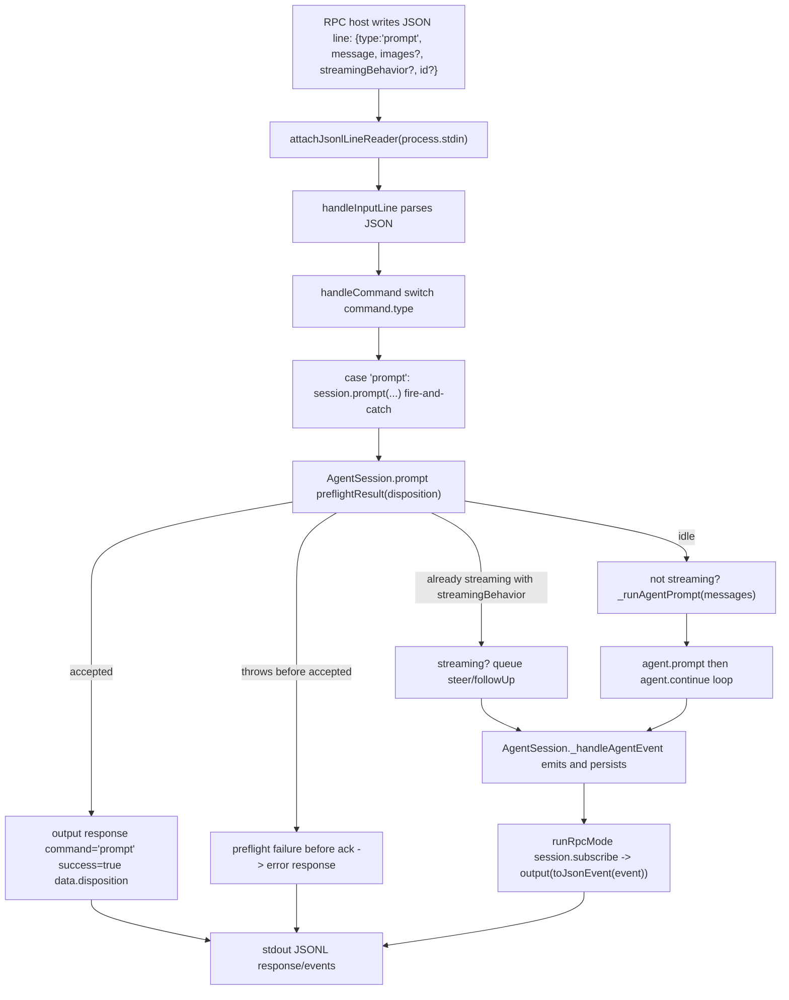

> `spine.trace-rpc-prompt` 走读一次 `{type:"prompt"}` RPC command 如何从 JSONL stdin 进入 `runRpcMode`，经 `AgentSession.prompt` preflight 接受后立即返回 prompt acknowledgement，再把同一轮 agent events 继续作为 JSONL stdout events 流给 host。

```mermaid
flowchart TD
 Host["RPC host writes JSON line: {type:'prompt', message, images?, streamingBehavior?, id?}"]
 Reader["attachJsonlLineReader(process.stdin)"]
 Parse["handleInputLine parses JSON"]
 Dispatch["handleCommand switch command.type"]
 PromptCase["case 'prompt': session.prompt(...) fire-and-catch"]
 Preflight["AgentSession.prompt preflightResult(disposition)"]
 Ack["output response command='prompt' success=true data.disposition"]
 Queue["streaming? queue steer/followUp"]
 Run["not streaming? _runAgentPrompt(messages)"]
 Agent["agent.prompt then agent.continue loop"]
 Events["AgentSession._handleAgentEvent emits and persists"]
 RpcSub["runRpcMode session.subscribe -> output(toJsonEvent(event))"]
 Stdout["stdout JSONL response/events"]
 Error["preflight failure before ack -> error response"]

 Host --> Reader --> Parse --> Dispatch --> PromptCase --> Preflight
 Preflight -->|accepted| Ack --> Stdout
 Preflight -->|throws before accepted| Error --> Stdout
 Preflight -->|already streaming with streamingBehavior| Queue --> Events
 Preflight -->|idle| Run --> Agent --> Events --> RpcSub --> Stdout
```

## 能回答的问题

- RPC `prompt` command 的 wire shape 是什么，`id` 如何用于 response correlation？
- 为什么 `prompt` 的 RPC success response 带 `data.disposition`，而不是整轮 agent run finished？
- 独立 RPC `steer` / `follow_up` command 是否也走 extension `input` handlers，`source` 是什么？
- `streamingBehavior: "steer" | "followUp"` 在 RPC prompt path 里什么时候必需，分别进入哪个 queue？
- prompt 文本在进入 LLM 前会经过 extension command、input hook、skill command 和 prompt template 哪些处理？
- AgentSession events 如何继续通过 RPC stdout 输出，并在哪里持久化到 session？
- RPC prompt path 的 `coding-agent` 边界在哪里，它怎样把 headless I/O 层接到共享 `AgentSession`？

## 端到端步骤

1. RPC prompt 的 ground truth 类型是 `RpcCommand` union 里的 `{ id?: string; type: "prompt"; message: string; images?: ImageContent[]; streamingBehavior?: "steer" | "followUp" }`；同一 union 还把 `steer`、`follow_up`、`abort` 等 prompting commands 分成独立 command type，所以本 trace 只覆盖 `type: "prompt"` 这一条路。[E: packages/coding-agent/src/modes/rpc/rpc-types.ts:20] [E: packages/coding-agent/src/modes/rpc/rpc-types.ts:22] [E: packages/coding-agent/src/modes/rpc/rpc-types.ts:23] [E: packages/coding-agent/src/modes/rpc/rpc-types.ts:24]
2. `runRpcMode(runtimeHost)` 是 headless JSON stdin/stdout mode：函数体先 `takeOverStdout()`，把当前 `runtimeHost.session` 保存为局部 `session`，后面用 `attachJsonlLineReader(process.stdin, ...)` 接 stdin，并用 `output()` 写 raw stdout。[E: packages/coding-agent/src/modes/rpc/rpc-mode.ts:54] [E: packages/coding-agent/src/modes/rpc/rpc-mode.ts:55] [E: packages/coding-agent/src/modes/rpc/rpc-mode.ts:56] [E: packages/coding-agent/src/modes/rpc/rpc-mode.ts:60] [E: packages/coding-agent/src/modes/rpc/rpc-mode.ts:808]
3. RPC stdout 的公共出口是 `output(obj)`，它把 object 交给 `serializeJsonLine` 后写入 guarded raw stdout；success response 统一是 `{ id, type: "response", command, success: true, data? }`，error response 统一是 `{ id, type: "response", command, success: false, error }`。[E: packages/coding-agent/src/modes/rpc/rpc-mode.ts:60] [E: packages/coding-agent/src/modes/rpc/rpc-mode.ts:61] [E: packages/coding-agent/src/modes/rpc/rpc-mode.ts:64] [E: packages/coding-agent/src/modes/rpc/rpc-mode.ts:70] [E: packages/coding-agent/src/modes/rpc/rpc-mode.ts:75]
4. `rebindSession()` 在进入 input loop 前执行，它把 RPC extension UI context 绑定到 session，再 `session.subscribe((event) => output(toJsonEvent(event)))`；`toJsonEvent` 会从 `message_update` 去掉 cumulative assistant snapshot，因此 RPC stdout 不是 raw `AgentSessionEvent`。[E: packages/coding-agent/src/modes/rpc/rpc-mode.ts:317] [E: packages/coding-agent/src/modes/rpc/rpc-mode.ts:319] [E: packages/coding-agent/src/modes/rpc/rpc-mode.ts:355] [E: packages/coding-agent/src/modes/rpc/rpc-mode.ts:356] [E: packages/coding-agent/src/modes/json-event.ts:48] [E: packages/coding-agent/src/modes/json-event.ts:56] [E: packages/coding-agent/src/modes/rpc/rpc-mode.ts:382]
5. stdin line reader 由 `attachJsonlLineReader(process.stdin, ...)` 安装，每一行进入 `handleInputLine`；`handleInputLine` 先 `JSON.parse(line)`，parse failure 立即输出 `command: "parse"` 的 error response。[E: packages/coding-agent/src/modes/rpc/rpc-mode.ts:750] [E: packages/coding-agent/src/modes/rpc/rpc-mode.ts:753] [E: packages/coding-agent/src/modes/rpc/rpc-mode.ts:755] [E: packages/coding-agent/src/modes/rpc/rpc-mode.ts:758] [E: packages/coding-agent/src/modes/rpc/rpc-mode.ts:808]
6. `handleInputLine` 会先识别 `type: "extension_ui_response"` 并解析 pending extension UI request；普通 RPC command 才会 cast 为 `RpcCommand`，交给 `handleCommand(command)`，若 `handleCommand` 返回 response 则输出并等待 stdout backpressure。[E: packages/coding-agent/src/modes/rpc/rpc-mode.ts:771] [E: packages/coding-agent/src/modes/rpc/rpc-mode.ts:774] [E: packages/coding-agent/src/modes/rpc/rpc-mode.ts:782] [E: packages/coding-agent/src/modes/rpc/rpc-mode.ts:784] [E: packages/coding-agent/src/modes/rpc/rpc-mode.ts:786]
7. `handleCommand` dispatch 的 prompt branch 不 `await` 整个 prompt；它用 `void session.prompt(...)` 启动异步任务，传入 `message`、`images`、`streamingBehavior`、`source: "rpc"` 和 `preflightResult` callback，然后返回 `undefined`，所以通用 `if (response) output(response)` 分支不会再输出第二个 synchronous response。[E: packages/coding-agent/src/modes/rpc/rpc-mode.ts:386] [E: packages/coding-agent/src/modes/rpc/rpc-mode.ts:394] [E: packages/coding-agent/src/modes/rpc/rpc-mode.ts:398] [E: packages/coding-agent/src/modes/rpc/rpc-mode.ts:399] [E: packages/coding-agent/src/modes/rpc/rpc-mode.ts:402] [E: packages/coding-agent/src/modes/rpc/rpc-mode.ts:413]
8. RPC prompt success response 是 per-input disposition：`preflightResult(disposition)` 首次触发时把 `preflightSucceeded` 置为 true 并输出 `success(id, "prompt", { disposition })`。`PromptDisposition` 为 `"handled"`（extension command / input handler 吃掉，不要等 `agent_settled`）、`"queued"`（streaming 入队）或 `"started"`（启动新 run）。如果 `session.prompt(...)` 在 preflight 成功前 reject（含 compaction 进行中的 throw），catch 才输出 `error(id, "prompt", e.message)`。[E: packages/coding-agent/src/modes/rpc/rpc-mode.ts:397] [E: packages/coding-agent/src/modes/rpc/rpc-mode.ts:403] [E: packages/coding-agent/src/modes/rpc/rpc-mode.ts:405] [E: packages/coding-agent/src/modes/rpc/rpc-mode.ts:408] [E: packages/coding-agent/src/core/agent-session.ts:295] [E: packages/coding-agent/src/core/agent-session.ts:1934] [E: packages/coding-agent/src/core/agent-session.ts:1953] [E: packages/coding-agent/src/core/agent-session.ts:1977] [E: packages/coding-agent/src/core/agent-session.ts:1939] [E: packages/coding-agent/src/core/agent-session.ts:2062] [E: packages/coding-agent/docs/rpc.md:64] [E: packages/coding-agent/docs/rpc.md:67]
9. `AgentSession.prompt` 的 option contract 包含 `streamingBehavior`、`source` 和 `preflightResult`；后续实现只在 streaming path 读取 `streamingBehavior`，把 `source` 传给 input handlers，并在 acceptance/rejection 处调用 `preflightResult`。rejected 时不回调 `preflightResult`。[E: packages/coding-agent/src/core/agent-session.ts:304] [E: packages/coding-agent/src/core/agent-session.ts:306] [E: packages/coding-agent/src/core/agent-session.ts:308] [E: packages/coding-agent/src/core/agent-session.ts:1949] [E: packages/coding-agent/src/core/agent-session.ts:1966]
10. `AgentSession.prompt` 先处理 slash-prefixed extension command：当 `expandPromptTemplates` 为 true 且 text 以 `/` 开头时调用 `_tryExecuteExtensionCommand`；若 extension command 命中，它只执行 command handler、调用 `preflightResult("handled")`、直接返回，不会构造 user message 给 agent。[E: packages/coding-agent/src/core/agent-session.ts:1926] [E: packages/coding-agent/src/core/agent-session.ts:1930] [E: packages/coding-agent/src/core/agent-session.ts:1931] [E: packages/coding-agent/src/core/agent-session.ts:1934]
11. 不是 extension command 时，`AgentSession.prompt` 会把 `source: "rpc"` 传给 extension input handlers：它在 `hasHandlers("input")` 时调用 `emitInput(currentText, currentImages, options?.source ?? "interactive", this.isStreaming ? options?.streamingBehavior : undefined)`，handler 可返回 handled 或 transform。[E: packages/coding-agent/src/core/agent-session.ts:1946] [E: packages/coding-agent/src/core/agent-session.ts:1876] [E: packages/coding-agent/src/core/agent-session.ts:1880] [E: packages/coding-agent/src/core/agent-session.ts:1949]
12. prompt text 在实际发送前还会展开 skill command 和 file-based prompt templates：`_expandSkillCommand(expandedText)` 先运行，`expandPromptTemplate(expandedText, [...this.promptTemplates])` 后运行。[E: packages/coding-agent/src/core/agent-session.ts:1960] [E: packages/coding-agent/src/core/agent-session.ts:1961] [E: packages/coding-agent/src/core/agent-session.ts:1962]
13. 如果当前 session 正在 streaming，`AgentSession.prompt` 要求 RPC command 提供 `streamingBehavior`；缺失时抛错，`"followUp"` 进入 `_queueFollowUp`，其他合法值 `"steer"` 进入 `_queueSteer`，随后调用 `preflightResult("queued")` 并返回。[E: packages/coding-agent/src/core/agent-session.ts:1966] [E: packages/coding-agent/src/core/agent-session.ts:1967] [E: packages/coding-agent/src/core/agent-session.ts:1972] [E: packages/coding-agent/src/core/agent-session.ts:1975] [E: packages/coding-agent/src/core/agent-session.ts:1977]
14. `_queueSteer` 和 `_queueFollowUp` 都把 text 放入本地 queue、调用 `_emitQueueUpdate()` 发出 `queue_update`，再把 `{ role: "user", content, timestamp }` 交给 agent-core 的 `agent.steer(...)` 或 `agent.followUp(...)`；结合 RPC `session.subscribe(output)`，可推断 RPC prompt 的 queue branch 会通过 session event subscription 暴露 queue state。[E: packages/coding-agent/src/core/agent-session.ts:2191] [E: packages/coding-agent/src/core/agent-session.ts:2192] [E: packages/coding-agent/src/core/agent-session.ts:2193] [E: packages/coding-agent/src/core/agent-session.ts:2198] [E: packages/coding-agent/src/core/agent-session.ts:2208] [E: packages/coding-agent/src/core/agent-session.ts:2215] [E: packages/coding-agent/src/core/agent-session.ts:1017] [E: packages/coding-agent/src/modes/rpc/rpc-mode.ts:355] [I]
15. 非 streaming prompt 会在 preflight 中先 flush pending bash 与 custom messages，校验 `this.model`，再校验 `this._modelRuntime.hasConfiguredAuth(this.model.provider)` 或 `checkAuth(this.model.provider)`。这两个校验失败会 **throw**，且 `preflightResult` 不被调用（`PromptOptions` 注明 rejected 时不回调），从而让 RPC prompt branch 输出 error response 而不是 success acknowledgement。[E: packages/coding-agent/src/core/agent-session.ts:1982] [E: packages/coding-agent/src/core/agent-session.ts:1986] [E: packages/coding-agent/src/core/agent-session.ts:1990] [E: packages/coding-agent/src/core/agent-session.ts:308] [E: packages/coding-agent/src/modes/rpc/rpc-mode.ts:408]
16. 非 streaming prompt 在校验和 compaction 检查后先 `emitBeforeAgentStart`，再构造 `messages` 数组，把 expanded text 包成 user text block，附加 images，清空并注入 `_pendingNextTurnMessages`，再把 extension custom messages 与 system-prompt update 写入同一批 messages。[E: packages/coding-agent/src/core/agent-session.ts:2015] [E: packages/coding-agent/src/core/agent-session.ts:2032] [E: packages/coding-agent/src/core/agent-session.ts:2035] [E: packages/coding-agent/src/core/agent-session.ts:2042] [E: packages/coding-agent/src/core/agent-session.ts:2047] [E: packages/coding-agent/src/core/agent-session.ts:2058]
17. `AgentSession.prompt` 在 `messages` 准备好后调用 `preflightResult("started")`，然后 `await this._runAgentPrompt(messages)`；`_runAgentPrompt` 先 `await this.agent.prompt(messages)`，再在 `_handlePostAgentRun()` 或 `_runBeforeSettleBoundary()` 返回 true 时继续 `await this.agent.continue()`，finally flush pending bash/custom messages 并发 `agent_settled`。[E: packages/coding-agent/src/core/agent-session.ts:2062] [E: packages/coding-agent/src/core/agent-session.ts:2063] [E: packages/coding-agent/src/core/agent-session.ts:1775] [E: packages/coding-agent/src/core/agent-session.ts:1785] [E: packages/coding-agent/src/core/agent-session.ts:1787] [E: packages/coding-agent/src/core/agent-session.ts:1792] [E: packages/coding-agent/src/core/agent-session.ts:1802]
18. `AgentSession` constructor 始终订阅 underlying agent events，`_handleAgentEvent` 会先把 queued user message 从 steering/follow-up display queues 中移除并 emit queue update，再把 event 发给 extension runner，再 `_emit(...)` 给 session listeners；RPC `rebindSession()` 注册的 listener 正是在这一层接到事件。[E: packages/coding-agent/src/core/agent-session.ts:485] [E: packages/coding-agent/src/core/agent-session.ts:1074] [E: packages/coding-agent/src/core/agent-session.ts:1090] [E: packages/coding-agent/src/core/agent-session.ts:1111] [E: packages/coding-agent/src/core/agent-session.ts:1112] [E: packages/coding-agent/src/modes/rpc/rpc-mode.ts:355]
19. session persistence 和 RPC event output 都接在 `_handleAgentEvent` 这条事件链上：`_handleAgentEvent` 先 `_emit(...)` 给 session listeners，随后当 event 是 `message_end` 且 message role 是 `user`、`assistant`、`toolResult` 或 `system` 时，`sessionManager.appendMessage(event.message)` 会走 `_persist()`；custom message 走 `appendCustomMessageEntry`。新 session 文件要等到第一条 user/assistant 消息才创建，setup-only entries 不会落盘。[E: packages/coding-agent/src/core/agent-session.ts:1115] [E: packages/coding-agent/src/core/agent-session.ts:1118] [E: packages/coding-agent/src/core/agent-session.ts:1133] [E: packages/coding-agent/src/core/session-manager.ts:1166] [E: packages/coding-agent/src/core/session-manager.ts:1172] [E: packages/coding-agent/src/core/session-manager.ts:1176] [E: packages/coding-agent/src/modes/rpc/rpc-mode.ts:355]
20. `RpcResponse` 类型把 prompt success response 声明为 `{ id?: string; type: "response"; command: "prompt"; success: true; data: { disposition: PromptDisposition } }`；该 union arm 没有 final message 字段，消息内容走 event stream 或 `get_last_assistant_text` / `get_messages`。[E: packages/coding-agent/src/modes/rpc/rpc-types.ts:116] [E: packages/coding-agent/src/modes/rpc/rpc-types.ts:118] [E: packages/coding-agent/src/modes/rpc/rpc-types.ts:233]

## 关键决策点

- prompt acknowledgement 和 agent completion 是两条不同信号：RPC `response(command="prompt")` 由 `preflightResult(disposition)` 驱动，agent 的 token/message/tool lifecycle 由 `session.subscribe` 经 `toJsonEvent` 继续输出；`handled` 时没有 run，不要等 `agent_settled`。[E: packages/coding-agent/src/modes/rpc/rpc-mode.ts:403] [E: packages/coding-agent/src/modes/rpc/rpc-mode.ts:405] [E: packages/coding-agent/src/modes/rpc/rpc-mode.ts:355] [E: packages/coding-agent/docs/rpc.md:67] [I]
- `type: "prompt"` 和 `type: "steer"` / `type: "follow_up"` 是不同 dispatch branch：prompt command 可以在 idle 时启动新 turn，也可以在 streaming 时通过 `streamingBehavior` 选择 steer/follow-up queue。[E: packages/coding-agent/src/modes/rpc/rpc-types.ts:22] [E: packages/coding-agent/src/modes/rpc/rpc-mode.ts:394] [E: packages/coding-agent/src/core/agent-session.ts:1975] [E: packages/coding-agent/src/core/agent-session.ts:1972] 独立 `steer` / `follow_up` 同步返回 success，但不再绕过 input handlers：`rpc-mode` → `session.steer` / `followUp(..., { source: "rpc" })` → `_queueUserInput` → `_runInputHandlers` → `emitInput`。[E: packages/coding-agent/src/modes/rpc/rpc-mode.ts:416] [E: packages/coding-agent/src/modes/rpc/rpc-mode.ts:417] [E: packages/coding-agent/src/modes/rpc/rpc-mode.ts:421] [E: packages/coding-agent/src/modes/rpc/rpc-mode.ts:422] [E: packages/coding-agent/src/core/agent-session.ts:2164] [E: packages/coding-agent/src/core/agent-session.ts:2180] [E: packages/coding-agent/src/core/agent-session.ts:2126] [E: packages/coding-agent/src/core/agent-session.ts:2136] [E: packages/coding-agent/src/core/extensions/types.ts:1127]
- RPC mode 的实现入口是 `coding-agent` 的 `runRpcMode`；它从 `runtimeHost.session` 取得 `AgentSession`，再在 `rebindSession()` 中绑定 extensions 并订阅 session events 输出。[E: packages/coding-agent/src/modes/rpc/rpc-mode.ts:54] [E: packages/coding-agent/src/modes/rpc/rpc-mode.ts:56] [E: packages/coding-agent/src/modes/rpc/rpc-mode.ts:317] [E: packages/coding-agent/src/modes/rpc/rpc-mode.ts:319] [E: packages/coding-agent/src/modes/rpc/rpc-mode.ts:355]
- prompt path 的 extension UI bridge 是 RPC-specific：RPC `bindExtensions` 传入 `createExtensionUIContext()`，其中 select/confirm/input/editor 等方法发 `extension_ui_request` 并等待 matching `extension_ui_response`；这让 headless host 负责实现交互 UI。[E: packages/coding-agent/src/modes/rpc/rpc-mode.ts:100] [E: packages/coding-agent/src/modes/rpc/rpc-mode.ts:122] [E: packages/coding-agent/src/modes/rpc/rpc-mode.ts:129] [E: packages/coding-agent/src/modes/rpc/rpc-mode.ts:136] [E: packages/coding-agent/src/modes/rpc/rpc-mode.ts:269] [E: packages/coding-agent/src/modes/rpc/rpc-mode.ts:319] [I]

## 指向 T1/T2 深挖

- `surface.modes.rpc` 应覆盖 RPC mode 的启动入口、shutdown、session switching、model/thinking/bash/session commands；本页只走读 `prompt` command 从 stdin 到 events stdout 的 single path。
- `surface.modes.rpc-protocol` 应展开 JSONL framing、`RpcResponse`、`RpcExtensionUIRequest`、`RpcSessionState` 的字段语义；本页只引用 prompt path 需要的 protocol fields。
- `ref.coding-agent.rpc-methods` 应逐项列出 `RpcCommand` union 与 `rpc-mode.ts` dispatch 的所有 command；本页只核对 prompt 相关 command 与 dispatch branch。

## Sources

- packages/coding-agent/src/modes/rpc/rpc-mode.ts
- packages/coding-agent/src/modes/rpc/rpc-types.ts
- packages/coding-agent/src/modes/json-event.ts
- packages/coding-agent/src/core/agent-session.ts
- packages/coding-agent/src/core/session-manager.ts
- packages/coding-agent/src/core/extensions/types.ts
- packages/coding-agent/docs/rpc.md

## 相关

- [surface.modes.rpc](../surface/modes/rpc.md) - RPC 无头模式的整体命令面、生命周期和 host 嵌入边界。
- [surface.modes.rpc-protocol](../surface/modes/rpc-protocol.md) - RPC JSONL 协议、response/event shape 与 extension UI request/response。
- [ref.coding-agent.rpc-methods](../reference/rpc-methods.md) - `RpcCommand` union 与 `rpc-mode.ts` dispatch 的命令目录。
