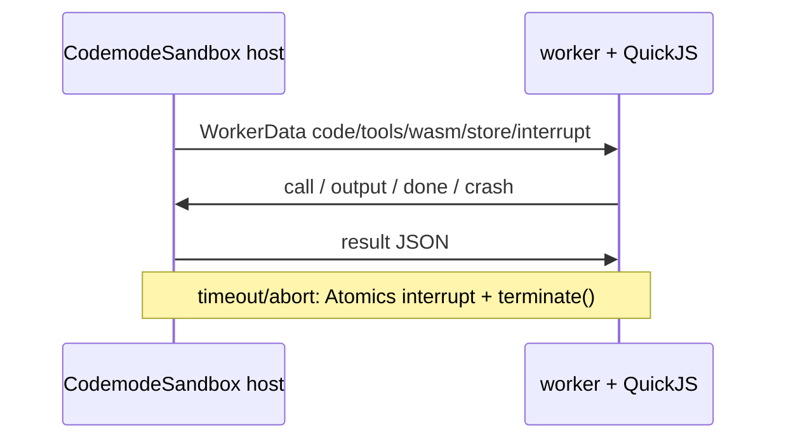

> `@earendil-works/pi-codemode`（**1.0.1**）在 worker 线程里用 QuickJS WASM 跑模型写的 JavaScript：脚本能用的能力只有注入的 `tools` / globals，以及 `ALL_TOOLS`、`text`、`image`、`exit`、`store`、`load`、`console.*`。`CodemodeSandbox.execute()` 每次新建 worker + VM；嵌套 tool 的参数与结果只在 VM↔host JSON 通道里，不进入 `result.output`。本包 `dependencies` 只有 `quickjs-wasi`，没有其它 Pi workspace 包。

## 能回答的问题

- `CodemodeSandbox.execute()` 如何起 worker、跑 QuickJS、处理超时 / abort / `close()`？
- 脚本里的 `tools`、`ALL_TOOLS`、`text`、`image`、`exit`、`store`、`load` 各做什么，输出与 store 上限是多少？
- 第一行 `// @options:` 由谁解析？sandbox 会不会执行 `timeout_ms` / `max_output_tokens`？
- `toCodemodeIdentifier()` 怎样把 `my-tool` 变成 `my_tool`，`ALL_TOOLS` 列出的是哪个名字？
- 嵌套 `tools.*` 调用为什么默认不进 LLM context？
- 本包为何能单独使用，和 coding-agent 内置 `codemode` 扩展的边界在哪？

## 职责边界

`@earendil-works/pi-codemode` 的 description 是 sandboxed JavaScript，唯一 capability 是调用注入的 tools。[E: packages/codemode/package.json:2] [E: packages/codemode/package.json:3] [E: packages/codemode/package.json:4]

npm `exports` 拆成四个入口：

| subpath | 源 | 角色 |
|---|---|---|
| `.` | `src/index.ts` | `CodemodeSandbox`、limits、types、`loadQuickJSWasm` |
| `./declarations` | `src/declarations.ts` | `renderDeclarations()` 等模型侧 TypeScript 声明 |
| `./source` | `src/source.ts` | `parseCodemodeSource()` / `CODEMODE_SOURCE_GRAMMAR`，不拉 WASM |
| `./worker` | `src/runtime/worker.ts` | worker 入口；import 即启动 |

[E: packages/codemode/package.json:9] [E: packages/codemode/package.json:14] [E: packages/codemode/package.json:19] [E: packages/codemode/package.json:24] [E: packages/codemode/src/index.ts:13]

`dependencies` 只有 `quickjs-wasi@3.6.2`。没有 `@earendil-works/*`。[E: packages/codemode/package.json:58] [E: packages/codemode/README.md:5] 根 build 把本包插在 `telemetry` 与 `mcp` 之间。[E: package.json:15] coding-agent 依赖 `@earendil-works/pi-codemode` `^1.0.1`，产品工具与 settings 不在本节点。[E: packages/coding-agent/package.json:53]

本包不解析 `// @options:`、不把结果写成 provider 消息、不实现 `searchTools`。`CodemodeSandbox.execute(code)` 把 `code` 当 async function body；options 行是调用方用 `parseCodemodeSource()` 剥掉之后再传入的事。[E: packages/codemode/src/runtime/host.ts:339] [E: packages/codemode/src/source.ts:100]

## 关键文件

- `packages/codemode/src/runtime/host.ts`：`CodemodeSandbox`、每轮 `Execution`、tool 调度、超时 / abort / `terminate()`。[E: packages/codemode/src/runtime/host.ts:285] [E: packages/codemode/src/runtime/host.ts:339]
- `packages/codemode/src/runtime/worker.ts`：`QuickJS.create()`、prelude、把 `code` 编成 `codemode.js`。[E: packages/codemode/src/runtime/worker.ts:54] [E: packages/codemode/src/runtime/worker.ts:146]
- `packages/codemode/src/runtime/prelude-source.ts`：VM 内 `PRELUDE_SOURCE`；limits 常量从这里 export。[E: packages/codemode/src/runtime/prelude-source.ts:28] [E: packages/codemode/src/runtime/prelude-source.ts:36] [E: packages/codemode/src/runtime/prelude-source.ts:42]
- `packages/codemode/src/runtime/protocol.ts`：host↔worker 消息；参数 / 结果 / 返回值都是 JSON 字符串。[E: packages/codemode/src/runtime/protocol.ts:31] [E: packages/codemode/src/runtime/protocol.ts:41]
- `packages/codemode/src/source.ts`：`parseCodemodeSource()`、`CODEMODE_OPTIONS_PREFIX`、`CODEMODE_SOURCE_GRAMMAR`。[E: packages/codemode/src/source.ts:11] [E: packages/codemode/src/source.ts:100]
- `packages/codemode/src/identifier.ts`：`toCodemodeIdentifier()`。[E: packages/codemode/src/identifier.ts:5]
- `packages/codemode/src/wasm.ts`：`loadQuickJSWasm()`，按 path 缓存 `WebAssembly.compile`。[E: packages/codemode/src/wasm.ts:21]
- `packages/codemode/src/declarations.ts`：`renderDeclarations()` / `schemaToType()`；schema 只生成声明。[E: packages/codemode/src/declarations.ts:105] [E: packages/codemode/README.md:113]

## 数据模型

### `CodemodeSandbox` / `CodemodeSandboxOptions`

构造时登记 `tools` 与 `globals`，保存默认 `timeoutMs`（`DEFAULT_TIMEOUT_MS = 300_000`）、可选 `memoryLimitBytes`、`wasm`、`workerUrl`。[E: packages/codemode/src/runtime/host.ts:22] [E: packages/codemode/src/runtime/host.ts:296] [E: packages/codemode/src/runtime/host.ts:339]

`globals` 名必须是 identifier 或恰好一段 `ns.member`；首段不得落在保留名 `tools` / `ALL_TOOLS` / `console` / `text` / `image` / `exit` / `globalThis` / `store` / `load`。[E: packages/codemode/src/runtime/host.ts:24] [E: packages/codemode/src/runtime/host.ts:304] `spread: true` 时 host 把调用参数数组交给 `execute`，而不是第一个参数。[E: packages/codemode/src/types.ts:29] [E: packages/codemode/test/sandbox.test.ts:450]

`timeoutMs: Infinity`（或任何非 finite 数）不设 timer，执行一直等到脚本 settle 或 `signal` / `close()`。[E: packages/codemode/src/runtime/host.ts:108] [E: packages/codemode/test/sandbox.test.ts:516]

`memoryLimitBytes` 原样传给 `QuickJS.create({ memoryLimit })`；省略则为 `undefined`（types 注释：默认不超过 wasm32 的 4 GiB）。[E: packages/codemode/src/runtime/host.ts:149] [E: packages/codemode/src/runtime/worker.ts:56] [I]

### `CodemodeResult` / `CodemodeCall` / 错误 kind

`execute()` 对脚本失败 **resolve** `{ ok: false }`，不 reject。已 `close()` 的 sandbox 对后续 `execute()` **reject** `Sandbox is closed`。[E: packages/codemode/src/runtime/host.ts:339] [E: packages/codemode/src/runtime/host.ts:340] [E: packages/codemode/test/sandbox.test.ts:610]

| `ok` | 字段 | 含义 |
|---|---|---|
| `true` | `value`、`output`、`calls`、`storeWrites` | 脚本 settle 或 `exit()`（`value` 为 `undefined`） |
| `false` | `error`、`output`、`calls` | **没有** `storeWrites` |

[E: packages/codemode/src/types.ts:82] [E: packages/codemode/src/types.ts:90] [E: packages/codemode/src/types.ts:75]

`CodemodeCall` 只有 `name`、`status`（`"ok" \| "error" \| "cancelled"`）、`durationMs`。没有参数、没有返回值。[E: packages/codemode/src/types.ts:51] [E: packages/codemode/src/types.ts:53] globals 调用不写入 `calls`。[E: packages/codemode/src/runtime/host.ts:213] [E: packages/codemode/test/sandbox.test.ts:441]

| `error.kind` | 何时 |
|---|---|
| `script` | 脚本抛错、语法错、输出超限、永远等不到的 Promise |
| `timeout` | 总时限到；worker `terminate()` |
| `aborted` | `options.signal` 或 `close()`；worker `terminate()` |
| `sandbox` | worker/VM 失败（缺 worker 文件、wasm 加载失败、wasm trap） |

[E: packages/codemode/src/types.ts:59] [E: packages/codemode/src/types.ts:61] [E: packages/codemode/src/types.ts:63] [E: packages/codemode/src/types.ts:65] [E: packages/codemode/src/runtime/host.ts:110] [E: packages/codemode/src/runtime/host.ts:176]

`CodemodeOutputItem` 是 `{ type: "text"; text }` 或 `{ type: "image"; data; mimeType }`（`data` 为 base64），与 `pi-ai` 的 text/image block 同形。[E: packages/codemode/src/types.ts:47] [E: packages/codemode/README.md:161]

### 脚本可见 API

Prelude 把 host `bridge` 关在闭包里，再挂到 `globalThis`：[E: packages/codemode/src/runtime/prelude-source.ts:349]

| 名字 | 行为 |
|---|---|
| `tools.<jsName>(args)` / `tools["<name>"](args)` | 返回 Promise；参数与结果 JSON 往返。抛错在脚本里变成同 message 的 `Error` |
| `ALL_TOOLS` | frozen `{ name: jsName, description }[]` |
| `text(value)` | 追加 text item；非 string 走 `JSON.stringify`（primitive 用 `String`） |
| `image(urlOrItem)` | 追加 image item：base64 `data:` URL、`{ image_url }`、或 MCP `{ type: "image", data, mimeType }` |
| `exit()` | 立刻成功结束，保留已有 output 与 store writes，`value: undefined` |
| `console.log/info/warn/error/debug` | 与 `text()` 一样追加 text item |
| `store(key, value)` / `load(key)` | 同步读写 JSON；`undefined` 删除 key |
| 配置的 globals | 顶层函数或冻结的 `ns.member`；不记入 `result.calls` |

[E: packages/codemode/src/runtime/prelude-source.ts:111] [E: packages/codemode/src/runtime/prelude-source.ts:264] [E: packages/codemode/src/runtime/prelude-source.ts:301] [E: packages/codemode/src/runtime/prelude-source.ts:329] [E: packages/codemode/src/runtime/prelude-source.ts:341] [E: packages/codemode/src/runtime/prelude-source.ts:184] [E: packages/codemode/src/runtime/prelude-source.ts:220]

`image()` 拒绝 `http`/`https`；MIME 按 PNG/JPEG/GIF/WebP 签名检测，忽略声明的 type。无效 base64 或非这四种格式抛 `TypeError`。[E: packages/codemode/src/runtime/prelude-source.ts:306] [E: packages/codemode/src/runtime/prelude-source.ts:322] [E: packages/codemode/test/sandbox.test.ts:77]

没有 timers、`fetch`、`process`、`require`、modules、`WebAssembly`。`eval` / `Function` 仍在同一 VM 里，读不到 host 全局。[E: packages/codemode/test/sandbox.test.ts:661] [E: packages/codemode/test/sandbox.test.ts:686] [E: packages/codemode/README.md:47]

### `toCodemodeIdentifier`

非 JavaScript identifier 字符变成 `_`。空串变成 `"_"`。`mcp__docs__search` 保持原样，`my-tool` 变成 `my_tool`。[E: packages/codemode/src/identifier.ts:5] [E: packages/codemode/src/identifier.ts:8] [E: packages/codemode/src/identifier.ts:11]

Host 把每个 tool 的 `jsName` 交给 worker；prelude 同时挂 `tools[jsName]` 与 `tools[name]`。两个 tool 归一到同一 identifier 时 **先登记的赢**：`ALL_TOOLS` 只收第一次，后登记的同 identifier 被挡住。[E: packages/codemode/src/runtime/host.ts:141] [E: packages/codemode/src/runtime/prelude-source.ts:116] [E: packages/codemode/test/sandbox.test.ts:259]

CJK 等非 `A-Za-z0-9_$` 字符同样变成 `_`，多个 CJK 名会撞到同一 identifier。[E: packages/codemode/src/identifier.ts:8]

### 输出与 store 上限

常量在 prelude 里定义，并从包根 re-export：[E: packages/codemode/src/index.ts:15]

| 常量 | 值 | 作用 |
|---|---|---|
| `MAX_OUTPUT_CHARS` | `16 * 1024 * 1024`（16 Mi） | `text`/`image`/`console` 的 text 与 base64 字符合计 |
| `MAX_OUTPUT_ITEMS` | `100_000` | 上述调用次数（含空字符串） |
| `MAX_STORE_VALUE_CHARS` | `256 * 1024`（256 Ki） | 单个 `store()` 值的 JSON 字符 |
| `MAX_STORE_TOTAL_CHARS` | `1024 * 1024`（1 Mi） | 全部 key+JSON 合计 |

[E: packages/codemode/src/runtime/prelude-source.ts:28] [E: packages/codemode/src/runtime/prelude-source.ts:29] [E: packages/codemode/src/runtime/prelude-source.ts:36] [E: packages/codemode/src/runtime/prelude-source.ts:37]

输出超限时 prelude 先 `done(false, …)` 再抛 `RangeError`：脚本 `catch` 也恢复不了输出，host 结束这一轮。[E: packages/codemode/src/runtime/prelude-source.ts:244] [E: packages/codemode/src/runtime/prelude-source.ts:249] [E: packages/codemode/test/sandbox.test.ts:582]

`store()` 超限抛脚本内 `RangeError`；非 JSON / 非 string key 抛 `TypeError`。`load()` 返回 `JSON.parse` 的副本，改它不会改 store。[E: packages/codemode/src/runtime/prelude-source.ts:202] [E: packages/codemode/src/runtime/prelude-source.ts:209] [E: packages/codemode/src/runtime/prelude-source.ts:223] [E: packages/codemode/test/sandbox.test.ts:383]

Sandbox **不**持久化 store：调用方把快照经 `options.store` 传入，成功结果用 `storeWrites.{ set, delete }` 交回。[E: packages/codemode/src/types.ts:135] [E: packages/codemode/src/runtime/host.ts:348]

### `parseCodemodeSource` 与 `// @options:`

`CODEMODE_OPTIONS_PREFIX` 是 `"// @options:"`。只看 **第一行**（允许行首空白）。支持字段只有 `max_output_tokens`、`timeout_ms`。[E: packages/codemode/src/source.ts:11] [E: packages/codemode/src/source.ts:13] [E: packages/codemode/src/source.ts:109]

剥掉 options 行时留下开头的 `\n`，后面源码行号不变。[E: packages/codemode/src/source.ts:110] [E: packages/codemode/src/source.ts:114] [E: packages/codemode/test/source.test.ts:15]

| 输入 | 结果 |
|---|---|
| 空 / 空白 | `CodemodeSourceError` |
| 非法 JSON、未知字段、非 object | `CodemodeSourceError` |
| 只有 options 行、后面没有代码 | `CodemodeSourceError` |
| `timeout_ms` 为 0 或大于 `2_147_483_647` | `CodemodeSourceError` |
| `max_output_tokens` 为非负安全整数（含 0） | 写入 `options.maxOutputTokens` |

[E: packages/codemode/src/source.ts:101] [E: packages/codemode/src/source.ts:86] [E: packages/codemode/src/source.ts:16] [E: packages/codemode/test/source.test.ts:35]

`CODEMODE_SOURCE_GRAMMAR` 是 Lark 文法，只固定 options 行形状；JSON 与代码仍由 `parseCodemodeSource` 检查。[E: packages/codemode/src/source.ts:22]

**Sandbox 不读这些字段。** `timeout_ms` / `max_output_tokens` 由调用方接到 `execute({ timeoutMs })` 或自己的 token 预算上。[E: packages/codemode/README.md:77] [E: packages/codemode/src/runtime/host.ts:345]

### `renderDeclarations`

`inputSchema` / `outputSchema` 只用来生成模型看到的 TypeScript。`handleCall` 对 args / return 只做 `JSON.parse` / `JSON.stringify`，不按 schema 校验。[E: packages/codemode/src/runtime/host.ts:223] [E: packages/codemode/src/runtime/host.ts:225] [E: packages/codemode/README.md:113]

`renderToolSignature` 用 `toCodemodeIdentifier(tool.name)` 当方法名。输入类型超过 `DEFAULT_INPUT_SCHEMA_MAX_CHARS`（16_000）渲染成 `unknown`。MCP `CallToolResult` 形 output schema 渲染成 `Promise<CallToolResult<T>>`，需要 `MCP_TYPESCRIPT_PREAMBLE`。[E: packages/codemode/src/declarations.ts:10] [E: packages/codemode/src/declarations.ts:146] [E: packages/codemode/src/declarations.ts:181]

## 控制流

1. `CodemodeSandbox.execute(code, options)`@`packages/codemode/src/runtime/host.ts:339` 若已 `close()` 则 reject；否则 new `Execution`，拷贝当前 tool 表，`serializeStore(options.store)`，`timeoutMs` 用 per-call 覆盖或默认 300_000。
2. `Execution` 构造@`packages/codemode/src/runtime/host.ts:100`：finite timeout 则 `setTimeout` → `kind: "timeout"`；`signal` 已 abort 则立刻 `kind: "aborted"`。
3. `loadQuickJSWasm()`@`packages/codemode/src/wasm.ts:21`（或构造时传入的 module）完成后 `new Worker(workerUrl, { workerData })`@`packages/codemode/src/runtime/host.ts:155`。默认 worker 与 host 模块同目录的 `worker.ts` / `worker.js`。[E: packages/codemode/src/runtime/host.ts:58]
4. Worker `QuickJS.create({ wasm, memoryLimit, maxStackSize: MAX_STACK_SIZE, interruptHandler, wasi: discardOutput })`@`packages/codemode/src/runtime/worker.ts:54`。WASI `fd_write` 丢弃，避免 QuickJS 诊断打到宿主 stdout/TUI。[E: packages/codemode/src/runtime/worker.ts:32] [E: packages/codemode/src/runtime/worker.ts:61] 栈守卫打开后，过深递归是可 catch 的 `RangeError`，而不是 wasm trap。[E: packages/codemode/src/runtime/worker.ts:59] [E: packages/codemode/test/sandbox.test.ts:630]
5. Worker `evalCode(PRELUDE_SOURCE, "codemode-prelude.js")`，再 `evalCode(\`(async (tools, console) => {${code}\\n})\`, "codemode.js")`@`packages/codemode/src/runtime/worker.ts:146`。wrapper 与脚本共享第 1 行，stack 行号与源码一致；第 1 行列号会偏移。[E: packages/codemode/src/runtime/worker.ts:146] [E: packages/codemode/README.md:189]
6. 脚本 `tools.x(args)` → prelude `bridge("call", id, name, argsJson)` → worker 发 `{ type: "call" }` → host `handleCall`@`packages/codemode/src/runtime/host.ts:210` 在 **host 线程**跑 `tool.execute(args, { signal })`，再 `{ type: "result", ok, payload }` 回去。Prelude `settle` 把 JSON 解析成 Promise resolve/reject。
7. `text` / `image` / `console.*` → `{ type: "output", item }`，host 推进 `output[]`@`packages/codemode/src/runtime/host.ts:186`。失败前已经 `output` 的 item 会留在结果里。[E: packages/codemode/test/sandbox.test.ts:165]
8. 脚本 return / `exit()` / 抛错 → `{ type: "done" }`。Host `finish()`@`packages/codemode/src/runtime/host.ts:242` abort 仍在跑的 tool `signal`（未 await 的 call 记 `cancelled`），`Atomics.store(interrupt, 1)`，然后 `worker.terminate()`。[E: packages/codemode/src/runtime/host.ts:251] [E: packages/codemode/src/runtime/host.ts:268] [E: packages/codemode/src/runtime/host.ts:270] [E: packages/codemode/test/sandbox.test.ts:331]
9. `drain()` 在 pending jobs 之后调 prelude `stalled()`：没有未完成 host call、脚本却还在等 Promise 时，立刻 `kind: "script"`（“can never settle”），而不是挂到超时。[E: packages/codemode/src/runtime/worker.ts:119] [E: packages/codemode/src/runtime/prelude-source.ts:399] [E: packages/codemode/test/sandbox.test.ts:522]
10. 并行 `execute()` 各用独立 worker / VM，不共享 `globalThis`。[E: packages/codemode/test/sandbox.test.ts:613]

## 设计动机与权衡

每次 `execute()` 新 worker：失控的同步死循环或微任务空转可以用 `terminate()` 杀掉，不会毒化下一轮。[E: packages/codemode/src/runtime/host.ts:155] [E: packages/codemode/src/runtime/host.ts:270] QuickJS 是同步解释器，放 host 线程会堵事件循环，所以脚本在 worker 里跑。[E: packages/codemode/README.md:184]

Host 在 `terminate()` 前写 `SharedArrayBuffer` interrupt：Bun 上 `terminate()` 停不了正在 wasm 里空转的线程（`while (true) {}` 或 `while (true) await null`）。[E: packages/codemode/src/runtime/protocol.ts:24] [E: packages/codemode/src/runtime/worker.ts:60] [E: packages/codemode/test/sandbox.test.ts:507] [E: packages/codemode/test/sandbox.test.ts:536]

嵌套 tool 调用默认不进 LLM context：args/return 只在 `call`/`result` JSON 通道和 VM 里。`CodemodeResult` 给调用方的是 `output`（脚本主动 `text`/`image`/`console`）、成功时的 `value`、以及不含 payload 的 `calls` 摘要。README 把这写成产品约定：只有脚本 output 与 return value 进入 LLM context。[E: packages/codemode/README.md:3] [E: packages/codemode/src/types.ts:51] [E: packages/codemode/src/runtime/host.ts:239] 调用方若另外把 nested result 写进 session，那是产品层的事，见 [subsys.coding-agent.codemode](../coding-agent/codemode.md)。

输出上限是因为 host 会把全部 `output` 留到脚本结束；循环 `text("")` 会撞 item 上限，循环打印会撞字符上限。[E: packages/codemode/src/runtime/prelude-source.ts:244] [E: packages/codemode/test/sandbox.test.ts:582] [E: packages/codemode/test/sandbox.test.ts:604]

## gotcha

- `parseCodemodeSource` 与 `CodemodeSandbox` 不通话。把带 `// @options:` 的原文直接 `execute()`，那一行只是 JS 注释，sandbox 不会改 timeout。[E: packages/codemode/src/source.ts:100] [E: packages/codemode/src/runtime/host.ts:339]
- 失败执行没有 `storeWrites`：`store()` 之后 throw，调用方拿不到写入。[E: packages/codemode/src/types.ts:90]
- `exit()` 在 prelude 里 `done(true)` 再 `throw EXIT`。`try { exit(); } catch {}` 留不住后续 `text()` / `return`。[E: packages/codemode/src/runtime/prelude-source.ts:337] [E: packages/codemode/test/sandbox.test.ts:151]
- 未 await 的 tool 在脚本 return 时被 abort，`calls[].status === "cancelled"`。[E: packages/codemode/test/sandbox.test.ts:329]
- 返回值再走一次 JSON：`return [undefined]` 变成 `[null]`；顶层 `return undefined` 仍是 `undefined`。[E: packages/codemode/test/sandbox.test.ts:378]
- 缺 tool 成员时 prelude Proxy 抛 `TypeError`，文案提到 `searchTools(query)`。**本包不实现 `searchTools`**；那是 host（coding-agent）可注入的 tool/global 提示语。[E: packages/codemode/src/runtime/prelude-source.ts:150] [E: packages/codemode/test/sandbox.test.ts:342]
- `tools` / `ALL_TOOLS` / `console` 冻结；给 `tools` 加成员无效。[E: packages/codemode/src/runtime/prelude-source.ts:122] [E: packages/codemode/test/sandbox.test.ts:705]
- 同 identifier 先赢：同时登记 `my-tool` 与 `my_tool` 时，`tools.my_tool()` 与 `tools["my-tool"]()` 都打到先登记的那个，`ALL_TOOLS` 只有一条 `my_tool`。[E: packages/codemode/test/sandbox.test.ts:273]
- 打包后默认 worker 路径与 `quickjs-wasi/quickjs.wasm` 不在磁盘上：必须传 `wasm: loadQuickJSWasm(path)` 和 `workerUrl`（URL，或 Bun 编译体里的相对 string）。[E: packages/codemode/src/types.ts:117] [E: packages/codemode/src/types.ts:124]
- README 写每轮 worker+VM 大约 20 ms，源码没有该数字常量，不是 API 保证。[E: packages/codemode/README.md:178] [I]

## 跨包边界

- 分层位置：[spine.layered-architecture](../../spine/layered-architecture.md)。`pkg: codemode` 与 `mcp` 一起位于 chord/tui/telemetry 之后、`ai` 之前。本包不 import chord / ai / agent / durable。
- 包索引：[ref.package-index](../../reference/package-index.md)。公开包版本 **1.0.1**；`engines.node` `>=22.19.0`。[E: packages/codemode/package.json:3] [E: packages/codemode/package.json:55]
- 产品面：[surface.codemode.overview](../../surface/codemode/overview.md)（coding-agent 暴露给模型的 `codemode` 工具与 `CodemodeSettings`）。
- 产品装配：[subsys.coding-agent.codemode](../coding-agent/codemode.md)（replaceable 内置扩展如何把本包 `execute()` 接到 Agent loop，以及 `tool-search` 协作）。coding-agent 依赖本包，本包不依赖 coding-agent。[E: packages/coding-agent/package.json:53]
- 可单独使用：把任意 `execute` 函数（远程 API、MCP、应用服务）当成 `CodemodeTool` 注入即可。[E: packages/codemode/README.md:5]
- 未安装上游 `node_modules` 时不要宣称 `packages/codemode` 的 vitest 在本机跑过。[U]

## Sources

- packages/codemode/package.json
- packages/codemode/README.md
- packages/codemode/src/index.ts
- packages/codemode/src/types.ts
- packages/codemode/src/source.ts
- packages/codemode/src/identifier.ts
- packages/codemode/src/declarations.ts
- packages/codemode/src/wasm.ts
- packages/codemode/src/runtime/host.ts
- packages/codemode/src/runtime/worker.ts
- packages/codemode/src/runtime/prelude-source.ts
- packages/codemode/src/runtime/protocol.ts
- packages/codemode/test/sandbox.test.ts
- packages/codemode/test/source.test.ts
- packages/codemode/test/declarations.test.ts
- package.json
- packages/coding-agent/package.json

## 相关

- [spine.layered-architecture](../../spine/layered-architecture.md) — 13 包分层；`codemode` 在 telemetry 之后、mcp/ai 之前。
- [ref.package-index](../../reference/package-index.md) — workspace / exports / 根 build 顺序。
- [surface.codemode.overview](../../surface/codemode/overview.md) — coding-agent 用户可见的 `codemode` 工具、`// @options:` 与 settings。
- [subsys.coding-agent.codemode](../coding-agent/codemode.md) — 内置 replaceable `codemode` 扩展如何调用本包，以及与 `tool-search` 的协作。
